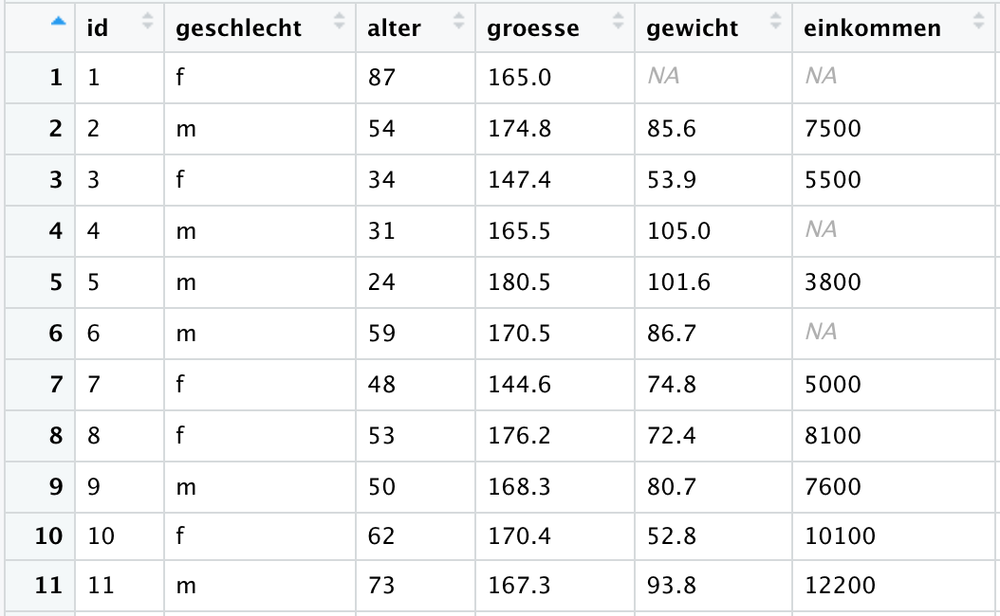
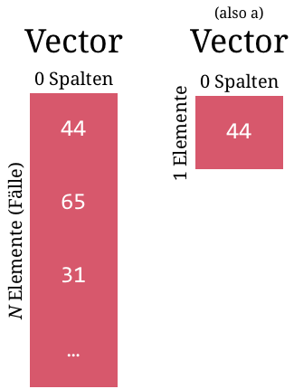
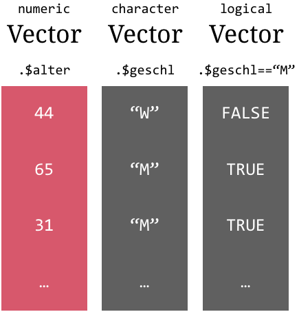
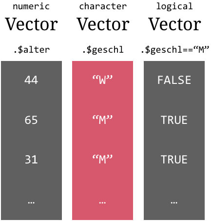
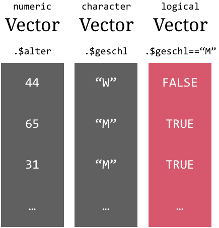
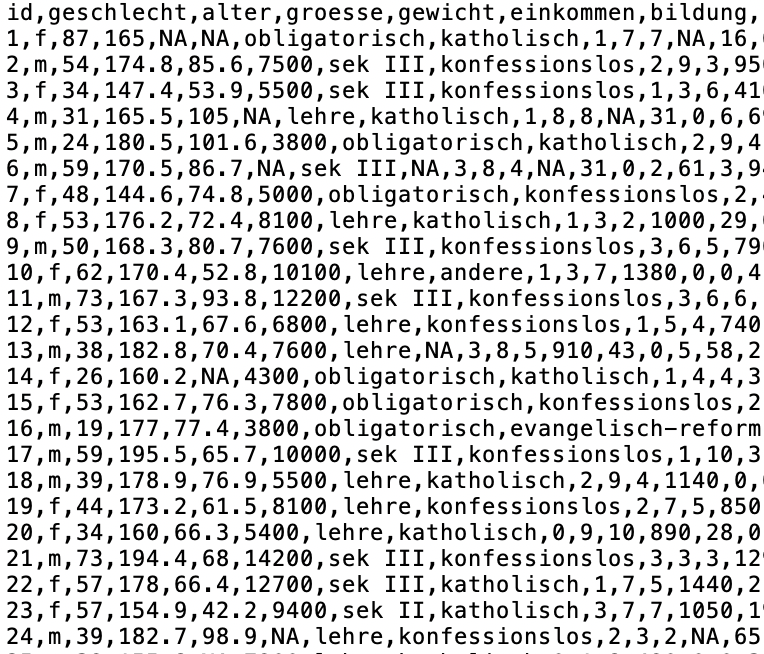
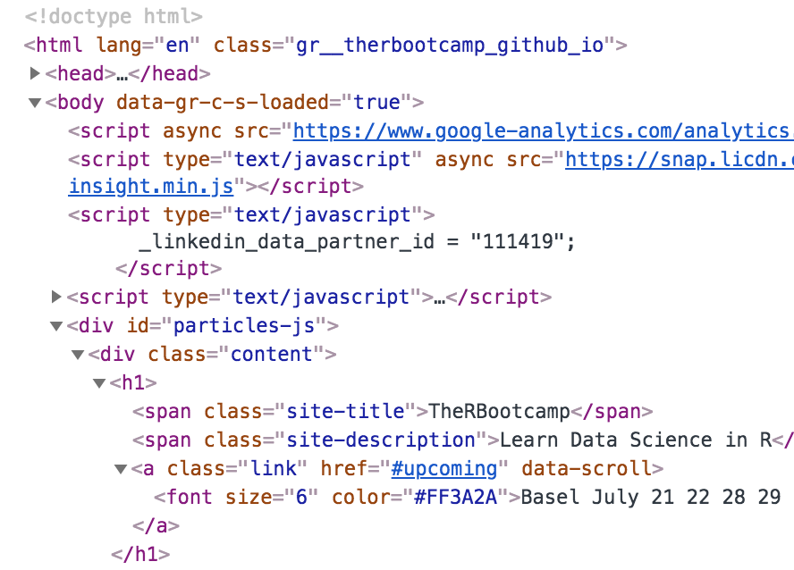
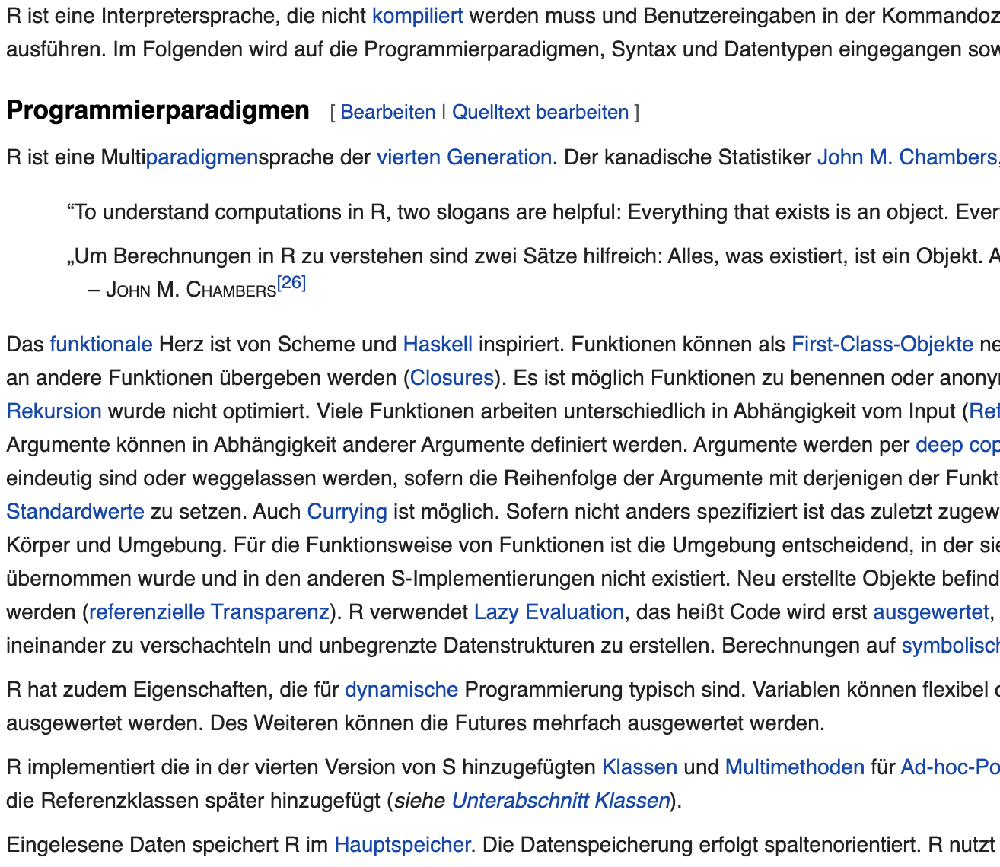
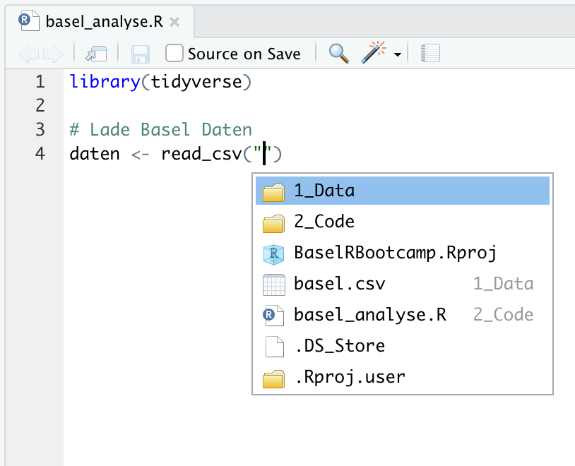
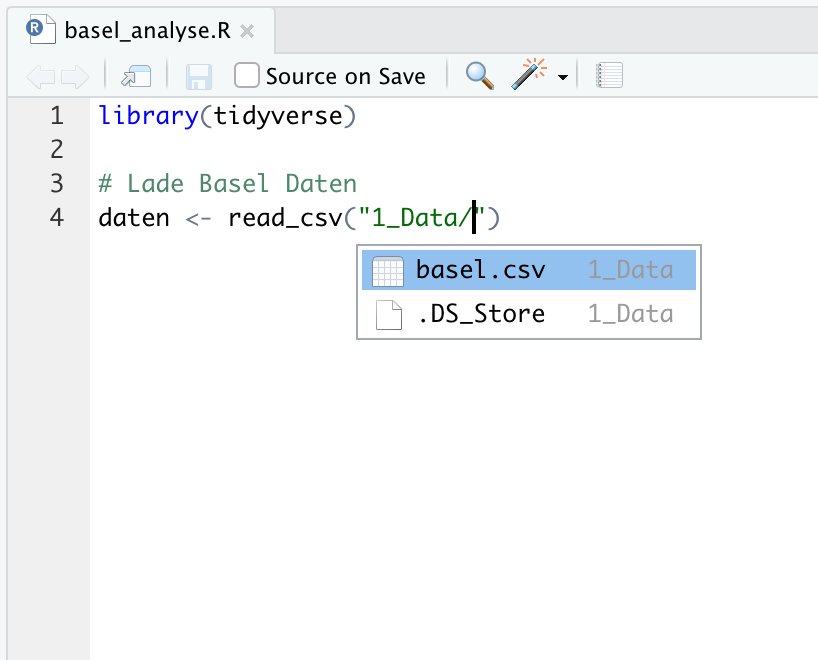

layout: true

<div class="my-footer">
  <span style="text-align:center">
    <span> 
      
    </span>
    <a href="https://therbootcamp.github.io/">
      <span style="padding-left:82px"> 
        <font color="#7E7E7E">
          www.therbootcamp.com
        </font>
      </span>
    </a>
    <a href="https://therbootcamp.github.io/">
      <font color="#7E7E7E">
       Explorative Datenanalyse mit R | März 2021
      </font>
    </a>
    </span>
  </div> 

---

```{r setup, include=FALSE}
options(htmltools.dir.version = FALSE)
# see: https://github.com/yihui/xaringan
# install.packages("xaringan")
# see: 
# https://github.com/yihui/xaringan/wiki
# https://github.com/gnab/remark/wiki/Markdown
options(width=110)
options(digits = 4)
require(tidyverse)
basel = readr::read_csv('1_data/basel.csv')
basel$alter[1:3] = c(44,65,31)
basel$geschlecht = ifelse(basel$geschlecht == "f", "W","M")
basel$geschlecht[1:3] = c("W","M","M") 
basel$groesse[1:3] = c(174,180,168)
```

<!---

.pull-left45[

# `Tidy` Daten

<ul>
  <li class="m1"><span>Jede Spalte ist eine Variable.</span></li>
  <li class="m2"><span>Jede Zeile ist eine Beobachtung.</span></li>
  <li class="m3"><span>Jede Zelle beinhaltet nur einen Wert.</span></li>
</ul>

<font style="font-size:16px">...nach <a href="https://github.com/tidyverse/tidyr">Hadley Wickham</a></font>

]

.pull-right45[
  <br><br><br>
  </img>
]

--->


# 3 Klassen von Datenobjekten

.pull-left4[

<high>`list`</high> - R's Mehrzweck-Container
- <span>Kann alle Daten beinhalten, inkl. `list`s</span>
- <span>Nützlich für komplexe Funktionsoutputs</span>

<high>`data.frame`</high> - R's Tabelle
- <span>Spezialfall einer `list`</span>
- <span>R's `Tidy`-Format für Daten

<high>`vector`</high> - R's Daten-Container
- <span>Primärer Daten-Container</span>
- <span>Beinhaltet Daten genau einer Klasse</span>

]

.pull-right55[
</img>
]


---

.pull-left45[

# data frame

<ul>
  <li class="m1"><span>Eine <mono>list</mono>e bestehend aus <high><mono>vector</mono>en gleicher Länge</high>.</span></li>
  <li class="m2"><span>Die <mono>vector</mono>en haben verschiedene <high>Klassen</high>: <mono>numeric</mono>, <mono>character</mono>, etc.</span></li>
  <li class="m3"><span>Verschiedene Varianten: <mono>data.frame</mono>, <mono>data.table</mono>, <highm>tibble</highm>.</span></li>
</ul>

]

.pull-right45[
  <br><br><br>
  </img>
  ]

---

.pull-left45[

# Inhalt ansehen

```{r, echo = F, message=F}
require(tibble)
options(tibble.width = 45, tibble.max_extra_cols = 0, tibble.print_max = 5,
        tibble.print_min = 5)
```

```{r, eval = T}
# printe basel
basel
```
]

.pull-right45[
  <br><br><br>
  </img>
  ]

---

.pull-left45[

# Inhalt ansehen

```{r, eval = F}
# Zeige den data frame in neuem tab
View(basel)
```

</img>
]

.pull-right45[
  <br><br><br>
  </img>
  ]

---

.pull-left45[

# Zugriff mit <high>`$`</high>

```{r, echo = F}
# Access age column from basel
options(max.print=14,width = 40,tibble.print_max = 3,tibble.width=40)
```

```{r}
# Extrahiere die Variable Alter
basel$alter

# Extrahiere die Variable Bildung
basel$bildung
```

]

.pull-right45[
  <br><br><br>
  </img>
  ]

---

.pull-left45[

# Verändern mit <high>`$`</high>

```{r, eval = T}
# Teile die Variable einkommen durch 1000
basel$einkommen <- basel$einkommen / 1000

# zeige data frame
basel
```

]

.pull-right45[
  <br><br><br>
  </img>
  ]

---

.pull-left45[

# `vector`

<ul>
  <li class="m1"><span>R's <high>primärer Daten-Container</high></span></li>
  <li class="m2"><span>Kann nur eine einzelne <high>Daten-Klasse</high> beinhalten (und fehlende Werte).</span></li>
  <li class="m3"><span>Daten-Klassen<br><br>
  <ul class="level">
    <li><span><highm>numeric</highm> - Alle Zahlen</span></li>
    <li><span><highm>character</highm> - Alle Zeichen (e.g., Namen)</span></li>
    <li><span><highm>logical</highm> - <mono>TRUE</mono> oder <mono>FALSE</mono></span></li>
    <li><span>...</span></li>
    <li><span><highm>NA</highm> - fehlende Werte</span></li>
  </ul>
  </span></li>
</ul>


]

.pull-right4[

  <br><br><br>

  </img>
  ]


---

# `numeric`

.pull-left45[

<highm>numeric</highm> Vektoren <high>beinhalten Zahlen</high> und nur Zahlen.

```{r, eval = F}
# Extrahiere die Variable Alter
basel$alter
```

```{r, echo = F}
# extract a numeric vectors
basel$alter[1:10]
```

```{r}
# Zeige die Klasse von Alter
class(basel$alter)

# Ist Alter numeric
is.numeric(basel$alter)
```

]

.pull-right4[
  </img>
  ]


---

# `character`

.pull-left45[

<highm>character</highm> Vektoren <high>beinhalten alle Zeichen</high> um die herum <high>Anführungszeichen</high> stehen.

```{r, eval = F}
# Extrahiere die Variable Geschlecht
basel$geschlecht
```

```{r, echo = F}
# Extrahiere die Variable Geschlecht
basel$geschlecht[1:8]
```

```{r, eval = F}
# Extrahiere die Variable Bildung
basel$bildung
```

```{r, echo = F}
# extract a numeric vectors
basel$bildung[1:8]
```


]

.pull-right4[
  </img>
  ]


---

# `character`

.pull-left45[

<highm>character</highm> Vektoren <high>beinhalten alle Zeichen</high> um die herum <high>Anführungszeichen</high> stehen.

```{r, eval = F}
# Extrahiere die Variable Alter
basel$alter
```

```{r, echo = F}
# extract a numeric vectors
basel$alter[1:10]
```

```{r, eval = F}
# Wandle Alter in character um
as.character(basel$alter)
```

```{r, echo = F}
# Wangle Alter in character um
as.character(basel$alter[1:10])
```

]

.pull-right4[
  </img>
  ]


---

# `logical`

.pull-left45[

<highm>logical</highm> Vektoren werden typischerweise durch <high>logische Vergleiche</high> erstellt und benutzt um in Data Frames oder Vektoren bestimmte <high>Fälle auszuwählen</high>. 

```{r, eval = F}
# Welche Werte in Geschlecht sind m
basel$geschlecht == "M"
```

```{r, echo = F}
# Welche Werte in Geschlecht sind m
basel$geschlecht[1:10] == "M"
```

```{r, eval = F}
# Welche Werte in Alteer sind kleiner 30
basel$alter < 50
```

```{r, echo = F}
# which ages are less than 30?
basel$alter[1:10] < 50
```

]

.pull-right4[
  </img>
  ]


---

# `logical`

.pull-left45[

<highm>logical</highm> Vektoren werden typischerweise durch <high>logische Vergleiche</high> erstellt und benutzt um in Data Frames oder Vektoren bestimmte <high>Fälle auszuwählen</high>. 

<u>Logische Operatoren</u>

<high>`==`</high> - ist gleich<br>
<high>`<`</high>, <high>`>`</high> - kleiner/grösser als<br>
<high>`<=`</high>, <high>`>=`</high> - kleiner/grösser als oder gleich<br>
<high>`&`</high>, <high>`&&`</high> - logisches UND<br>
<high>`|`</high>, <high>`||`</high> - logisches ODER<br>

]

.pull-right4[
  </img>
  ]

---

.pull-left45[

# Zugriff / Ändern via `[ ]`

```{r, eval = F}
# Extrahiere die Variable Alter
alter <- basel$alter
alter
```

```{r, echo = F}
# Extrahiere die Variable Alter
alter <- basel$alter[1:10]
alter
```

```{r, eval = T}
# Extrahiere zweiten Wert
alter[2]
```

```{r, eval = F}
# Ändere zweiten Wert
alter[2] <- 100
alter
```

Mehr Info [hier](http://rspatial.org/intr/rst/4-indexing.html).

]

.pull-right4[

  <br><br><br>

  </img>
  ]


---

<div class="center_text">
  <span>
  Input/Ouput
  </span>
</div> 


---

# Das <mono>tidyverse</mono>

<ul>
  <li class="m1"><span>Das <a href="https://www.tidyverse.org/"><mono>tidyverse</mono></a> ist eine Sammlung hoch-performanter, nutzerfreundlicher Pakete für eine effiziente Datenaufbereitung und -analyse.</span></li>
</ul>

<ol style="padding-left:72px">
  <li><high><mono>readr</mono> für Daten I/O</high>.</li>
  <li><high><mono>tibble</mono> für moderne <mono>data_frame</mono>'s</high>.</li>
  <li><mono>dplyr</mono> für Datenverarbeitung.</li>
  <li><mono>tidyr</mono> für Datenverarbeitung.</li>
  <li><mono>ggplot2</mono> für Grafiken.</li>
</ol>

<table style="cellspacing:0; cellpadding:0; border:none;padding-top:20px" width=90%>
  <col width="15%">
  <col width="15%">
  <col width="15%">
  <col width="15%">
  <col width="15%">
  <tr>
    <td bgcolor="white">
    </img>
    </td>
    <td bgcolor="white">
    </img>
    </td>
    <td bgcolor="white">
    </img>
    </td>
    <td bgcolor="white">
    </img>
    </td>
    <td bgcolor="white">
    </img>
    </td>
  </tr>
</table>


---

# Datentypen ausserhalb von R

<table class="tg"  style="cellspacing:0; cellpadding:0; border:none;" width="95%">
<col width=30%>
<col width=30%>
<col width=30%>
<tr>
  <td bgcolor = 'white' style='vertical-align:top'>
    <ul>
      <li class="m1"><span><high>Strukturierte Daten</high>
        <ul class="level">
        <li><span>Delimiter getrennt: <mono>.csv</mono>, <mono>.txt</mono>, etc.</span></li>
        <li><span>Relationale Datenbanken: <mono>SQL</mono></span></li>
        </ul>
        <br>
        </span></li>
      </ul>
    </td>
  <td bgcolor = 'white' style='vertical-align:top'>
    <ul>
      <li class="m2"><span><high>Semi-strukturierte Daten</high>
        <ul class="level">
        <li><span>Markup: <mono>.xml</mono>, <mono>.xls</mono>, <mono>.html</mono> etc.</span></li>
        <li><span>Non markup: <mono>JSON</mono>, <mono>MongoDB</mono></span></li>
        </ul>
        <br>
        </span></li>
      </ul>
    </td>
  <td bgcolor = 'white' style='vertical-align:top'>
    <ul>
      <li class="m3"><span><high>Unstrukturierte Daten</high>
        <ul class="level">
        <li><span>z.B. Text</span></li>
        </ul>
        <br><br><br><br><br2>
        </span></li>
      </ul>
    </td>
  </tr>
</table>


---

# <mono>readr</mono> 

.pull-left45[

<ul>
  <li class="m1"><span><high>Delimiter</high> separieren die Spalten.</span></li>
  <li class="m2"><span>Meist als <high>lokale Textdatei</high> vorliegend.</span></li>
  <li class="m3"><span><high>Datenklassen</high> werden inferiert.</span></li>
</ul>

<br>
<p align="center">
  
</p>

]

.pull-right45[

<p align="center">
  
</p>

]

---

# <mono>readr</mono> 

.pull-left45[

<ul>
  <li class="m1"><span><high>Delimiter</high> separieren die Spalten.</span></li>
  <li class="m2"><span>Meist als <high>lokale Textdatei</high> vorliegend.</span></li>
  <li class="m3"><span><high>Datenklassen</high> werden inferiert.</span></li>
</ul>

<br>
<p align="center">
  
</p>

]

.pull-right45[

```{r, echo = F, message=F}
require(tibble)
options(tibble.width = 35, tibble.max_extra_cols = 0, tibble.print_max = 3,
        tibble.print_min = 5)
```


```{r, message = F}
# Lese Basel Datensatz ein
basel <- read_csv("1_Data/basel.csv")

# Benutze expliziten Delimiter
basel <- read_delim("1_Data/basel.csv",
                   delim = ",")
basel

```

]

---

# <mono>tibble</mono> 

.pull-left45[

<ul>
  <li class="m1"><span>Schlanke Version des <high>data frames</high> mit:</span></li>
  <ul class="level">
    <li><span>Informativeren <high>Print</high></span></li>
    <li><span>Keinen <high>Faktoren</high></span></li>
    <li><span>Konsistenteres <high>Subsetting</high></span></li>
  </ul>
</ul>

<br>
<p align="center">
  
</p>

]

.pull-right45[

```{r, echo = F, message=F}
require(tibble)
options(tibble.width = 35, tibble.max_extra_cols = 0, tibble.print_max = 3,
        tibble.print_min = 5)
```


```{r, message = F}
# Lese Basel Datensatz ein
basel <- read_csv("1_Data/basel.csv")

# Benutze expliziten Delimiter
basel <- read_delim("1_Data/basel.csv",
                   delim = ",")
basel

```

]


---

# Den Filepath finden

.pull-left45[

<ul>
  <li class="m1"><span>Finde den Filepath mittels RStudio's <high>Auto-Complete</high>.</span></li>
  <li class="m2"><span>Setze den Cursor zwischen Anführungszeichen und drücke <highm>Tab</highm>.</span></li>
</ul>

<br>

<p align="center">
  </img>
</p>

] 

.pull-right45[

<p align="center">
  </img>
</p>

]

---

# Den Filepath finden

.pull-left45[

<ul>
  <li class="m1"><span>Finde den Filepath mittels RStudio's <high>Auto-Complete</high>.</span></li>
  <li class="m2"><span>Setze den Cursor zwischen Anführungszeichen und drücke <highm>Tab</highm>.</span></li>
</ul>

<br>

<p align="center">
  </img>
</p>

] 

.pull-right45[

<p align="center">
  </img>
</p>

]

---

# Inferierte Datentypen 

.pull-left45[


```{r}
# Lese Basel Datensatz ein
basel <- read_csv("1_Data/basel.csv")
```

]

.pull-right45[

</image>

]

---

# Inferierte Datentypen 

.pull-left45[

Manchmal ist es nötig `readr` etwas auf die Sprünge zu helfen, damit <high>Datentypen korrekt inferiert</high> werden. 

```{r, eval = F}
# Setze Symbol für fehlende Werte
basel <- read_csv("1_Data/basel.csv",
                  na = c('NA'))

# Re-inferiere Datentypen
basel <- type_convert(basel)
```
]

.pull-right45[

</image>

]

---

# Relationale Datenbanken <font style="font-size: 16px">siehe <a href="https://db.rstudio.com/">db.rstudio.com</a></font>

.pull-left45[

<ul>
  <li class="m1"><span>R kann direkt <high>auf Datenbanken arbeiten</high>: <mono>MySQL</mono>, <mono>MariaDB</mono>, <mono>BigQuery</mono>, <mono>Redshift</mono>, etc.<br><font style="font-size:16px">Siehe <a href="https://db.rstudio.com/databases">hier</a>.</font></span></li>
  <li class="m2"><span><mono>dplyr</mono> wird z.B. <high>automatisch übersetzt.</high></span></li>
</ul>

]

.pull-right45[

```{r, include=F}

require(DBI)
require(RMySQL)

```

```{r}
# Verbinge mit MySQL Datenbank
con <- dbConnect(MySQL(), 
         user='studiech_rbootca', 
         password='Du*5hA+7NU:8T', 
         dbname='studiech_rbootcamp', 
         host='studie.ch',
         port = 3306)

# Zeige Tabellen
dbListTables(con)

```

]


---

# Relationale Datenbanken <font style="font-size: 16px">siehe <a href="https://db.rstudio.com/">db.rstudio.com</a></font>

.pull-left45[

<ul>
  <li class="m1"><span>R kann direkt <high>auf Datenbanken arbeiten</high>: <mono>MySQL</mono>, <mono>MariaDB</mono>, <mono>BigQuery</mono>, <mono>Redshift</mono>, etc.<br><font style="font-size:16px">Siehe <a href="https://db.rstudio.com/databases">hier</a>.</font></span></li>
  <li class="m2"><span><mono>dplyr</mono> wird z.B. <high>automatisch übersetzt.</high></span></li>
</ul>

]

.pull-right45[

```{r, echo = F, message=F}
require(tibble)
options(tibble.width = 40, tibble.max_extra_cols = 0, tibble.print_max = 3,
        tibble.print_min = 5)
```

```{r}
# Extrahiere Tabelle Customers
basel <- tbl(con, "basel")
basel

```

]

---

# Relationale Datenbanken <font style="font-size: 16px">siehe <a href="https://db.rstudio.com/">db.rstudio.com</a></font>

.pull-left45[

<ul>
  <li class="m1"><span>R kann direkt <high>auf Datenbanken arbeiten</high>: <mono>MySQL</mono>, <mono>MariaDB</mono>, <mono>BigQuery</mono>, <mono>Redshift</mono>, etc.<br><font style="font-size:16px">Siehe <a href="https://db.rstudio.com/databases">hier</a>.</font></span></li>
  <li class="m2"><span><mono>dplyr</mono> wird z.B. <high>automatisch übersetzt.</high></span></li>
</ul>

]

.pull-right45[

```{r, echo = F, message=F}
require(tibble)
options(tibble.width = 40, tibble.max_extra_cols = 0, tibble.print_max = 3, max.print=10)
```

```{r, warning=F}
# Extrahiere Tabelle Customers
basel <- tbl(con, "basel")

# Extrahiere CompanyNamer Variable
basel %>% pull(konfession)

```

]


---

# Semi-strukturierte Daten <font style="font-size: 16px">mit <a href="https://github.com/r-lib/xml2"><mono>xml2</mono></a> und <a href="https://github.com/hadley/rvest"><mono>rvest</mono></a></font> 

```{r, echo = F, message=F}
library(xml2) ; library(rvest) ; library(tibble)
options(max.print=100, width=220,tibble.width = 90,tibble.print_min = 10)
```

```{r, message=F}
# Tabelle laden von Wikipedia (mit xml2 und rvest)
read_html("https://en.wikipedia.org/wiki/R_(programming_language)") %>%
  html_node(xpath = '//*[@id="mw-content-text"]/div/table[2]') %>%
  html_table() %>% as_tibble()
```


---

# Other data <font style="font-size: 16px">siehe <a href="https://cran.r-project.org/web/packages/rio/vignettes/rio.html">rio</a></font>

.pull-left45[
### `readr`  
```{r, eval = F}
# read fixed width files (can be fast)
data <- read_fwf(file, ...)

# read Apache style log files
data <- read_log(file, ...)

```

### `haven` 
```{r, eval = F}
# read SAS's .sas7bat and sas7bcat files
data <- read_sas(file, ...)

# read SPSS's .sav files
data <- read_sav(file, ...)

# etc
```
]

.pull-right45[
### `readxl` 
```{r, eval = F}
# read Excel's .xls and xlsx files
data <- read_excel(file, ...)
```
<br>
### Other
```{r, eval = F}
# Read Matlab .mat files
data <- R.matlab::readMat(file, ...)

# Read and wrangle .xml and .html
data <- XML::xmlParseParse(file, ...)

# from package jsonlite: read .json files
data <- jsonlite::read_json(file, ...)
```
]

---

class: middle, center

<h1><a href="https://www.dropbox.com/s/cfp1iibrl5nsmi3/TheRBootcamp.zip?dl=1" download>Projekt</a></h1>

---

class: middle, center

<h1><a href="https://therbootcamp.github.io/EDA_2021Mar/_sessions/Data/Data_practical.html">Practical</a></h1>


