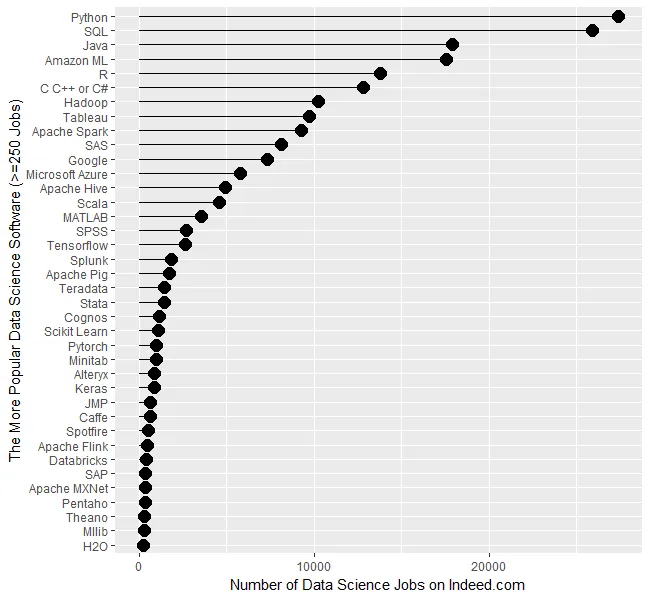
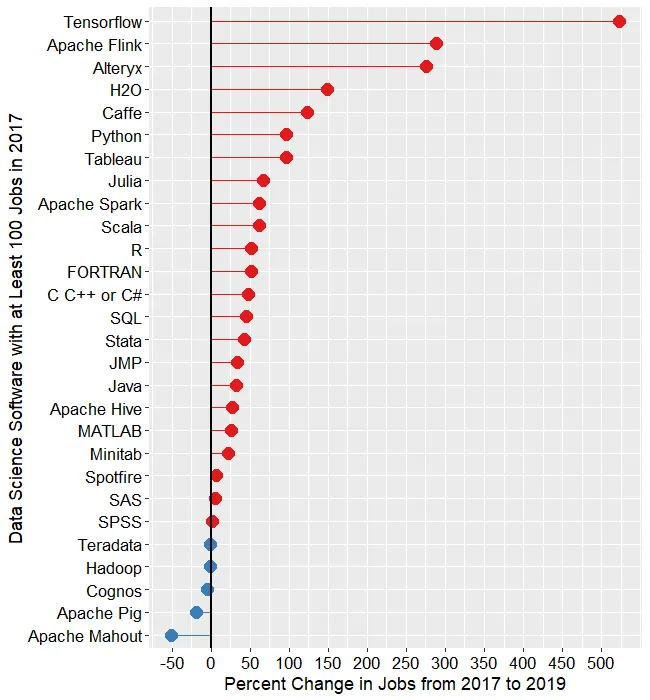
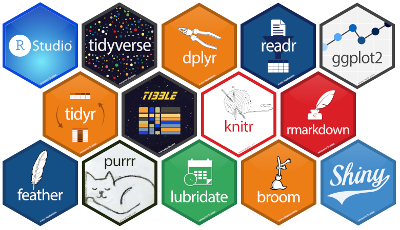
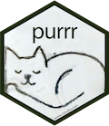
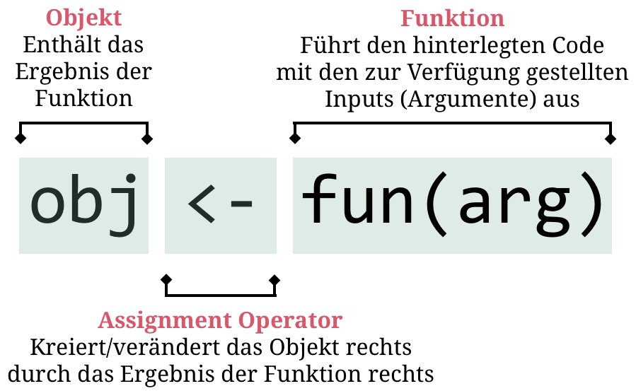
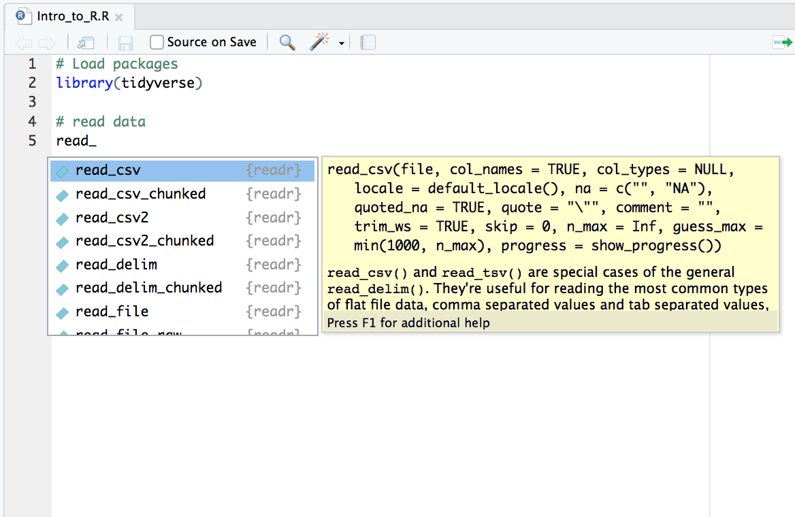
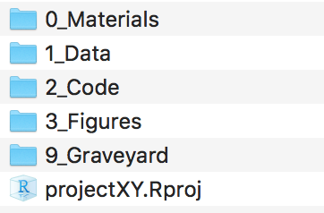

layout: true

<div class="my-footer">
  <span style="text-align:center">
    <span> 
      
    </span>
    <a href="https://therbootcamp.github.io/">
      <span style="padding-left:82px"> 
        <font color="#7E7E7E">
          www.therbootcamp.com
        </font>
      </span>
    </a>
    <a href="https://therbootcamp.github.io/">
      <font color="#7E7E7E">
       Explorative Datenanalyse mit R @ CSS | Dezember 2019
      </font>
    </a>
    </span>
  </div> 

---


```{r, eval = TRUE, echo = FALSE, warning=F,message=F}
# Code to knit slides
baselers <- readr::read_csv("data/baselers.csv")
```

```{r setup, include=FALSE}
options(htmltools.dir.version = FALSE)
# see: https://github.com/yihui/xaringan
# install.packages("xaringan")
# see: 
# https://github.com/yihui/xaringan/wiki
# https://github.com/gnab/remark/wiki/Markdown
options(width=110)
options(digits = 4)

require(tidyverse)
```

<!---
# R

From [Wikipedia](https://en.wikipedia.org/wiki/Statistical_model) (emphasis added):

> R is an **open source programming language** and software environment for **statistical computing and graphics** that is supported by the **R Foundation for Statistical Computing**. The R language is **widely used among statisticians and data miners** for developing statistical software and data analysis. Polls, surveys of data miners, and studies of scholarly literature databases show that **R's popularity has increased substantially in recent years**.

> R is a GNU package. The source code for the R software environment is written primarily in **C, Fortran, and R**. R is freely available under the GNU General Public License, and pre-compiled binary versions are provided for various operating systems. While R has a command line interface, there are several **graphical front-ends available**.


GNU's Not Unix!
GPL guarantees end users the freedom to run, study, share and modify the software
--->


# R ist eine Programmiersprache

Eine Programmiersprache ist eine <high>formale Sprache</high> die eine Reihe Instruktionen für alle möglichen Ziele spezifiziert. Programmiersprachen bestehen aus <high>instruktionen für einen Computer</high> und werden genutzt um <high>Algorithmen zu implementieren</high>.

.pull-left4[
<br>
### Algorithmus in Worten
1. Lade Daten
2. Extrahiere Variablen
3. Führe Analyse durch
4. Zeige Resultate
]

.pull-right6[
<br>
### Implementation in R
```{r, eval=F}
data <- read.table(link)
variables <- data[,c('gruppe','variable')]
analysis <- lm(variable ~ gruppe, data = variables)
summary(analysis)
```
]

---

# Warum R?

.pull-left45[

<p align = "center">
  <br>
  <font style="font-size:10px">siehe <a href="http://r4stats.com/articles/popularity/">r4stats.com</a></font>
</p>

]

.pull-right45[
<p align = "center">
  <br>
  <font style="font-size:10px">siehe <a href="http://r4stats.com/articles/popularity/">r4stats.com</a></font>
</p>

]

---

# R wird relevant bleiben

R ist de facto die <high>lingua franca</high> für Statistik und Datenanalyse. 

.pull-left45[
<br>
### Pro
1. **Open-source** und umsonst.
2. **Community** (e.g., [stackoverflow](https://stackoverflow.com/))
3. **Erweiterbarkeit** ([CRAN](https://cran.r-project.org/))
4. [**Tidyverse**](https://www.tidyverse.org/)
5. [**RStudio**](https://www.rstudio.com/)
6. **Produktivität**: [Latex](https://www.latex-project.org/), [Markdown](https://daringfireball.net/projects/markdown/), [GitHub](https://github.com/)
]

.pull-right45[
<br>
### Ehemals Contra
1. **Unschön**e Sprache wird überarbeitet ([Tidyverse](https://www.tidyverse.org/))
2. **Langsam**e Elemente werden ersetzt ([Rcpp](http://www.rcpp.org/))
3. **Brücken** zu externen Tools/Sprachen ([rPython](http://rpython.r-forge.r-project.org/), [tensorflow](https://tensorflow.rstudio.com/))

]

---

# Komponenten von R
<br>
<table class="tg"  style="cellspacing:0; cellpadding:0; border:none;" width="95%">
<col width="25%">
<col width="35%">
<col width="25%">
<tr valign="top">
  <td style="padding:20px">
  <p align = "center">
  <font style="font-size:28px"><i>R</i></font><br><br>
  <br>
  <font style="font-size:10px">adapted from <a href="https://cei.org/file/internet-server-farm">cei.org</a></font>
  </p>
  </td>
  <td style="padding:20px">
  <p align = "center">
  <font style="font-size:28px"><i>RStudio</i></font><br><br>
  <br>
  <font style="font-size:10px">adapted from <a href="https://rstudio.com/">rstudio.com</a></font>
</p>
  </td>
  <td style="padding:20px">
  <p align = "center">
  <font style="font-size:28px"><i>R Packages</i></font><br><br>
  <br>
  <font style="font-size:10px">adapted from <a href="https://towardsdatascience.com/ten-random-useful-things-in-r-that-you-might-not-know-about-54b2044a3868">towardsdatascience.com</a></font>
</p>
  </td>
</tr>
</table>

---

# Das mächtige `tidyverse`

Das [`tidyverse`](https://www.tidyverse.org/) ist im Kern eine Sammlung hoch-performanter, nutzerfreundlicher Pakete, die speziell für eine effizientere Datenanalyse entwickelt wurden. 
1. `ggplot2` für Grafiken.
2. `dplyr` für Datenverarbeitung</high>.
3. `tidyr` für Datenverarbeitung.
4. `readr` für Daten I/O.
5. `purrr` für funktionales Programmieren.
6. `tibble` für moderne `data.frame`s.
<br><br>


<table style="cellspacing:0; cellpadding:0; border:none;">
  <col width="15%">
  <col width="15%">
  <col width="15%">
  <col width="15%">
  <col width="15%">
  <col width="15%">
  <tr>
    <td bgcolor="white">
    </img>
    </td>
    <td bgcolor="white">
    </img>
    </td>
    <td bgcolor="white">
    </img>
    </td>
    <td bgcolor="white">
    </img>
    </td>
    <td bgcolor="white">
    </img>
    </td>
    <td bgcolor="white">
    </img>
    </td>
  </tr>
</table>

---

<div class="center_text">
  <span>
  10 grundlegende R Lektionen
  </span>
</div> 


---

# 10 grundlegende R Lektionen

.pull-left4[

<b>Syntax</b>
<ul>
  <li class="m1"><span>Der Assignment Operator <mono><-</mono></span></li>
  <li class="m2"><span><mono><-</mono> kreiert/verändert Objekte</span></li>
  <li class="m3"><span>Alles passiert durch Funktionen</span></li>
  <li class="m4"><span>Funktionen haben (Default) Argumente</span></li>
  <li class="m5"><span>Argumente erwarten Klassen</span></li>
  <li class="m6"><span>Findet Hilfe mit <mono>?</mono></span></li>
</ul>

<b>Produktivität</b>
<ul>
  <li class="m7"><span>Funktionen leben in Paketen</span></li>
  <li class="m8"><span>Lernt von Fehlern und Warnungen</span></li>
  <li class="m9"><span>Benutzt R in RStudio</span></li>
  <li class="m10"><span>Benutzt Projekte in Rstudio</span></li>
</ul>

]

---

# 10 grundlegende R Lektionen

.pull-left4[
<b>Syntax</b>
<ul>
  <li class="m1"><span><high>Der Assignment Operator <mono><-</mono></high></span></li>
  <li class="m2g"><span><mono><-</mono> kreiert/verändert Objekte</span></li>
  <li class="m3g"><span>Alles passiert durch Funktionen</span></li>
  <li class="m4g"><span>Funktionen haben (Default) Argumente</span></li>
  <li class="m5g"><span>Argumente erwarten Klassen</span></li>
  <li class="m6g"><span>Findet Hilfe mit <mono>?</mono></span></li>
</ul>

<b>Produktivität</b>
<ul>
  <li class="m7g"><span>Funktionen leben in Paketen</span></li>
  <li class="m8g"><span>Lernt von Fehlern und Warnungen</span></li>
  <li class="m9g"><span>Benutzt R in RStudio</span></li>
  <li class="m10g"><span>Benutzt Projekte in Rstudio</span></li>
</ul>
]


.pull-right5[

<p align="center">
  
</p>


]


---

# 10 grundlegende R Lektionen

.pull-left4[
<b>Syntax</b>
<ul>
  <li class="m1g"><span>Der Assignment Operator <mono><-</mono></span></li>
  <li class="m2"><span><high><mono><-</mono> kreiert/verändert Objekte</high></span></li>
  <li class="m3g"><span>Alles passiert durch Funktionen</span></li>
  <li class="m4g"><span>Funktionen haben (Default) Argumente</span></li>
  <li class="m5g"><span>Argumente erwarten Klassen</span></li>
  <li class="m6g"><span>Findet Hilfe mit <mono>?</mono></span></li>
</ul>

<b>Produktivität</b>
<ul>
  <li class="m7g"><span>Funktionen leben in Paketen</span></li>
  <li class="m8g"><span>Lernt von Fehlern und Warnungen</span></li>
  <li class="m9g"><span>Benutzt R in RStudio</span></li>
  <li class="m10g"><span>Benutzt Projekte in Rstudio</span></li>
</ul>
]


.pull-right5[
```{r}
# Ein Objekt namens eins_zwei_drei
eins_zwei_drei <- c(1, 2, 3)

# Printe das Objekt
print(eins_zwei_drei)

# Printe das Objekt
eins_zwei_drei

```
]

---

# 10 grundlegende R Lektionen

.pull-left4[
<b>Syntax</b>
<ul>
  <li class="m1g"><span>Der Assignment Operator <mono><-</mono></span></li>
  <li class="m2"><span><high><mono><-</mono> kreiert/verändert Objekte</high></span></li>
  <li class="m3g"><span>Alles passiert durch Funktionen</span></li>
  <li class="m4g"><span>Funktionen haben (Default) Argumente</span></li>
  <li class="m5g"><span>Argumente erwarten Klassen</span></li>
  <li class="m6g"><span>Findet Hilfe mit <mono>?</mono></span></li>
</ul>

<b>Produktivität</b>
<ul>
  <li class="m7g"><span>Funktionen leben in Paketen</span></li>
  <li class="m8g"><span>Lernt von Fehlern und Warnungen</span></li>
  <li class="m9g"><span>Benutzt R in RStudio</span></li>
  <li class="m10g"><span>Benutzt Projekte in Rstudio</span></li>
</ul>
]


.pull-right5[
```{r}
# Ein Objekt namens eins_zwei_drei
eins_zwei_drei <- c(1, 2, 3)

# Berechne den Mittelwert
mean(eins_zwei_drei)
```

]

---

# 10 grundlegende R Lektionen

.pull-left4[
<b>Syntax</b>
<ul>
  <li class="m1g"><span>Der Assignment Operator <mono><-</mono></span></li>
  <li class="m2"><span><high><mono><-</mono> kreiert/verändert Objekte</high></span></li>
  <li class="m3g"><span>Alles passiert durch Funktionen</span></li>
  <li class="m4g"><span>Funktionen haben (Default) Argumente</span></li>
  <li class="m5g"><span>Argumente erwarten Klassen</span></li>
  <li class="m6g"><span>Findet Hilfe mit <mono>?</mono></span></li>
</ul>

<b>Produktivität</b>
<ul>
  <li class="m7g"><span>Funktionen leben in Paketen</span></li>
  <li class="m8g"><span>Lernt von Fehlern und Warnungen</span></li>
  <li class="m9g"><span>Benutzt R in RStudio</span></li>
  <li class="m10g"><span>Benutzt Projekte in Rstudio</span></li>
</ul>
]


.pull-right5[
```{r}
# Ein Objekt namens eins_zwei_drei
eins_zwei_drei <- c(1, 2, 3)

# Berechne den Mittelwert
ergebnis <- mean(eins_zwei_drei)

# Benutze Ergebnis
ergebnis * 10
```

]

---

# 10 grundlegende R Lektionen

.pull-left4[
<b>Syntax</b>
<ul>
  <li class="m1g"><span>Der Assignment Operator <mono><-</mono></span></li>
  <li class="m2"><span><high><mono><-</mono> kreiert/verändert Objekte</high></span></li>
  <li class="m3g"><span>Alles passiert durch Funktionen</span></li>
  <li class="m4g"><span>Funktionen haben (Default) Argumente</span></li>
  <li class="m5g"><span>Argumente erwarten Klassen</span></li>
  <li class="m6g"><span>Findet Hilfe mit <mono>?</mono></span></li>
</ul>

<b>Produktivität</b>
<ul>
  <li class="m7g"><span>Funktionen leben in Paketen</span></li>
  <li class="m8g"><span>Lernt von Fehlern und Warnungen</span></li>
  <li class="m9g"><span>Benutzt R in RStudio</span></li>
  <li class="m10g"><span>Benutzt Projekte in Rstudio</span></li>
</ul>
]


.pull-right5[
```{r}
# Ein Objekt namens eins_zwei_drei
eins_zwei_drei <- c(1, 2, 3)

# Printe das Objekt
eins_zwei_drei

# Addiere 100
eins_zwei_drei + 100

# Printe das Objekt
eins_zwei_drei

```

]

---

# 10 grundlegende R Lektionen

.pull-left4[
<b>Syntax</b>
<ul>
  <li class="m1g"><span>Der Assignment Operator <mono><-</mono></span></li>
  <li class="m2"><span><high><mono><-</mono> kreiert/verändert Objekte</high></span></li>
  <li class="m3g"><span>Alles passiert durch Funktionen</span></li>
  <li class="m4g"><span>Funktionen haben (Default) Argumente</span></li>
  <li class="m5g"><span>Argumente erwarten Klassen</span></li>
  <li class="m6g"><span>Findet Hilfe mit <mono>?</mono></span></li>
</ul>

<b>Produktivität</b>
<ul>
  <li class="m7g"><span>Funktionen leben in Paketen</span></li>
  <li class="m8g"><span>Lernt von Fehlern und Warnungen</span></li>
  <li class="m9g"><span>Benutzt R in RStudio</span></li>
  <li class="m10g"><span>Benutzt Projekte in Rstudio</span></li>
</ul>
]


.pull-right5[
```{r}
# Ein Objekt namens eins_zwei_drei
eins_zwei_drei <- c(1, 2, 3)

# Printe das Objekt
eins_zwei_drei

# Ändere das Objekt
eins_zwei_drei <- eins_zwei_drei + 100

# Printe das Objekt
eins_zwei_drei

```

]


---

# 10 grundlegende R Lektionen

.pull-left4[
<b>Syntax</b>
<ul>
  <li class="m1g"><span>Der Assignment Operator <mono><-</mono></span></li>
  <li class="m2"><span><high><mono><-</mono> kreiert/verändert Objekte</high></span></li>
  <li class="m3g"><span>Alles passiert durch Funktionen</span></li>
  <li class="m4g"><span>Funktionen haben (Default) Argumente</span></li>
  <li class="m5g"><span>Argumente erwarten Klassen</span></li>
  <li class="m6g"><span>Findet Hilfe mit <mono>?</mono></span></li>
</ul>

<b>Produktivität</b>
<ul>
  <li class="m7g"><span>Funktionen leben in Paketen</span></li>
  <li class="m8g"><span>Lernt von Fehlern und Warnungen</span></li>
  <li class="m9g"><span>Benutzt R in RStudio</span></li>
  <li class="m10g"><span>Benutzt Projekte in Rstudio</span></li>
</ul>
]


.pull-right5[
```{r}
# Ein Objekt namens eins_zwei_drei
eins_zwei_drei <- c(1, 2, 3)

# Ergänze um weitere Zahl
und_vier <- c(eins_zwei_drei, 4)

# Printe das Objekt
und_vier

```

]

---

# 10 grundlegende R Lektionen

.pull-left4[
<b>Syntax</b>
<ul>
  <li class="m1g"><span>Der Assignment Operator <mono><-</mono></span></li>
  <li class="m2g"><span><mono><-</mono> kreiert/verändert Objekte</span></li>
  <li class="m3"><span><high>Alles passiert durch Funktionen</high></span></li>
  <li class="m4g"><span>Funktionen haben (Default) Argumente</span></li>
  <li class="m5g"><span>Argumente erwarten Klassen</span></li>
  <li class="m6g"><span>Findet Hilfe mit <mono>?</mono></span></li>
</ul>

<b>Produktivität</b>
<ul>
  <li class="m7g"><span>Funktionen leben in Paketen</span></li>
  <li class="m8g"><span>Lernt von Fehlern und Warnungen</span></li>
  <li class="m9g"><span>Benutzt R in RStudio</span></li>
  <li class="m10g"><span>Benutzt Projekte in Rstudio</span></li>
</ul>
]


.pull-right5[
<p align="center"></p>
]

---

# 10 grundlegende R Lektionen

.pull-left4[
<b>Syntax</b>
<ul>
  <li class="m1g"><span>Der Assignment Operator <mono><-</mono></span></li>
  <li class="m2g"><span><mono><-</mono> kreiert/verändert Objekte</span></li>
  <li class="m3"><span><high>Alles passiert durch Funktionen</high></span></li>
  <li class="m4g"><span>Funktionen haben (Default) Argumente</span></li>
  <li class="m5g"><span>Argumente erwarten Klassen</span></li>
  <li class="m6g"><span>Findet Hilfe mit <mono>?</mono></span></li>
</ul>

<b>Produktivität</b>
<ul>
  <li class="m7g"><span>Funktionen leben in Paketen</span></li>
  <li class="m8g"><span>Lernt von Fehlern und Warnungen</span></li>
  <li class="m9g"><span>Benutzt R in RStudio</span></li>
  <li class="m10g"><span>Benutzt Projekte in Rstudio</span></li>
</ul>
]


.pull-right5[
```{r}
# Funktion c()
eins_zwei_drei <- c(1, 2, 3)

# Funktion `+`()
eins_zwei_drei + 100

# Funktion print()
eins_zwei_drei

# Funktion mean()
mean(x = eins_zwei_drei)

```
]

---

# 10 grundlegende R Lektionen

.pull-left4[
<b>Syntax</b>
<ul>
  <li class="m1g"><span>Der Assignment Operator <mono><-</mono></span></li>
  <li class="m2g"><span><mono><-</mono> kreiert/verändert Objekte</span></li>
  <li class="m3g"><span>Alles passiert durch Funktionen</span></li>
  <li class="m4"><span><high>Funktionen haben (Default) Argumente</high></span></li>
  <li class="m5g"><span>Argumente erwarten Klassen</span></li>
  <li class="m6g"><span>Findet Hilfe mit <mono>?</mono></span></li>
</ul>

<b>Produktivität</b>
<ul>
  <li class="m7g"><span>Funktionen leben in Paketen</span></li>
  <li class="m8g"><span>Lernt von Fehlern und Warnungen</span></li>
  <li class="m9g"><span>Benutzt R in RStudio</span></li>
  <li class="m10g"><span>Benutzt Projekte in Rstudio</span></li>
</ul>
]


.pull-right5[
```{r, error=TRUE,tidy=T}
# Kein Argument
mean()

# Ein (notwendiges) Argument
mean(c(1, 2, 3))

# Hinzufügen eines fehlenden Werts (NA)
mean(c(1, 2, 3, NA))

```
]

---

# 10 grundlegende R Lektionen

.pull-left4[
<b>Syntax</b>
<ul>
  <li class="m1g"><span>Der Assignment Operator <mono><-</mono></span></li>
  <li class="m2g"><span><mono><-</mono> kreiert/verändert Objekte</span></li>
  <li class="m3g"><span>Alles passiert durch Funktionen</span></li>
  <li class="m4"><span><high>Funktionen haben (Default) Argumente</high></span></li>
  <li class="m5g"><span>Argumente erwarten Klassen</span></li>
  <li class="m6g"><span>Findet Hilfe mit <mono>?</mono></span></li>
</ul>

<b>Produktivität</b>
<ul>
  <li class="m7g"><span>Funktionen leben in Paketen</span></li>
  <li class="m8g"><span>Lernt von Fehlern und Warnungen</span></li>
  <li class="m9g"><span>Benutzt R in RStudio</span></li>
  <li class="m10g"><span>Benutzt Projekte in Rstudio</span></li>
</ul>
]


.pull-right5[
```{r, error=TRUE,tidy=T}
# Kein Argument
mean()

# Ein (notwendiges) Argument
mean(c(1, 2, 3))

# Ändere den Default zur Entfernung des NAs
mean(c(1, 2, 3, NA), na.rm = TRUE)

```
]


---

# 10 grundlegende R Lektionen

.pull-left4[
<b>Syntax</b>
<ul>
  <li class="m1g"><span>Der Assignment Operator <mono><-</mono></span></li>
  <li class="m2g"><span><mono><-</mono> kreiert/verändert Objekte</span></li>
  <li class="m3g"><span>Alles passiert durch Funktionen</span></li>
  <li class="m4g"><span>Funktionen haben (Default) Argumente</span></li>
  <li class="m5"><span><high>Argumente erwarten Klassen</high></span></li>
  <li class="m6g"><span>Findet Hilfe mit <mono>?</mono></span></li>
</ul>

<b>Produktivität</b>
<ul>
  <li class="m7g"><span>Funktionen leben in Paketen</span></li>
  <li class="m8g"><span>Lernt von Fehlern und Warnungen</span></li>
  <li class="m9g"><span>Benutzt R in RStudio</span></li>
  <li class="m10g"><span>Benutzt Projekte in Rstudio</span></li>
</ul>
]


.pull-right5[
```{r, error=TRUE,tidy=T}
# Berechne Mittelwert von c(1, 2, 3)
mean(c(1, 2, 3))

# Berechne Mittelwert von c("1", "2", "3")
mean(c("1", "2", "3"))
```
]

---

# 10 grundlegende R Lektionen

.pull-left4[
<b>Syntax</b>
<ul>
  <li class="m1g"><span>Der Assignment Operator <mono><-</mono></span></li>
  <li class="m2g"><span><mono><-</mono> kreiert/verändert Objekte</span></li>
  <li class="m3g"><span>Alles passiert durch Funktionen</span></li>
  <li class="m4g"><span>Funktionen haben (Default) Argumente</span></li>
  <li class="m5"><span><high>Argumente erwarten Klassen</high></span></li>
  <li class="m6g"><span>Findet Hilfe mit <mono>?</mono></span></li>
</ul>

<b>Produktivität</b>
<ul>
  <li class="m7g"><span>Funktionen leben in Paketen</span></li>
  <li class="m8g"><span>Lernt von Fehlern und Warnungen</span></li>
  <li class="m9g"><span>Benutzt R in RStudio</span></li>
  <li class="m10g"><span>Benutzt Projekte in Rstudio</span></li>
</ul>
]


.pull-right5[
```{r, error=TRUE,tidy=T}
# Klasse von c(1, 2, 3)
class(c(1, 2, 3))

# Klasse von c("1", "2", "3")
class(c("1", "2", "3"))
```
]

---

# 10 grundlegende R Lektionen

.pull-left4[
<b>Syntax</b>
<ul>
  <li class="m1g"><span>Der Assignment Operator <mono><-</mono></span></li>
  <li class="m2g"><span><mono><-</mono> kreiert/verändert Objekte</span></li>
  <li class="m3g"><span>Alles passiert durch Funktionen</span></li>
  <li class="m4g"><span>Funktionen haben (Default) Argumente</span></li>
  <li class="m5g"><span>Argumente erwarten Klassen</span></li>
  <li class="m6"><span><high>Findet Hilfe mit <mono>?</mono></high></span></li>
</ul>

<b>Produktivität</b>
<ul>
  <li class="m7g"><span>Funktionen leben in Paketen</span></li>
  <li class="m8g"><span>Lernt von Fehlern und Warnungen</span></li>
  <li class="m9g"><span>Benutzt R in RStudio</span></li>
  <li class="m10g"><span>Benutzt Projekte in Rstudio</span></li>
</ul>
]


.pull-right5[
```{r}
?mean
```
<p align="center"></p>
]

---

# 10 grundlegende R Lektionen

.pull-left4[
<b>Syntax</b>
<ul>
  <li class="m1g"><span>Der Assignment Operator <mono><-</mono></span></li>
  <li class="m2g"><span><mono><-</mono> kreiert/verändert Objekte</span></li>
  <li class="m3g"><span>Alles passiert durch Funktionen</span></li>
  <li class="m4g"><span>Funktionen haben (Default) Argumente</span></li>
  <li class="m5g"><span>Argumente erwarten Klassen</span></li>
  <li class="m6"><span><high>Findet Hilfe mit <mono>?</mono></high></span></li>
</ul>

<b>Produktivität</b>
<ul>
  <li class="m7g"><span>Funktionen leben in Paketen</span></li>
  <li class="m8g"><span>Lernt von Fehlern und Warnungen</span></li>
  <li class="m9g"><span>Benutzt R in RStudio</span></li>
  <li class="m10g"><span>Benutzt Projekte in Rstudio</span></li>
</ul>
]


.pull-right5[
```{r}
?mean
```
<p align="center"></p>
]

---

# 10 grundlegende R Lektionen

.pull-left4[
<b>Syntax</b>
<ul>
  <li class="m1g"><span>Der Assignment Operator <mono><-</mono></span></li>
  <li class="m2g"><span><mono><-</mono> kreiert/verändert Objekte</span></li>
  <li class="m3g"><span>Alles passiert durch Funktionen</span></li>
  <li class="m4g"><span>Funktionen haben (Default) Argumente</span></li>
  <li class="m5g"><span>Argumente erwarten Klassen</span></li>
  <li class="m6"><span><high>Findet Hilfe mit <mono>?</mono></high></span></li>
</ul>

<b>Produktivität</b>
<ul>
  <li class="m7g"><span>Funktionen leben in Paketen</span></li>
  <li class="m8g"><span>Lernt von Fehlern und Warnungen</span></li>
  <li class="m9g"><span>Benutzt R in RStudio</span></li>
  <li class="m10g"><span>Benutzt Projekte in Rstudio</span></li>
</ul>
]


.pull-right5[
```{r}
# Mittelwert von c(1, 2, 3)
mean(c(1, 2, 3))

# Mittelwert von c(TRUE, FALSE, TRUE)
mean(c(TRUE, FALSE, TRUE))

# Mittelwert von c("1", "2", "3")
mean(c("1", "2", "3"))
```

]

---

# 10 grundlegende R Lektionen

.pull-left4[
<b>Syntax</b>
<ul>
  <li class="m1g"><span>Der Assignment Operator <mono><-</mono></span></li>
  <li class="m2g"><span><mono><-</mono> kreiert/verändert Objekte</span></li>
  <li class="m3g"><span>Alles passiert durch Funktionen</span></li>
  <li class="m4g"><span>Funktionen haben (Default) Argumente</span></li>
  <li class="m5g"><span>Argumente erwarten Klassen</span></li>
  <li class="m6"><span><high>Findet Hilfe mit <mono>?</mono></high></span></li>
</ul>

<b>Produktivität</b>
<ul>
  <li class="m7g"><span>Funktionen leben in Paketen</span></li>
  <li class="m8g"><span>Lernt von Fehlern und Warnungen</span></li>
  <li class="m9g"><span>Benutzt R in RStudio</span></li>
  <li class="m10g"><span>Benutzt Projekte in Rstudio</span></li>
</ul>
]


.pull-right5[
```{r}
?mean
```
<p align="center"></p>
]


---

# 10 grundlegende R Lektionen

.pull-left4[
<b>Syntax</b>
<ul>
  <li class="m1g"><span>Der Assignment Operator <mono><-</mono></span></li>
  <li class="m2g"><span><mono><-</mono> kreiert/verändert Objekte</span></li>
  <li class="m3g"><span>Alles passiert durch Funktionen</span></li>
  <li class="m4g"><span>Funktionen haben (Default) Argumente</span></li>
  <li class="m5g"><span>Argumente erwarten Klassen</span></li>
  <li class="m6"><span><high>Findet Hilfe mit <mono>?</mono></high></span></li>
</ul>

<b>Produktivität</b>
<ul>
  <li class="m7g"><span>Funktionen leben in Paketen</span></li>
  <li class="m8g"><span>Lernt von Fehlern und Warnungen</span></li>
  <li class="m9g"><span>Benutzt R in RStudio</span></li>
  <li class="m10g"><span>Benutzt Projekte in Rstudio</span></li>
</ul>
]


.pull-right5[
```{r, error = T}
# Mittelwert von c(1, 2, 3, NA)
mean(c(1, 2, 3, NA), na.rm = TRUE)

# Mittelwert von c(1, 2, 3, NA)
mean(c(1, 2, 3, NA), na.rm = "TRUE")

# Mittelwert von c(1, 2, 3, NA)
mean(c(1, 2, 3, NA), na.rm = "ABCD")
```

]

---

# 10 grundlegende R Lektionen

.pull-left4[
<b>Syntax</b>
<ul>
  <li class="m1g"><span>Der Assignment Operator <mono><-</mono></span></li>
  <li class="m2g"><span><mono><-</mono> kreiert/verändert Objekte</span></li>
  <li class="m3g"><span>Alles passiert durch Funktionen</span></li>
  <li class="m4g"><span>Funktionen haben (Default) Argumente</span></li>
  <li class="m5g"><span>Argumente erwarten Klassen</span></li>
  <li class="m6"><span><high>Findet Hilfe mit <mono>?</mono></high></span></li>
</ul>

<b>Produktivität</b>
<ul>
  <li class="m7g"><span>Funktionen leben in Paketen</span></li>
  <li class="m8g"><span>Lernt von Fehlern und Warnungen</span></li>
  <li class="m9g"><span>Benutzt R in RStudio</span></li>
  <li class="m10g"><span>Benutzt Projekte in Rstudio</span></li>
</ul>
]


.pull-right5[
```{r}
# Klasse von TRUE
class(TRUE)

# Klasse von "TRUE"
class("TRUE")

# Klasse von "ABCD"
class("ABCD")
```

]

---

# 10 grundlegende R Lektionen

.pull-left4[
<b>Syntax</b>
<ul>
  <li class="m1g"><span>Der Assignment Operator <mono><-</mono></span></li>
  <li class="m2g"><span><mono><-</mono> kreiert/verändert Objekte</span></li>
  <li class="m3g"><span>Alles passiert durch Funktionen</span></li>
  <li class="m4g"><span>Funktionen haben (Default) Argumente</span></li>
  <li class="m5g"><span>Argumente erwarten Klassen</span></li>
  <li class="m6"><span><high>Findet Hilfe mit <mono>?</mono></high></span></li>
</ul>

<b>Produktivität</b>
<ul>
  <li class="m7g"><span>Funktionen leben in Paketen</span></li>
  <li class="m8g"><span>Lernt von Fehlern und Warnungen</span></li>
  <li class="m9g"><span>Benutzt R in RStudio</span></li>
  <li class="m10g"><span>Benutzt Projekte in Rstudio</span></li>
</ul>
]


.pull-right5[
```{r}
# Wandle "TRUE" in logical um
as.logical("TRUE")

# Wandle "ABCD" in logical um
as.logical("ABCD")
```

]


---

# 10 grundlegende R Lektionen

.pull-left4[
<b>Syntax</b>
<ul>
  <li class="m1g"><span>Der Assignment Operator <mono><-</mono></span></li>
  <li class="m2g"><span><mono><-</mono> kreiert/verändert Objekte</span></li>
  <li class="m3g"><span>Alles passiert durch Funktionen</span></li>
  <li class="m4g"><span>Funktionen haben (Default) Argumente</span></li>
  <li class="m5g"><span>Argumente erwarten Klassen</span></li>
  <li class="m6g"><span>Findet Hilfe mit <mono>?</mono></span></li>
</ul>

<b>Produktivität</b>
<ul>
  <li class="m7g"><span>Funktionen leben in Paketen</span></li>
  <li class="m8g"><span>Lernt von Fehlern und Warnungen</span></li>
  <li class="m9g"><span>Benutzt R in RStudio</span></li>
  <li class="m10g"><span>Benutzt Projekte in Rstudio</span></li>
</ul>
]


.pull-right5[
<p align="center"><br><br><br><br><br><font style="font-size:48px"><i>Kurze<br>Pause?</i></font></p>
]

---

# 10 grundlegende R Lektionen

.pull-left4[
<b>Syntax</b>
<ul>
  <li class="m1g"><span>Der Assignment Operator <mono><-</mono></span></li>
  <li class="m2g"><span><mono><-</mono> kreiert/verändert Objekte</span></li>
  <li class="m3g"><span>Alles passiert durch Funktionen</span></li>
  <li class="m4g"><span>Funktionen haben (Default) Argumente</span></li>
  <li class="m5g"><span>Argumente erwarten Klassen</span></li>
  <li class="m6g"><span>Findet Hilfe mit <mono>?</mono></span></li>
</ul>

<b>Produktivität</b>
<ul>
  <li class="m7"><span><high>Funktionen leben in Paketen</high></span></li>
  <li class="m8g"><span>Lernt von Fehlern und Warnungen</span></li>
  <li class="m9g"><span>Benutzt R in RStudio</span></li>
  <li class="m10g"><span>Benutzt Projekte in Rstudio</span></li>
</ul>
]


.pull-right5[
<p align="center"></p>
]

---

# 10 grundlegende R Lektionen

.pull-left4[
<b>Syntax</b>
<ul>
  <li class="m1g"><span>Der Assignment Operator <mono><-</mono></span></li>
  <li class="m2g"><span><mono><-</mono> kreiert/verändert Objekte</span></li>
  <li class="m3g"><span>Alles passiert durch Funktionen</span></li>
  <li class="m4g"><span>Funktionen haben (Default) Argumente</span></li>
  <li class="m5g"><span>Argumente erwarten Klassen</span></li>
  <li class="m6g"><span>Findet Hilfe mit <mono>?</mono></span></li>
</ul>

<b>Produktivität</b>
<ul>
  <li class="m7"><span><high>Funktionen leben in Paketen</high></span></li>
  <li class="m8g"><span>Lernt von Fehlern und Warnungen</span></li>
  <li class="m9g"><span>Benutzt R in RStudio</span></li>
  <li class="m10g"><span>Benutzt Projekte in Rstudio</span></li>
</ul>
]


.pull-right5[

<iframe src="https://www.rdocumentation.org/trends?page1=1&sort1=total&page2=1&sort2=total&page3=1&page4=1" width="500" height="400" frameborder="0" marginheight="0" marginwidth="0" zoom="0.5"></iframe>

<p align="center">
<font style="font-size:10px">siehe <a href="https://www.rdocumentation.org/trends">www.rdocumentation.org/trends
  </a></font>
</p>

]


---

# 10 grundlegende R Lektionen

.pull-left4[
<b>Syntax</b>
<ul>
  <li class="m1g"><span>Der Assignment Operator <mono><-</mono></span></li>
  <li class="m2g"><span><mono><-</mono> kreiert/verändert Objekte</span></li>
  <li class="m3g"><span>Alles passiert durch Funktionen</span></li>
  <li class="m4g"><span>Funktionen haben (Default) Argumente</span></li>
  <li class="m5g"><span>Argumente erwarten Klassen</span></li>
  <li class="m6g"><span>Findet Hilfe mit <mono>?</mono></span></li>
</ul>

<b>Produktivität</b>
<ul>
  <li class="m7"><span><high>Funktionen leben in Paketen</high></span></li>
  <li class="m8g"><span>Lernt von Fehlern und Warnungen</span></li>
  <li class="m9g"><span>Benutzt R in RStudio</span></li>
  <li class="m10g"><span>Benutzt Projekte in Rstudio</span></li>
</ul>
]


.pull-right5[

<high>Installiere</high> Pakete <high>einmal</high> mit `install.packages()`

```{r, eval = FALSE}
install.packages("tidyverse")
```
<br2>
<high>Lade</high> existierende Pakete <high>jedes mal</high> mit `library()`

```{r, eval = FALSE}
library(tidyverse)
```

<p align="left"></p>
]


---

# 10 grundlegende R Lektionen

.pull-left4[
<b>Syntax</b>
<ul>
  <li class="m1g"><span>Der Assignment Operator <mono><-</mono></span></li>
  <li class="m2g"><span><mono><-</mono> kreiert/verändert Objekte</span></li>
  <li class="m3g"><span>Alles passiert durch Funktionen</span></li>
  <li class="m4g"><span>Funktionen haben (Default) Argumente</span></li>
  <li class="m5g"><span>Argumente erwarten Klassen</span></li>
  <li class="m6g"><span>Findet Hilfe mit <mono>?</mono></span></li>
</ul>

<b>Produktivität</b>
<ul>
  <li class="m7g"><span>Funktionen leben in Paketen</span></li>
  <li class="m8"><span><high>Lernt von Fehlern und Warnungen</high></span></li>
  <li class="m9g"><span>Benutzt R in RStudio</span></li>
  <li class="m10g"><span>Benutzt Projekte in Rstudio</span></li>
</ul>
]

.pull-right5[

```{r, eval=F}
# Message: Interessant
basel <- type_convert(baselers)
```

```{r, echo=F, error=T}
# Message: interessant
basel <- type_convert(baselers[1:6])
```

```{r, error=T}
# Warning: Wichtig
result <- mean('NA')

# Error: Beheben
lenth(x = 1)

```

]

---

# 10 grundlegende R Lektionen

.pull-left4[
<b>Syntax</b>
<ul>
  <li class="m1g"><span>Der Assignment Operator <mono><-</mono></span></li>
  <li class="m2g"><span><mono><-</mono> kreiert/verändert Objekte</span></li>
  <li class="m3g"><span>Alles passiert durch Funktionen</span></li>
  <li class="m4g"><span>Funktionen haben (Default) Argumente</span></li>
  <li class="m5g"><span>Argumente erwarten Klassen</span></li>
  <li class="m6g"><span>Findet Hilfe mit <mono>?</mono></span></li>
</ul>

<b>Produktivität</b>
<ul>
  <li class="m7g"><span>Funktionen leben in Paketen</span></li>
  <li class="m8"><span><high>Lernt von Fehlern und Warnungen</high></span></li>
  <li class="m9g"><span>Benutzt R in RStudio</span></li>
  <li class="m10g"><span>Benutzt Projekte in Rstudio</span></li>
</ul>
]

.pull-right5[

<p style="top:250px"> </p>

| Fehler | Beschreibung |
|:------|:--------------------------------------------|
| `'could not find function'`| Typo oder Paket nicht geladen|
| `'error in eval'`| Ein Objekt wird verwendet, dass nicht existiert.|
| `'cannot open()'`| Typo oder fehlende Ordner im Pfad.|
| `'no applicable method'`| Funktion erwartet andere Klassen. |
| package errors | Fehler im installieren, kompilieren, oder laden von Paketen. |

]

---

# 10 grundlegende R Lektionen

.pull-left4[
<b>Syntax</b>
<ul>
  <li class="m1g"><span>Der Assignment Operator <mono><-</mono></span></li>
  <li class="m2g"><span><mono><-</mono> kreiert/verändert Objekte</span></li>
  <li class="m3g"><span>Alles passiert durch Funktionen</span></li>
  <li class="m4g"><span>Funktionen haben (Default) Argumente</span></li>
  <li class="m5g"><span>Argumente erwarten Klassen</span></li>
  <li class="m6g"><span>Findet Hilfe mit <mono>?</mono></span></li>
</ul>

<b>Produktivität</b>
<ul>
  <li class="m7g"><span>Funktionen leben in Paketen</span></li>
  <li class="m8g"><span>Lernt von Fehlern und Warnungen</span></li>
  <li class="m9"><span><high>Benutzt R in RStudio</high></span></li>
  <li class="m10g"><span>Benutzt Projekte in Rstudio</span></li>
</ul>
]

.pull-right5[

<p align = "center">
  
</p>

]

---

# 10 grundlegende R Lektionen

.pull-left4[
<b>Syntax</b>
<ul>
  <li class="m1g"><span>Der Assignment Operator <mono><-</mono></span></li>
  <li class="m2g"><span><mono><-</mono> kreiert/verändert Objekte</span></li>
  <li class="m3g"><span>Alles passiert durch Funktionen</span></li>
  <li class="m4g"><span>Funktionen haben (Default) Argumente</span></li>
  <li class="m5g"><span>Argumente erwarten Klassen</span></li>
  <li class="m6g"><span>Findet Hilfe mit <mono>?</mono></span></li>
</ul>

<b>Produktivität</b>
<ul>
  <li class="m7g"><span>Funktionen leben in Paketen</span></li>
  <li class="m8g"><span>Lernt von Fehlern und Warnungen</span></li>
  <li class="m9"><span><high>Benutzt R in RStudio</high></span></li>
  <li class="m10g"><span>Benutzt Projekte in Rstudio</span></li>
</ul>
]

.pull-right5[

<p align = "left">
  
<br><br><br>
Shortcut für <high>schicke Code zur Console</high>:<br><br2><font size = 6>&#8984;/ctrl + &#9166;</font><br><br2><br2>
Shortcut für <high>führe Chunk wiederholt aus</high>:<br><br2><font size = 6>  &#8984;/ctrl + &#8679; + p</font>
</p>

]

---

# 10 grundlegende R Lektionen

.pull-left4[
<b>Syntax</b>
<ul>
  <li class="m1g"><span>Der Assignment Operator <mono><-</mono></span></li>
  <li class="m2g"><span><mono><-</mono> kreiert/verändert Objekte</span></li>
  <li class="m3g"><span>Alles passiert durch Funktionen</span></li>
  <li class="m4g"><span>Funktionen haben (Default) Argumente</span></li>
  <li class="m5g"><span>Argumente erwarten Klassen</span></li>
  <li class="m6g"><span>Findet Hilfe mit <mono>?</mono></span></li>
</ul>

<b>Produktivität</b>
<ul>
  <li class="m7g"><span>Funktionen leben in Paketen</span></li>
  <li class="m8g"><span>Lernt von Fehlern und Warnungen</span></li>
  <li class="m9"><span><high>Benutzt R in RStudio</high></span></li>
  <li class="m10g"><span>Benutzt Projekte in Rstudio</span></li>
</ul>
]

.pull-right5[

<p align = "center">
  
</p>

]


---

# 10 grundlegende R Lektionen

.pull-left4[
<b>Syntax</b>
<ul>
  <li class="m1g"><span>Der Assignment Operator <mono><-</mono></span></li>
  <li class="m2g"><span><mono><-</mono> kreiert/verändert Objekte</span></li>
  <li class="m3g"><span>Alles passiert durch Funktionen</span></li>
  <li class="m4g"><span>Funktionen haben (Default) Argumente</span></li>
  <li class="m5g"><span>Argumente erwarten Klassen</span></li>
  <li class="m6g"><span>Findet Hilfe mit <mono>?</mono></span></li>
</ul>

<b>Produktivität</b>
<ul>
  <li class="m7g"><span>Funktionen leben in Paketen</span></li>
  <li class="m8g"><span>Lernt von Fehlern und Warnungen</span></li>
  <li class="m9g"><span>Benutzt R in RStudio</span></li>
  <li class="m10"><span><high>Benutzt Projekte in Rstudio</high></span></li>
</ul>
]

.pull-right5[

<b>Projekte helfen bei...</b><br>
workspace und history speichern &#9679; projektspezifische Optionen setzen &#9679; Dateien finden &#9679; Versionskontrolle &#9679; etc.
<br><br>
<p align = "left">
  
</p>


]

---

class: middle, center

<h1><a href="https://therbootcamp.github.io/EDA_2019CSS/1_Data/TheRBootcamp_EDA_2019CSS_data.zip">Downloads</a></h1>

---

class: middle, center

<h1><a>Interactive</a></h1>


