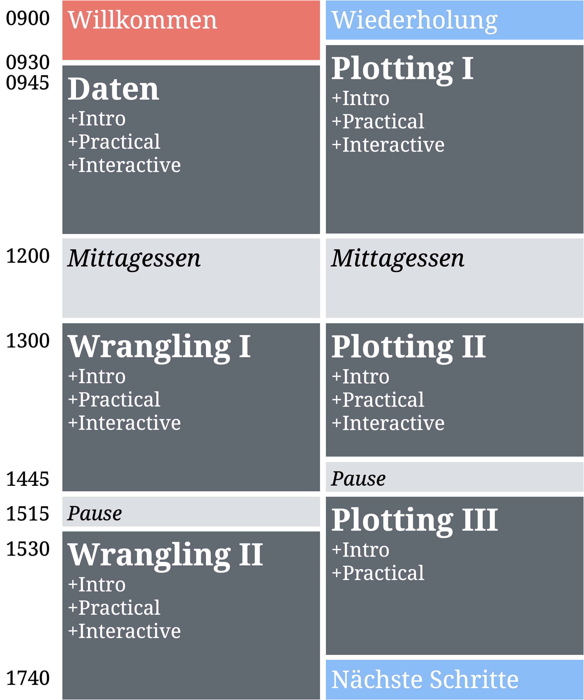

layout: true

<div class="my-footer">
  <span style="text-align:center">
    <span> 
      
    </span>
    <a href="https://therbootcamp.github.io/">
      <span style="padding-left:82px"> 
        <font color="#7E7E7E">
          www.therbootcamp.com
        </font>
      </span>
    </a>
    <a href="https://therbootcamp.github.io/">
      <font color="#7E7E7E">
       Explorative Datenanalyse mit R | März 2021
      </font>
    </a>
    </span>
  </div> 

---

```{r setup, include=FALSE}
options(htmltools.dir.version = FALSE)
# see: https://github.com/yihui/xaringan
# install.packages("xaringan")
# see: 
# https://github.com/yihui/xaringan/wiki
# https://github.com/gnab/remark/wiki/Markdown
options(width=110)
options(digits = 4)
library(tidyverse)
```


.pull-left45[

<br><br><br><br><br>

# Hallo Tidyverse Experten

Nach zwei Tagen kennt ihr nun die Grundlagen von R und des Tidyverse!

]

.pull-right4[


]

---

.pull-left2[

# "Tidyverse" kann noch mehr

]

.pull-right75[

<p align = "center">
  <br><br>
  </img><br>
  <font style="font-size:10px">from <a href="https://www.mitchelloharawild.com/blog/hexwall/">mitchelloharawild.com</a></font>
</p>

]

---

# Nächste Schritte

.pull-left5[
<font size = 4><i>
<font size = 6>
1. Anwenden<br>
2. Bücher<br>
3. Webseiten<br>
4. Hilfe & Consulting<br>
5. Weiterführende Kurse<br>
]

</font>
<br>

.pull-right5[
<p align="center"></p>
]

---

# Bücher  

Hier ist eine unvollständige Liste guter Bücher über R lose geordnet nach vorausgesetzter Erfahrung.<br><br>

<table width="80%" style="cellspacing:0; cellpadding:0; border:none;">

  <tr>    

  <td> 
  <a href="http://r4ds.had.co.nz/"></a>
  </td>

  <td>
  <a href="https://covers.oreillystatic.com/images/0636920028574/cat.gif"></a>
  </td>

  <td> 
  <a href="https://ggplot2-book.org/"></a>
  </td>

  <td>
  <a href="https://www.springer.com/de/book/9783540799979"></a>
  </td>
  
  <td>
  <a href="https://bookdown.org/ndphillips/YaRrr/"></a>
  </td>
  
  <td>
  <a href="https://www.orellfuessli.ch/shop/home/artikeldetails/ID35367941.html?ProvID=10917736&gclid=Cj0KCQiAg_HhBRDNARIsAGHLV5238Q26gQmFttHRnYGjcAhz4CslStb-3qBegvuZS5gnCpWSLNlQvF0aAgfOEALw_wcB"></a>
  </td>
  
  </tr>
  

  <tr style="background-color:#ffffff">

  <td>
  <a href="http://appliedpredictivemodeling.com/"></a>
  </td>
  
  <td>
  <a href="http://www-bcf.usc.edu/~gareth/ISL/ISLR%20First%20Printing.pdf"></a>
  </td>
  
  <td>
  <a href="https://www.manning.com/books/deep-learning-with-r"></a>
  </td>


  <td>
  <a href="https://csgillespie.github.io/efficientR/"></a>
  </td>

  <td>
  <a href="www.rcpp.org/"></a>
  </td>
  
  
  <td>
  <a href="http://adv-r.had.co.nz/"></a>
  </td>


  </tr>
  


</table>
<br>


---

.pull-left4[

# Webseiten

Das Netz ist vll. der beste Ort für Informationen über R.

<font size = 4><i>Beginnt eure Suche mit:</i></font>

[Google](www.google.com). Stellt sicher, dass ihr *R* oder *Rproject* mit in eurer Suche habt. 

<br>
<font size = 4><i>Meistens werdet ihr dann weitergeleitet zu:</i></font>

[R-bloggers](www.r-bloggers.com) informiert euch über die neusten R Entwicklungen. Meldet euch für den Newsletter an.

[Stackoverflow](https://stackoverflow.com/questions/tagged/r) ist eine Seite für R Probleme und Lösungen. Versucht selbst mal ein Problem zu posten. Oft bekommt ihr erstaunlich schnell Antwort.

]

.pull-right5[
<p align="left" style="padding: 0 0px"><br><br><br><br><br><br><br><br><br>
    <a href="https://www.google.com/"></a><br><br><br2>
    <a href="https://www.r-bloggers.com/"></a><br>
  <a href="https://stackoverflow.com/"></a>
</p>
]

---

# Support

<table width=80% class="tg"  style="cellspacing:0; cellpadding:0; border:none">
  <col width="50%">
  <col width="50%">
  <tr>
    <th class="tg-yw4l" valign='top'>
    <p align="center"><br>
    <a href="www.dirkwulff.org"></a><br>
    <p align="center">
    <font size = 5>Dr. Dirk Wulff</font><br><br>
    <a href="www.dirkwulff.org"><b>dirkwulff.org</b></a><br>
    <a href="https://github.com/dwulff"><b>github.com/dwulff</b></a><br>
    <font size=4><i>packages: </i></font> 
    <a href="https://cran.r-project.org/web/packages/cstab/index.html"><b>cstab</b></a>, <br>
    <a href="https://cran.r-project.org/web/packages/mousetrap/index.html"><b>mousetrap</b></a>, <a href="https://cran.r-project.org/web/packages/memnet/index.html"><b>memnet</b> <a href="https://github.com/dwulff/choicepp"><b>choicepp</b>
    </p>  
  </th>

  <th class="tg-yw4l" valign='top'>
    <p align="center">
    <p align="center"><br>
    <a href="https://www.schulte-mecklenbeck.com/"></a><br>
    <p align="center">
    <font size = 5>Dr. Michael Schulte-<br>Mecklenbeck</font><br><br>
    <a href="www.schulte-mecklenbeck.com"><b>schulte-mecklenbeck.com</b></a><br>
    <a href="https://github.com/schultem"><b>github.com/schultem</b></a><br><br>
    </p>
  </th>


</tr>

</table>

---


# Weiterführende Kurse


<table class="tg"  style="cellspacing:0; cellpadding:0; border:none;">
<tr valign="top">
  <col width="20%">
  <col width="20%">
  <col width="20%">
  <col width="20%">
  <col width="20%">
  <td>
    <p align="center">
      <a class="project-link" href="https://therbootcamp.github.io/#courses" align="center">
      <font style="font-size:20px;weight:700"><br>Einführung in die moderne Datenanalyse mit R</font><br>
      <br>
      </img><br><br>
      <high>März 31,<br>2020</high><br><br><br><br>
    </p>
  </td>
  <td>
    <p align="center">
      <a class="project-link" href="https://therbootcamp.github.io/#courses" align="center">
      <font style="font-size:20px;weight:700"><br>Explorative Datenanalyse mit R<br></font><br>
      <br>
      </img><br><br>
      <high>März 19/20,<br>2020</high><br><br><br><br>
    </p>
  </td>
  <td>
    <p align="center">
      <a class="project-link" href="https://therbootcamp.github.io/#courses" align="center">
      <font style="font-size:20px;weight:700"><br>Statistik mit R<br><br></font><br>
      <br>
      </img><br><br>
      <high>Statistik 16/17,<br>2020</high><br><br><br><br>
      </a>
    </p>
  </td>
  <td>
    <p align="center">
      <a class="project-link" href="https://therbootcamp.github.io/#courses" align="center">
      <font style="font-size:20px;weight:700"><br>Maschinelles Lernen mit R<br></font><br>
      <br>
      </img><br><br>
      <high>Mai 14/15,<br>2020</high><br><br><br><br>
      </a>
    </p>
  </td>
  <td>
    <p align="center">
      <a class="project-link" href="https://therbootcamp.github.io/#courses" align="center">
      <font style="font-size:20px;weight:700"><br>Reporting mit R<br><br></font><br>
      <br>
      </img><br><br>
      <high>Juni 25/26,<br>2020</high><br><br><br><br>
      </a>
    </p>
  </td>
  </tr>


---

.pull-left45[
# Bitte gebt uns Feedback
<br><br>

<p align = "center">
  </img><br>
  <font style="font-size:10px">from <a href="https://cdn-images-1.medium.com/max/1600/1*5OZNYAfzDZfM1lwJBZEuHQ.png">medium.com</a></font>
</p>

]

.pull-right45[

<p align="center"><br><br>
<iframe src="ttps://docs.google.com/forms/d/e/1FAIpQLSdwG4wcc-PzgPp1cKNVxZFLB9sHV88tSK-p6xIVBcBObBqaxA/viewform?embedded=true" width="430" height="550" frameborder="0" marginheight="0" marginwidth="0">Loading…</iframe></p>


]

---
class: center, middle

# Herzlichen Dank!

