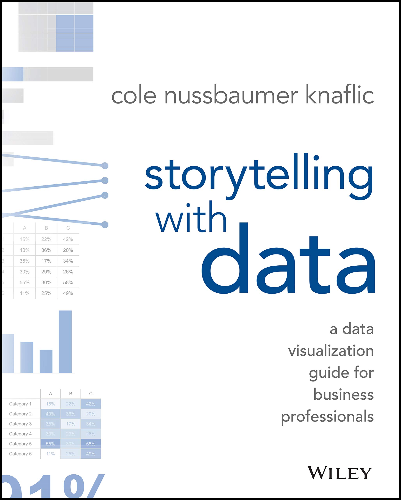
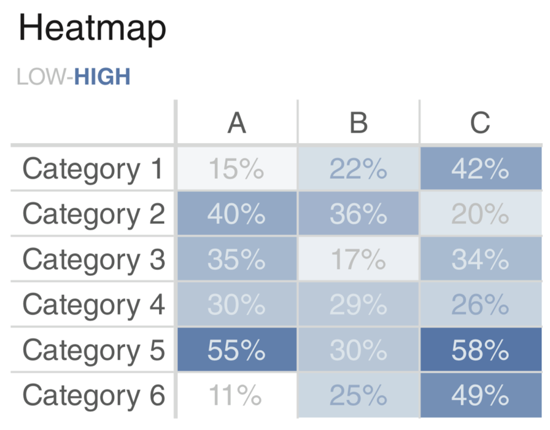

layout: true

<div class="my-footer">
  <span style="text-align:center">
    <span> 
      
    </span>
    <a href="https://therbootcamp.github.io/">
      <span style="padding-left:82px"> 
        <font color="#7E7E7E">
          www.therbootcamp.com
        </font>
      </span>
    </a>
    <a href="https://therbootcamp.github.io/">
      <font color="#7E7E7E">
       Explorative Datenanalyse mit R | März 2021
      </font>
    </a>
    </span>
  </div> 

---

```{r setup, include=FALSE}
options(htmltools.dir.version = FALSE)
# see: https://github.com/yihui/xaringan
# install.packages("xaringan")
# see: 
# https://github.com/yihui/xaringan/wiki
# https://github.com/gnab/remark/wiki/Markdown
options(width=110)
options(digits = 4)
```

```{r, echo = FALSE ,message = FALSE, warning = FALSE}
knitr::opts_chunk$set(comment=NA, fig.width=6, fig.height=6, echo = TRUE, eval = TRUE, 
                      message = FALSE, warning = FALSE, fig.align = 'center', dpi = 200)
library(tidyverse)
library(ggthemes)
library(extrafont)
library(gridExtra)
#loadfonts()
```

# Agenda

.pull-left4[

<ul>
  <li class="m1"><span>Kontext</span></li>
  <br>
  <li class="m2"><span>Kognitive Limitationen</span></li>
  <ul class="level">
    <li><span>Vermeide 'clutter'?</span></li>
    <li><span>Schaffe Ordnung</span></li>
    <li><span>Setze Fokus</span></li>
    <li><span>Nutze Vorwissen</span></li>
  </ul>
  <br>
  <li class="m3"><span>Abildungsarten</span></li>
  <ul class="level">
    <li><span>Text, Tabelle, Graphik</span></li>
    <li><span>Do's und Dont's</span></li>
  </ul>
</ul>

]


.pull-right5[

<p align="center">
<br>
<font style="font-size:10px">from <a href="https://www.modernanalyst.com/Resources/BusinessAnalystHumor/tabid/218/ID/3516/Data_Analysis_Conclusions.aspx">modernanalyst.com</a></font>
</p>

]


---

# Agenda

.pull-left4[

<ul>
  <li class="m1"><span>Kontext</span></li>
  <br>
  <li class="m2"><span>Kognitive Limitationen</span></li>
  <ul class="level">
    <li><span>Vermeide 'clutter'?</span></li>
    <li><span>Schaffe Ordnung</span></li>
    <li><span>Setze Fokus</span></li>
    <li><span>Nutze Vorwissen</span></li>
  </ul>
  <br>
  <li class="m3"><span>Abildungsarten</span></li>
  <ul class="level">
    <li><span>Text, Tabelle, Graphik</span></li>
    <li><span>Do's und Dont's</span></li>
  </ul>
</ul>


]


.pull-right5[

<p align="center">
<br>
<font style="font-size:10px">from <a href="http://www.storytellingwithdata.com/">storytellingwithdata.com</a></font>
</p>

]


---

# Was ist der Kontext?

.pull-left4[

<ul>
  <li class="m1"><span>Zwecke</span></li>
  <ul class="level">
    <li><span>Explorierend</span></li>
    <li><span><high>Erklärend</high></span></li>
  </ul>
  <br>
  <li class="m2"><span>Audience</span></li>
  <ul class="level">
    <li><span>Vorwissen</span></li>
    <li><span>Erwartungen</span></li>
  </ul>
</ul>

]

.pull-right5[

<p align="center">
<br>
<font style="font-size:10px">from <a href="">upbeatagency.com</a></font>
</p>

]

---

# Kognitive Limitationen

.pull-left4[

<ul>
  <li class="m1"><span><high>Gedächtnis-</high> und <high>Aufmerksamkeitspanne</high> von Menschen sind limitiert.</span></li><br>
  <li class="m2"><span>Informationsverarbeitung beeinflusst durch:</span></li>
  <ul class="level">
    <span><li><high>Erwartungen</high> und Vorwissen</span></li>
    <span><li><high>Visuelle</high> Charakteristika</li></span>
  </ul>
  </span></li>
</ul>

]

.pull-right5[
<p align="center">
<br>
<font style="font-size:10px">from <a href="https://www.pinterest.de/pin/458311699553074413/?lp=true">pinterest.de</a></font>
</p>
]

---

# Kognitive Limitationen

.pull-left4[

<ul>
  <li class="m1"><span><high>Gedächtnis-</high> und <high>Aufmerksamkeitspanne</high> von Menschen sind limitiert.</span></li>
  <li class="m2"><span>Informationsverarbeitung beeinflusst durch:</span></li>
  <ul class="level">
    <span><li><high>Erwartungen</high> und Vorwissen</span></li>
    <span><li><high>Visuelle</high> Charakteristika</li></span>
  </ul>
  </span></li>
</ul>

]

.pull-right5[
<p align="center">
<br>
<font style="font-size:10px">adapted from <a href="http://www.storytellingwithdata.com/">storytellingwithdata.com</a></font>
</p>
]

---

# Kognitive Limitationen

.pull-left4[

<ul>
  <li class="m1"><span><high>Gedächtnis-</high> und <high>Aufmerksamkeitspanne</high> von Menschen sind limitiert.</span></li>
  <li class="m2"><span>Informationsverarbeitung beeinflusst durch:</span></li>
  <ul class="level">
    <span><li><high>Erwartungen</high> und Vorwissen</span></li>
    <span><li><high>Visuelle</high> Charakteristika</li></span>
  </ul>
  </span></li>
</ul>

]

.pull-right5[
<p align="center">
<br>
<font style="font-size:10px">adapted from <a href="http://www.storytellingwithdata.com/">storytellingwithdata.com</a></font>
</p>
]


---

# Vermeide 'clutter'

.pull-left3[

<ul>
  <li class="m1"><span>Entferne alle <high>unnötig</high>en Elemente.</span></li>
  <li class="m2"><span><high>Freiflächen</high> in Graphiken sind genauso wichtig wie Pausen beim sprechen.</span></li>
</ul>

]

.pull-right6[
<p align="center">
<br>
<font style="font-size:10px">adapted from <a href="http://www.storytellingwithdata.com/">storytellingwithdata.com</a></font>
</p>
]

---

# Vermeide 'clutter'

.pull-left3[

<ul>
  <li class="m1"><span>Entferne alle <high>unnötig</high>en Elemente.</span></li>
  <li class="m2"><span><high>Freiflächen</high> in Graphiken sind genauso wichtig wie Pausen beim sprechen.</span></li>
</ul>

]

.pull-right6[
<p align="center">
<br>
<font style="font-size:10px">adapted from <a href="http://www.storytellingwithdata.com/">storytellingwithdata.com</a></font>
</p>
]

---

# Vermeide 'clutter'

.pull-left3[

<ul>
  <li class="m1"><span>Entferne alle <high>unnötig</high>en Elemente.</span></li>
  <li class="m2"><span><high>Freiflächen</high> in Graphiken sind genauso wichtig wie Pausen beim sprechen.</span></li>
</ul>

]

.pull-right6[
<p align="center">
<br>
<font style="font-size:10px">adapted from <a href="http://www.storytellingwithdata.com/">storytellingwithdata.com</a></font>
</p>
]


---

# Schaffe Ordnung

.pull-left3[
<ul>
  <li class="m1"><span>Richte Elemente an <high>klare</high>n <high>Linien</high> aus.</span></li>
  <li class="m2"><span>Nochmal: <high>Freiflächen</high> in Graphiken sind genauso wichtig wie Pausen beim sprechen.</span></li>
</ul>
]

.pull-right6[
<p align="center">
<br>
<font style="font-size:10px">adapted from <a href="http://www.storytellingwithdata.com/">storytellingwithdata.com</a></font>
</p>
]

---

# Schaffe Ordnung

.pull-left3[
<ul>
  <li class="m1"><span>Richte Elemente an <high>klare</high>n <high>Linien</high> aus.</span></li>
  <li class="m2"><span>Nochmal: <high>Freiflächen</high> in Graphiken sind genauso wichtig wie Pausen beim sprechen.</span></li>
</ul>
]

.pull-right6[
<p align="center">
<br>
<font style="font-size:10px">adapted from <a href="http://www.storytellingwithdata.com/">storytellingwithdata.com</a></font>
</p>
]

---

# Setze Fokus

.pull-left3[
<ul>
  <li class="m1"><span>Nutze <high>wenige Farben</high> und setze sie <high>strategisch</high> ein (gilt auch für Kontrast).</span></li>
  <br>
  <li class="m2"><span>Wähle angemessene, <high>ansprechende Farben</high>.</span></li>
  <ul class="level">
    <li><span>Tools: <a href="https://color.adobe.com/de/create">color.adobe.com</a> oder <a href="https://coolors.co/">coolors.co</a></span></li>
    <li><span>Farbsätze: <a href="https://cran.r-project.org/web/packages/viridis/vignettes/intro-to-viridis.html">viridis</a></span></li>
  </ul>
  <br>
  <li class="m3"><span>Sei <high>konsistent</high>.</span></li>
</ul>

]

.pull-right6[
<p align="center">
<br>
<font style="font-size:10px">adapted from <a href="http://www.storytellingwithdata.com/">storytellingwithdata.com</a></font>
</p>
]

---

# Setze Fokus

.pull-left3[
<ul>
  <li class="m1"><span>Nutze <high>wenige Farben</high> und setze sie <high>strategisch</high> ein (gilt auch für Kontrast).</span></li>
  <br>
  <li class="m2"><span>Wähle angemessene, <high>ansprechende Farben</high>.</span></li>
  <ul class="level">
    <li><span>Tools: <a href="https://color.adobe.com/de/create">color.adobe.com</a> oder <a href="https://coolors.co/">coolors.co</a></span></li>
    <li><span>Farbsätze: <a href="https://cran.r-project.org/web/packages/viridis/vignettes/intro-to-viridis.html">viridis</a></span></li>
  </ul>
  <br>
  <li class="m3"><span>Sei <high>konsistent</high>.</span></li>
</ul>

]

.pull-right6[
<p align="center">
<br>
<font style="font-size:10px">adapted from <a href="http://www.storytellingwithdata.com/">storytellingwithdata.com</a></font>
</p>
]


---

# Setze Fokus

.pull-left3[
<ul>
  <li class="m1"><span>Nutze <high>wenige Farben</high> und setze sie <high>strategisch</high> ein (gilt auch für Kontrast).</span></li>
  <br>
  <li class="m2"><span>Wähle angemessene, <high>ansprechende Farben</high>.</span></li>
  <ul class="level">
    <li><span>Tools: <a href="https://color.adobe.com/de/create">color.adobe.com</a> oder <a href="https://coolors.co/">coolors.co</a></span></li>
    <li><span>Farbsätze: <a href="https://cran.r-project.org/web/packages/viridis/vignettes/intro-to-viridis.html">viridis</a></span></li>
  </ul>
  <br>
  <li class="m3"><span>Sei <high>konsistent</high>.</span></li>
</ul>

]

.pull-right6[
<p align="center">
<br>
<font style="font-size:10px">see <a href="https://color.adobe.com/de/create">color.adobe.com</a></font>
</p>
]

---

# Setze Fokus

.pull-left3[
<ul>
  <li class="m1"><span>Nutze <high>wenige Farben</high> und setze sie <high>strategisch</high> ein (gilt auch für Kontrast).</span></li>
  <br>
  <li class="m2"><span>Wähle angemessene, <high>ansprechende Farben</high>.</span></li>
  <ul class="level">
    <li><span>Tools: <a href="https://color.adobe.com/de/create">color.adobe.com</a> oder <a href="https://coolors.co/">coolors.co</a></span></li>
    <li><span>Farbsätze: <a href="https://cran.r-project.org/web/packages/viridis/vignettes/intro-to-viridis.html">viridis</a></span></li>
  </ul>
  <br>
  <li class="m3"><span>Sei <high>konsistent</high>.</span></li>
</ul>

]

.pull-right6[
<p align="center">
<br>
<font style="font-size:10px">see <a href="https://coolors.co/">coolors.co</a></font>
</p>
]

---

class: middle, center

<h1>Darstellungsarten</h1>
<h2>Do's und Don'ts</h2>

---

# DO: Text chart

.pull-left3[

<ul>
  <li class="m1"><span>Geht es nur um eine Zahl, präsentiere sie als Text.</span></li>
</ul>

]


.pull-right6[
<p align="center">
<br>
<font style="font-size:10px">adapted from <a href="http://www.storytellingwithdata.com/">storytellingwithdata.com</a></font>
</p>

]


---

# DO: Text chart

.pull-left3[

<ul>
  <li class="m1"><span>Geht es nur um eine Zahl, präsentiere sie als Text.</span></li>
</ul>

]


.pull-right6[
<p align="center">
<br>
<font style="font-size:10px">adapted from <a href="http://www.storytellingwithdata.com/">storytellingwithdata.com</a></font>
</p>

]

---

# DO: Tabellen

.pull-left3[

<ul>
  <li class="m1"><span>Tabellen sind <high>präzise</high> und vollständig.</span></li>
  <li class="m2"><span>Müssen <high>seriell gelesen</high> werden und brauchen of Zeit.</span></li>
  <li class="m3"><span><high>Schlankere Tabellen</high> sind leichter zu lesen.</span></li>
  <li class="m4"><span><high>Farben</high> können das Verständnis <high>unterstützen</high>.</span></li>
</ul>

]


.pull-right6[
<p align="center">
<br>
<font style="font-size:10px">adapted from <a href="http://www.storytellingwithdata.com/">storytellingwithdata.com</a></font>
</p>

]

---

# DO: Tabellen

.pull-left3[

<ul>
  <li class="m1"><span>Tabellen sind <high>präzise</high> und vollständig.</span></li>
  <li class="m2"><span>Müssen <high>seriell gelesen</high> werden und brauchen of Zeit.</span></li>
  <li class="m3"><span><high>Schlankere Tabellen</high> sind leichter zu lesen.</span></li>
  <li class="m4"><span><high>Farben</high> können das Verständnis <high>unterstützen</high>.</span></li>
</ul>
]


.pull-right6[
<p align="center">
<br>
<font style="font-size:10px">adapted from <a href="http://www.storytellingwithdata.com/">storytellingwithdata.com</a></font>
</p>

]

---

# DO: Graphiken

.pull-left3[

<ul>
  <li class="m1"><span>Können <high>parallel</high> verarbeitet werden.</span></li>
  <li class="m2"><span>Eine gute Graphik ist oft leichter zu verstehen als eine gute Tabelle.</span></li>
  <li class="m3"><span>Gute Graphiken sind <high>schwieriger</high> als gute Tabellen.</span></li>
</ul>

]


.pull-right6[
<p align="center">
<br>
<font style="font-size:10px">adapted from <a href="http://www.storytellingwithdata.com/">storytellingwithdata.com</a></font>
</p>

]


<!---

# DO: Barplot

.pull-left3[

<ul>
  <li class="m1"><span>Sehr <high>geläufig</high> und dadurch attraktiv.</span></li>
  <li class="m2"><span>Grundlinie liegt auf <high>Null</high>.</span></li>
  <li class="m3"><span>Natürliche <high>Reihenfolge</high> der Kategorien.</span></li>
</ul>

]


.pull-right6[
<p align="center">
<br>
<font style="font-size:10px">adapted from <a href="http://www.storytellingwithdata.com/">storytellingwithdata.com</a></font>
</p>

]


# DO: Barplot

.pull-left3[

<ul>
  <li class="m1"><span>Sehr <high>geläufig</high> und dadurch attraktiv.</span></li>
  <li class="m2"><span>Grundlinie liegt auf <high>Null</high>.</span></li>
  <li class="m3"><span>Natürliche <high>Reihenfolge</high> der Kategorien.</span></li>
</ul>

]


.pull-right6[
<p align="center">
<br>
<font style="font-size:10px">adapted from <a href="http://www.storytellingwithdata.com/">storytellingwithdata.com</a></font>
</p>

]


# DO: Barplot

.pull-left3[

<ul>
  <li class="m1"><span>Sehr <high>geläufig</high> und dadurch attraktiv.</span></li>
  <li class="m2"><span>Grundlinie liegt auf <high>Null</high>.</span></li>
  <li class="m3"><span>Natürliche <high>Reihenfolge</high> der Kategorien.</span></li>
</ul>

]


.pull-right6[

<p align="center">
<br>
<font style="font-size:10px">adapted from <a href="http://www.storytellingwithdata.com/">storytellingwithdata.com</a></font>
</p>

]


# DO: Horizontaler Barplot

.pull-left3[

<ul>
  <li class="m1"><span>Horizontale Barplots sind etwas <high>leichter zu lesen</high>.</span></li>
</ul>

]


.pull-right6[
<p align="center">

<br>
<font style="font-size:10px">adapted from <a href="http://www.storytellingwithdata.com/">storytellingwithdata.com</a></font>
</p>

]


# DO: Horizontaler Barplot

.pull-left3[

<ul>
  <li class="m1"><span>Horizontale Barplots sind etwas <high>leichter zu lesen</high>.</span></li>
</ul>

]


.pull-right6[
<p align="center">

<br>
<font style="font-size:10px">adapted from <a href="http://www.storytellingwithdata.com/">storytellingwithdata.com</a></font>
</p>

]


# DO: Linienplot

.pull-left3[

<ul>
  <li class="m1"><span>Gut für den <high>Verlauf einzelner Variablen</high>.</span></li>
  <li class="m2"><span>X-Achse muss <high>gleichschrittig</high> sein.</span></li>
</ul>

]


.pull-right6[
<p align="center">
<br>
<font style="font-size:10px">adapted from <a href="http://www.storytellingwithdata.com/">storytellingwithdata.com</a></font>
</p>

]


# DO: Linienplot

.pull-left3[

<ul>
  <li class="m1"><span>Gut für den <high>Verlauf einzelner Variablen</high>.</span></li>
  <li class="m2"><span>X-Achse muss <high>gleichschrittig</high> sein.</span></li>
</ul>

]


.pull-right6[
<p align="center">
<br>
<font style="font-size:10px">adapted from <a href="http://www.storytellingwithdata.com/">storytellingwithdata.com</a></font>
</p>

]


# DO: Slopeplot

.pull-left3[

<ul>
  <li class="m1"><span>Gut für <high>Veränderungen</high> über zwei Beobachtungen.</span></li>
  <li class="m2"><span>Überlappungen können <high>leicht komplex</high> werden.</span></li>
</ul>

]


.pull-right6[
<p align="center">
<br>
<font style="font-size:10px">adapted from <a href="http://www.storytellingwithdata.com/">storytellingwithdata.com</a></font>
</p>

]


# DO: Slopeplot

.pull-left3[

<ul>
  <li class="m1"><span>Gut für <high>Veränderungen</high> über zwei Beobachtungen.</span></li>
  <li class="m2"><span>Überlappungen können <high>leicht komplex</high> werden.</span></li>
</ul>

]


.pull-right6[
<p align="center">
<br>
<font style="font-size:10px">adapted from <a href="http://www.storytellingwithdata.com/">storytellingwithdata.com</a></font>
</p>

]


# DO: Scatterplot

.pull-left3[

<ul>
  <li class="m1"><span>Gut für <high>Zusammenhänge</high>.</span></li>
</ul>

]


.pull-right6[
<p align="center">
<br>
<font style="font-size:10px">adapted from <a href="http://www.storytellingwithdata.com/">storytellingwithdata.com</a></font>
</p>

]


# DO: Scatterplot

.pull-left3[

<ul>
  <li class="m1"><span>Gut für <high>Zusammenhänge</high>.</span></li>
</ul>

]


.pull-right6[
<p align="center">
<br>
<font style="font-size:10px">adapted from <a href="http://www.storytellingwithdata.com/">storytellingwithdata.com</a></font>
</p>

]


--->

---

# DON'T: Pie charts

.pull-left3[

<ul>
  <li class="m1"><span><high>Schwer</high> zu verstehen.</span></li>
  <li class="m2"><span><high>Niemals 3D</high>.</span></li>
</ul>

]


.pull-right6[
<p align="center">

<br>
<font style="font-size:10px">adapted from <a href="http://www.storytellingwithdata.com/">storytellingwithdata.com</a></font>
</p>

]

---

# DON'T: Pie charts

.pull-left3[

<ul>
  <li class="m1"><span><high>Schwer</high> zu verstehen.</span></li>
  <li class="m2"><span><high>Niemals 3D</high>.</span></li>
</ul>


]


.pull-right6[
<p align="center">

<br>
<font style="font-size:10px">adapted from <a href="http://www.storytellingwithdata.com/">storytellingwithdata.com</a></font>
</p>

]

---

# DON'T: Area graph

.pull-left3[

<ul>
  <li class="m1"><span><high>Besser</high> als pie charts.</span></li>
  <li class="m2"><span>Flächen immer schwer zu verstehen.</span></li>
</ul>


]


.pull-right6[
<p align="center">

<br>
<font style="font-size:10px">adapted from <a href="http://www.storytellingwithdata.com/">storytellingwithdata.com</a></font>
</p>

]

---

# DON'T: 2. Achse

.pull-left3[

<ul>
  <li class="m1"><span><high>Unnötig komplex</high></span></li>
  <li class="m2"><span>Besser:</span></li>
  <ul class="level">
    <li><span>Explizierte Werte</span></li>
    <li><span>Vertikal getrennte Achse</span></li>
  </ul>
</ul>


]


.pull-right6[
<p align="center">

<br>
<font style="font-size:10px">adapted from <a href="http://www.storytellingwithdata.com/">storytellingwithdata.com</a></font>
</p>

]

---

# DON'T: 2. Achse

.pull-left3[

<ul>
  <li class="m1"><span><high>Unnötig komplex</high></span></li>
  <li class="m2"><span>Besser:</span></li>
  <ul class="level">
    <li><span>Explizierte Werte</span></li>
    <li><span>Vertikal getrennte Achse</span></li>
  </ul>
</ul>

]


.pull-right6[
<p align="center">

<br>
<font style="font-size:10px">adapted from <a href="http://www.storytellingwithdata.com/">storytellingwithdata.com</a></font>
</p>

]

---

# DON'T: 2. Achse

.pull-left3[

<ul>
  <li class="m1"><span><high>Unnötig komplex</high></span></li>
  <li class="m2"><span>Besser:</span></li>
  <ul class="level">
    <li><span>Explizierte Werte</span></li>
    <li><span>Vertikal getrennte Achse</span></li>
  </ul>
</ul>

]


.pull-right6[
<p align="center">

<br>
<font style="font-size:10px">adapted from <a href="http://www.storytellingwithdata.com/">storytellingwithdata.com</a></font>
</p>

]

---

# DO: Annotation

.pull-left3[

<ul>
  <li class="m1"><span>Annotation ist <high>sehr wichtig</high></span></li>
  <li class="m2"><span>Immer nötig:</span></li>
  <ul class="level">
    <li><span>x-Achsen Titel</span></li>
    <li><span>y-Achsen Titel</span></li>
  </ul>
  <br>
  <li class="m3"><span>Meistens hilfreich:</span></li>
  <ul class="level">
    <li><span>Plot Titel</span></li>
  </ul>
  <br>
  <li class="m4"><span>Oft hilfreich:</span></li>
  <ul class="level">
    <li><span>Untertitel</span></li>
    <li><span>Legende</span></li>
    <li><span>Erläuterungen im plot</span></li>
  </ul>
</ul>

]


.pull-right6[
<p align="center">

<br>
<font style="font-size:10px">adapted from <a href="http://www.storytellingwithdata.com/">storytellingwithdata.com</a></font>
</p>

]


---

class: middle, center

<h1><a href="https://therbootcamp.github.io/EDA_2021Mar/_sessions/PlottingIII/PlottingIII_practical.html">Practical</a></h1>