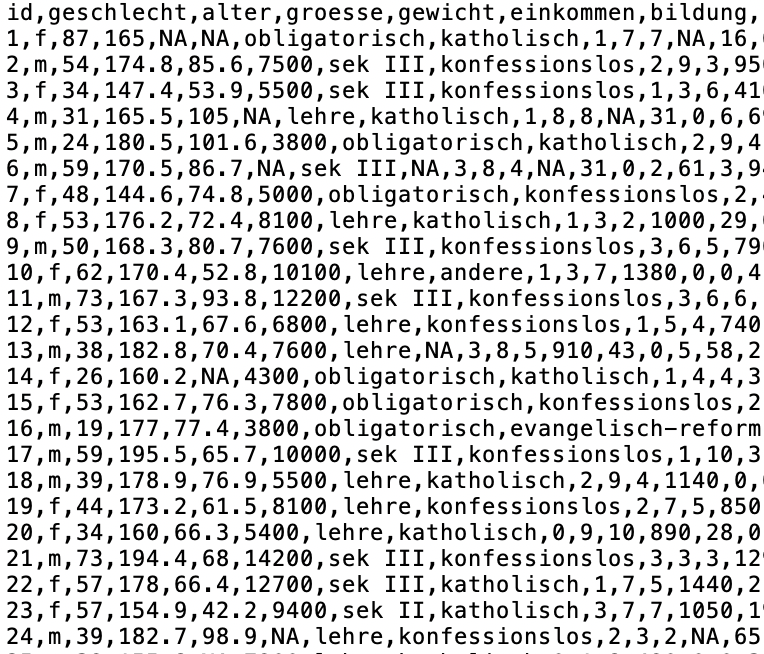
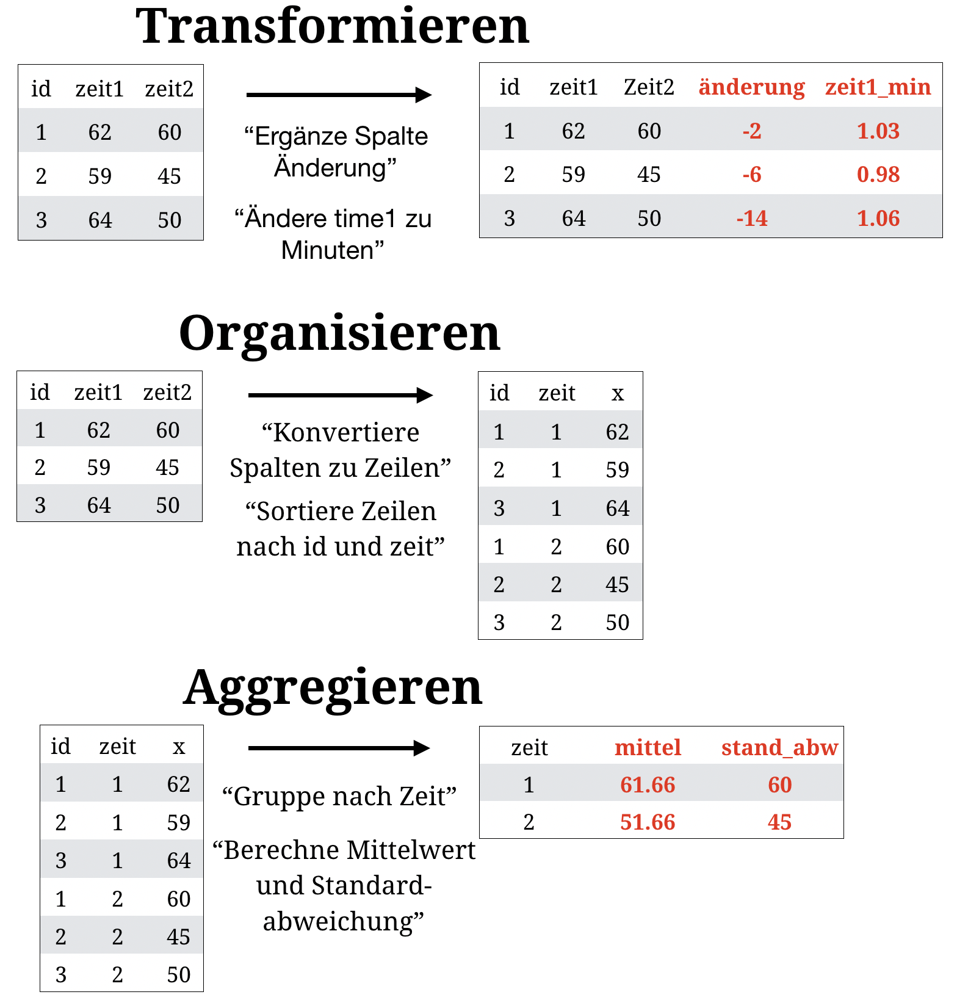
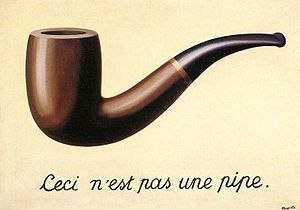

layout: true

<div class="my-footer">
  <span style="text-align:center">
    <span> 
      
    </span>
    <a href="https://therbootcamp.github.io/">
      <span style="padding-left:82px"> 
        <font color="#7E7E7E">
          www.therbootcamp.com
        </font>
      </span>
    </a>
    <a href="https://therbootcamp.github.io/">
      <font color="#7E7E7E">
       Explorative Datenanalyse mit R | September 2020
      </font>
    </a>
    </span>
  </div> 

---

```{r setup, include=FALSE}
options(htmltools.dir.version = FALSE)
# see: https://github.com/yihui/xaringan
# install.packages("xaringan")
# see: 
# https://github.com/yihui/xaringan/wiki
# https://github.com/gnab/remark/wiki/Markdown
options(width=110)
options(digits = 4)
require(tidyverse)
```


# 3 Klassen von Datenobjekten

.pull-left4[

<high>`list`</high> - R's Mehrzweck-Container
- <span>Kann alle Daten beinhalten, inkl. `list`s</span>
- <span>Nützlich für komplexe Funktionsoutputs</span>

<high>`data_frame`</high>, <high>`tibble`</high> - R's Tabelle
- <span>Spezialfall einer `list`</span>
- <span>R's `Tidy`-Format für Daten

<high>`vector`</high> - R's Daten-Container 
- <span>Primärer Daten-Container</span>
- <span>Beinhaltet daten von genau einem Klasse</span>
 
]

.pull-right55[
</img>
]

---

# Datentypen ausserhalb von R

<table class="tg"  style="cellspacing:0; cellpadding:0; border:none;" width="95%">
<col width=30%>
<col width=30%>
<col width=30%>
<tr>
  <td bgcolor = 'white' style='vertical-align:top'>
    <ul>
      <li class="m1"><span><high>Strukturierte Daten</high>
        <ul class="level">
        <li><span>Delimiter getrennt: <mono>.csv</mono>, <mono>.txt</mono>, etc.</span></li>
        <li><span>Relationale Datenbanken: <mono>SQL</mono></span></li>
        </ul>
        <br>
        </span></li>
      </ul>
    </td>
  <td bgcolor = 'white' style='vertical-align:top'>
    <ul>
      <li class="m2"><span><high>Semi-strukturierte Daten</high>
        <ul class="level">
        <li><span>Markup: <mono>.xml</mono>, <mono>.xls</mono>, <mono>.html</mono> etc.</span></li>
        <li><span>Non markup: <mono>JSON</mono>, <mono>MongoDB</mono></span></li>
        </ul>
        <br>
        </span></li>
      </ul>
    </td>
  <td bgcolor = 'white' style='vertical-align:top'>
    <ul>
      <li class="m3"><span><high>Unstrukturierte Daten</high>
        <ul class="level">
        <li><span>z.B. Text</span></li>
        </ul>
        <br><br><br><br><br2>
        </span></li>
      </ul>
    </td>
  </tr>
</table>


---

# Delimiter getrennte Daten 

.pull-left45[

<ul>
  <li class="m1"><span><high>Delimiter</high> separieren die Spalten.</span></li>
  <li class="m2"><span>Meist als <high>lokale Textdatei</high> vorliegend.</span></li>
  <li class="m3"><span><high>Datenklassen</high> werden inferiert.</span></li>
</ul>

<br>
<p align="center">
  
</p>

]

.pull-right45[

```{r, echo = F, message=F}
require(tibble)
options(tibble.width = 35, tibble.max_extra_cols = 0, tibble.print_max = 3,
        tibble.print_min = 5)
```


```{r, message = F}
# Lese Basel Datensatz ein
basel <- read_csv("1_Data/basel.csv")

# Benutze expliziten Delimiter
basel <- read_delim("1_Data/basel.csv",
                   delim = ",")
basel

```

]

---

# Das mächtige <mono>tidyverse</mono>

<ul>
  <li class="m1"><span>Das <a href="https://www.tidyverse.org/"><mono>tidyverse</mono></a> ist im Kern eine Sammlung hoch-performanter, nutzerfreundlicher Pakete, die speziell für eine effizientere Datenanalyse entwickelt wurden.</span></li>
</ul>

<ol style="padding-left:72px">
  <li><mono>ggplot2</mono> für Grafiken.</li>
  <li><high><mono>dplyr</mono> für Datenverarbeitung</high>.</li>
  <li><high><mono>tidyr</mono> für Datenverarbeitung</high>.</li>
  <li><mono>readr</mono> für Daten I/O.</li>
  <li><mono>purrr</mono> für funktionales Programmieren.</li>
  <li><mono>tibble</mono> für moderne <mono>data_frame</mono>'s.</li>
</ol>

<table style="cellspacing:0; cellpadding:0; border:none;padding-top:20px">
  <col width="15%">
  <col width="15%">
  <col width="15%">
  <col width="15%">
  <col width="15%">
  <col width="15%">
  <tr>
    <td bgcolor="white">
    </img>
    </td>
        <td bgcolor="white">
    </img>
    </td>
    <td bgcolor="white">
    </img>
    </td>
    <td bgcolor="white">
    </img>
    </td>
    <td bgcolor="white">
    </img>
    </td>
    <td bgcolor="white">
    </img>
    </td>
  </tr>
</table>

---

.pull-left45[

# Was ist Wrangling?

<ul>
  <li class="m1"><span><high>Transformieren</high>
  <br><br>
  <ul class="level">
    <li><span>Spaltennamen verändern</span></li>
    <li><span>Neue Variablen kreieren</span></li>
  </ul></span></li>
  <li class="m2"><span><high>Organisieren</high>
  <br><br>
  <ul class="level">
    <li><span>Sortieren</span></li>
    <li><span>Datensätze zusammenführen</span></li>
    <li><span>Spalten zu Zeilen flippen</span></li>
  </ul></span></li>
  <li class="m3"><span><high>Aggregieren</high>
  <br><br>
  <ul class="level">
    <li><span>Datengruppen bilden</span></li>
    <li><span>Statistiken für Gruppen berechnen</span></li>
  </ul></span></li>
</ul>

]

.pull-right5[
<br>
<p align="center">

</p>

]


---

# <mono>%>%</mono>

.pull-left45[

<ul>
  <li class="m1"><span>Der präferierte Gebrauch von <mono>dplyr</mono> beinhaltet einen <high>neuen Operator</high>, die Pipe <highm>%>%</highm>.</span></li>
</ul>

<br>

<p align="center">
  <br>
<font style="font-size:10px">from <a href="https://upload.wikimedia.org/wikipedia/en/thumb/b/b9/MagrittePipe.jpg">wikimedia.org</a></font>
</p>


]

.pull-right45[

<p align="center">
  
</p>

]


---


.pull-left4[

# Transformation

<ul>
  <li class="m1"><span><high>Umbenennen</high>: Intuitive Spaltennamen vergeben.
  <br><br>
  <ul class="level">
    <li><span><mono>rename()</mono></span></li>
  </ul>
  </span></li>
  <li class="m2"><span><high>Umkodieren</high>: Angemessene Einheiten und Datenlabels  vergeben.
  <br><br>
  <ul class="level">
    <li><span><mono>mutate()</mono></span></li>
    <li><span><mono>case_when()</mono></span></li>
  </ul>
  </span></li>
  <li class="m3"><span><high>Verbinden</high>: Datensätze zusammenführen.
  <br><br>
  <ul class="level">
    <li><span><mono>left_join()</mono></span></li>
  </ul>
  </span></li>
</ul>

]

.pull-right45[

<br>

```{r, echo = F}
patienten <- tibble(id = c(1, 2, 3, 4, 5),
                    X1 = c(37, 65, 57, 34, 45),
                    X2 = c(1, 2, 2, 1, 2))

```

```{r}
patienten
```


```{r, echo = F}
ergebnisse <- tibble(id = c(4, 92, 1, 2, 99),
                     t_1 = c(100, 134, 123, 143, 102),
                     t_2 = c(105, 150, 135, 140,68))
```

```{r}
ergebnisse
```

]

---

# Organisation

.pull-left4[

<ul>
  <li class="m4"><span><high>Sortieren</high>: Datensatz ordnen.
  <br><br>
  <ul class="level">
    <li><span><mono>arrange()</mono></span></li>
  </ul>
  </span></li>
  <li class="m5"><span><high>Filtern</high>: Relevante Fälle auswählen.
  <br><br>
  <ul class="level">
    <li><span><mono>slice()</mono></span></li>
    <li><span><mono>filter()</mono></span></li>
  </ul>
  </span></li>
  <li class="m6"><span><high>Auswählen</high>: Relevante Variablen auswählen.
  <br><br>
  <ul class="level">
    <li><span><mono>select()</mono></span></li>
  </ul>
  </span></li>
</ul>

]

.pull-right55[

```{r,echo=FALSE,error=TRUE}
patienten_ergebnisse = patienten %>% 
  rename(alter = X1, bedingung = X2) %>%
  mutate(bed_label = case_when(
    bedingung == 1 ~ "placebo",
    bedingung == 2 ~ "medikament")) %>%
  
  # Verbinde mit ergebnisse
  left_join(ergebnisse, by = "id")
```


```{r}
# Verbundener tibble
patienten_ergebnisse
```


]

---

# Aggregation

.pull-left4[

<ul>
  <li class="m1"><span><high>Aggregation</high>
  <br><br>
  <ul class="level">
    <li><span><mono>summarise()</mono></span></li>
    <li><span><mono>summarise_if()</mono></span></li>
    <li><span><mono>group_by(), summarise()</mono></span></li>
    <li><span><mono>n(), first(), last(), nth()</mono></span></li>
    <li><span><mono>pull()</mono></span></li>
  </ul>
  </span></li>
</ul>

]

.pull-right5[

```{r, echo=F}
options(tibble.width=40, tibble.print_max=5, tibble.print_min=5, tibble.max_extra_cols=10)
```

```{r}
basel
```


]


---

class: middle, center

<h1><a href=https://therbootcamp.github.io/EDA_2020Sep/index.html>Agenda</a></h1>
