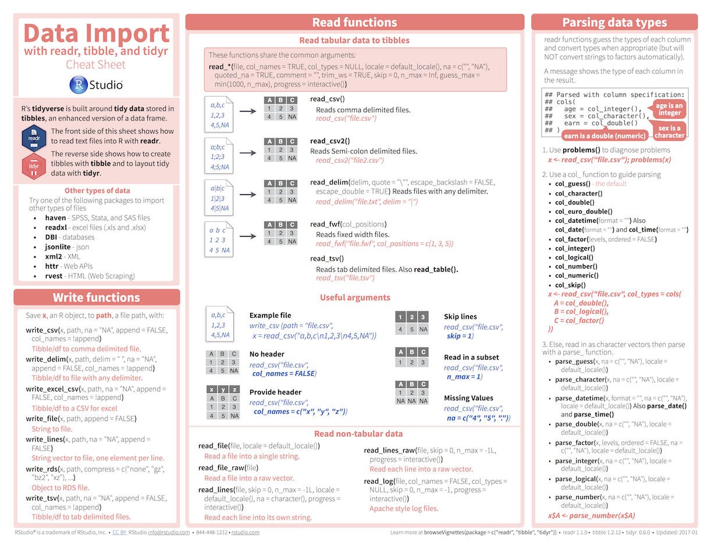
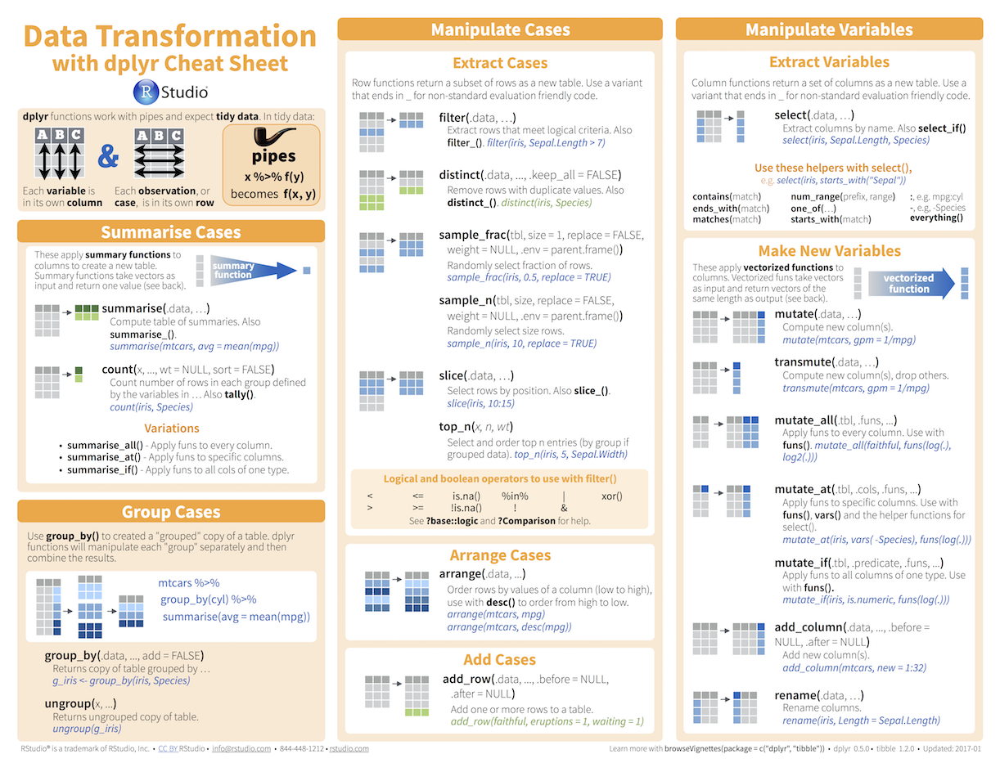

layout: true

<div class="my-footer">
  <span style="text-align:center">
    <span> 
      
    </span>
    <a href="https://therbootcamp.github.io/">
      <span style="padding-left:82px"> 
        <font color="#7E7E7E">
          www.therbootcamp.com
        </font>
      </span>
    </a>
    <a href="https://therbootcamp.github.io/">
      <font color="#7E7E7E">
       Explorative Datenanalyse mit R | März 2021
      </font>
    </a>
    </span>
  </div> 

---


```{r setup, include=FALSE}
options(htmltools.dir.version = FALSE)
options(width=110)
options(digits = 4)

knitr::opts_chunk$set(fig.align = 'center')
```


.pull-left6[

<br><br><br><br><br>

# Ziel

>###Das Ziel dieses Kurses ist Euch den kompetenten Umgang mit R für die Aufbereitung, Exploration, und Visualisierung von Daten zu vermitteln. 

]

.pull-right4[

<br><br><br><br>
<p align="center"></p>

]


---

.pull-left3[

# Der Data Science Kreislauf

]

.pull-right7[
<br>
<p align = "center">
<br>
<font style="font-size:10px">from <a href="http://sudeep.co/">http://sudeep.co/</a></font>
</p>
]

<!---

# Data Science Rollen

<br><br>
<p align = "center">
<br>
<font style="font-size:10px">from <a href="https://news.efinancialcareers.com/sg-en/3001517/data-science-careers-finance">efinancialcareers.com</a></font>
</p>

--->

---

# Data Science’s missverstandener Held

.pull-left45[

<i>"Your analyst is the sprinter; their ability to quickly help you see and summarize what-is-here is a superpower for your process."</i>

<i>"The only roles every business needs are decision-makers and analysts. If you lose your analysts, who will help you figure out which problems are worth solving?"</i>

<a href="https://hbr.org/2018/12/what-great-data-analysts-do-and-why-every-organization-needs-them">Harvard Business Review</a><br><a href="https://towardsdatascience.com/secret-paragraphs-from-hbrs-analytics-ddd2ead761d4">Towards Data Science</a>

<br><br><br><br><br><br>
<b>Cassie Kozyrkov</b><br>
Chief Decision Scientist at Google

]


.pull-right45[

<p align = "center">
<br>
<font style="font-size:10px">from <a href="https://medium.com/@kozyrkov">medium.com</a></font>
</p>

]

---

# Exploration in Maschinellem Lernen

.pull-left4[

<p align = "center">
<br>
<font style="font-size:10px">from <a href="https://medium.com/@dkwok94/machine-learning-for-my-grandma-ca242e97ef62">medium.com</a></font>
</p>

]


.pull-right5[

<i>"…some machine learning projects succeed and some fail. What makes the difference? Easily the most important factor is the features used."</i>

<b>Pedro Domingos</b>, Professor for Computer Science, Uni Washington

<br>
<i>"The algorithms we used are very standard for Kagglers. […] We spent most of our efforts in feature engineering."</i>

<b>Xavier Conort</b>, Chief Data Scientist, Data Robot

<br>
<i>"Coming up with features is difficult, time-consuming, requires expert knowledge. "Applied machine learning" is basically feature engineering."</i>

<b>Andrew Ng</b>, Founder and CEO of Landing AI

]

---

.pull-left4[

<br>
# Agenda 

<ul>
  <li class="m1"><span><high>Workshop</high></span></li>
  <ul class="level">
    <li><span>1 Block zu Data IO</span></li>
    <li><span>2 Blöcke zu Wrangling</span></li>
    <li><span>3 Blöcke zu Plotting</span></li>
  </ul><br>
  <li class="m2"><span><high>Block</high></span></li>
  <ul class="level">
    <li><span>Folien-basierten Einführung</span></li>
    <li><span>Viele Übungen</span></li>
    <li><span>Interaktiven Zusammenfassung</span></li>
  </ul>
  </span></li>
</ul>

]

.pull-right45[
<br><br>


]

---


# Einführung

.pull-left45[
<br2>

<ul>
  <li class="m1"><span><high>Einführung</high>
  <br><br>
  <ul class="level">
    <li><span>30-45 min</span></li>
    <li><span>Konzepte & Code Beispiele</span></li>
  </ul>
  </span></li>
  <li class="m2"><span><high>Materialien</high>
  <br><br>
  <ul class="level">
    <li><span>Immer <a href="https://therbootcamp.github.io/EDA_2020Feb/">online verfügbar</a></span></li>
  </ul>
  </span></li>
</ul>

]

.pull-right55[

<p align="center">

<br>
<font style="font-size:10px">from <a href="www.Freepik.com">Freepik.com</a></font>
</p>

]


---

.pull-left45[

# Übungen


<ul>
  <li class="m1"><span><high>Selber Programmieren</high>
  <br><br>
  <ul class="level">
    <li><span>20 - 50 Aufgaben</span></li>
    <li><span>Zu Beginn einfach dann zunehmend schwieriger.</span></li>
    <li><span>Folgt Eurem eigenen Tempo.</span></li>
    <li><span>Antworten kommen später.</span></li>
  </ul>
  </span></li>
</ul>

]


.pull-right5[
<br>

  <iframe src="https://therbootcamp.github.io/EDA_2020Feb/_sessions/Data/Data_practical.html" height="480px" width = "500px"></iframe>

  Beispiel:<a href="https://therbootcamp.github.io/EDA_2020Feb/_sessions/Data/Data_practical.html"> Daten </a>

]

<!---

# Cheatsheets

<table width="100%" style="cellspacing:0; cellpadding:0; border:none">
  <tr>    
  <td>
  <p align = 'center'>RStudio<br><br>
  <a href="image/rstudio-ide.pdf"></a></p>
  </td>
 
  <td>
   <p align = 'center'>Base R<br><br>
  <a href="image/base-r.pdf"></a></p>
  </td>  
  
  <td> 
   <p align = 'center'>Data Import<br><br>
  <a href="image/data-import.pdf" download></a></p>
  </td>
  
  <td>
  <p align = 'center'>Data Wrangling<br><br>
  <a href="image/data-transformation.pdf"></a></p>
  </td>

  <td>
  <p align = 'center'>Data Visualization<br><br>
  <a href="image/data-visualization-2.1.pdf"></a></p>
  </td>
  

  </tr>
</table>
<br>


.pull-left4[

<br><br>
# Pausen

<ul>
  <li class="m1"><span>Mach <high>jederzeit</high> Pausen.</span></li>
  <li class="m2"><span>Bedient euch an der <high>Pausenverpflegung</high>.</span></li>
  <li class="m3"><span>Lunch alleine oder begleitet uns zum <high>Tibits</high>.</span></li>
</ul>

]


.pull-right6[

<p align='center'><br><br><br><br>
<br>
<font style="font-size:10px">from <a href="https://www.tibits.ch/de/restaurants.html#tibits-basel">Tibits.ch</a></font>
</p>

]

# Photos

<p align="center">

</p>

--->

---

# Vorstellung

.pull-left5[

<ul>
  <li class="m1"><span>Wie heisst Du?</span></li>
  <li class="m2"><span>Was ist dein Beruf?</span></li>
  <li class="m3"><span>Hast du Programmiererfahrung mit R oder anderen Programmiersprachen?</span></li>
  <li class="m4"><span>Welche Probleme möchtest du mit R lösen?</span></li>
</ul>

]

.pull-right45[

<p align="center">

<br>
<font style="font-size:10px">from <a href="www.artofmanliness.com">artofmanliness.com</a></font>
</p>

]

---
class: middle, center

<h1><a href=https://therbootcamp.github.io/EDA_2020Sep/index.html>Agenda</a></h1>
