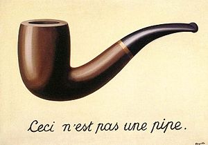
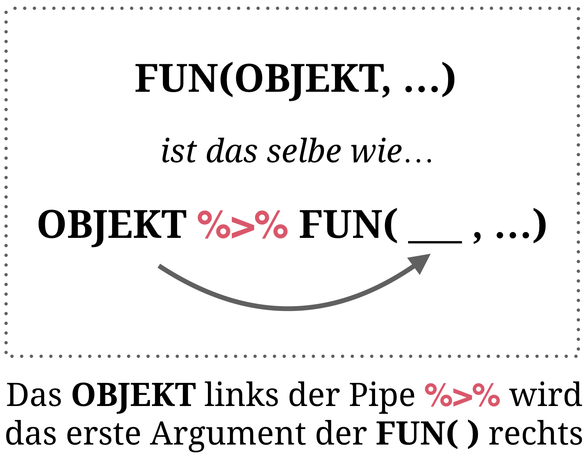

layout: true

<div class="my-footer">
  <span style="text-align:center">
    <span> 
      
    </span>
    <a href="https://therbootcamp.github.io/">
      <span style="padding-left:82px"> 
        <font color="#7E7E7E">
          www.therbootcamp.com
        </font>
      </span>
    </a>
    <a href="https://therbootcamp.github.io/">
      <font color="#7E7E7E">
       Explorative Datenanalyse mit R | März 2021
      </font>
    </a>
    </span>
  </div> 

---

```{r setup, include=FALSE}
options(htmltools.dir.version = FALSE)
# see: https://github.com/yihui/xaringan
# install.packages("xaringan")
# see: 
# https://github.com/yihui/xaringan/wiki
# https://github.com/gnab/remark/wiki/Markdown
options(width=110)
options(digits = 4)
require(tidyverse)
basel = readr::read_csv('1_data/basel.csv')
```

<!---

# Was ist <i>Wrangling</i>?

<p align = "center">
<br>
<font style="font-size:10px">from <a href="https://datasciencebe.com/tag/data-wrangling/">datasciencebe.com</a></font>
</p>


--->

.pull-left45[

# Was ist Wrangling?

<ul>
  <li class="m1"><span><high>Transformieren</high>
  <br><br>
  <ul class="level">
    <li><span>Spaltennamen verändern</span></li>
    <li><span>Neue Variablen kreieren</span></li>
  </ul></span></li>
  <li class="m2"><span><high>Organisieren</high>
  <br><br>
  <ul class="level">
    <li><span>Sortieren</span></li>
    <li><span>Datensätze zusammenführen</span></li>
    <li><span>Spalten zu Zeilen flippen</span></li>
  </ul></span></li>
  <li class="m3"><span><high>Aggregieren</high>
  <br><br>
  <ul class="level">
    <li><span>Datengruppen bilden</span></li>
    <li><span>Statistiken für Gruppen berechnen</span></li>
  </ul></span></li>
</ul>


]

.pull-right5[
<br>
<p align="center">

</p>

]

---


.pull-left4[

# 2 'dreckige' Datensätze

<ul>
  <li class="m1"><span><high>Umbenennen</high>: Intuitive Spaltennamen vergeben.</span></li>
  <li class="m2"><span><high>Umkodieren</high>: Angemessene Einheiten und Datenlabels  vergeben.</span></li>
  <li class="m3"><span><high>Verbinden</high>: Datensätze zusammenführen.</span></li>
  <li class="m4"><span><high>Sortieren</high>: Datensatz ordnen.</span></li>
  <li class="m5"><span><high>Filtern</high>: Relevante Fälle auswählen.</span></li>
  <li class="m6"><span><high>Auswählen</high>: Relevante Variablen auswählen.</span></li>
</ul>

]

.pull-right45[

<br>

```{r, echo = F}
patienten <- tibble(id = c(1, 2, 3, 4, 5),
                    X1 = c(37, 65, 57, 34, 45),
                    X2 = c(1, 2, 2, 1, 2))

```

```{r}
patienten
```


```{r, echo = F}
ergebnisse <- tibble(id = c(4, 92, 1, 2, 99),
                     t_1 = c(100, 134, 123, 143, 102),
                     t_2 = c(105, 150, 135, 140,68))
```

```{r}
ergebnisse
```

]


---

# Das <mono>tidyverse</mono>

<ul>
  <li class="m1"><span>Das <a href="https://www.tidyverse.org/"><mono>tidyverse</mono></a> ist eine Sammlung hoch-performanter, nutzerfreundlicher Pakete für eine effiziente Datenaufbereitung und -analyse.</span></li>
</ul>

<ol style="padding-left:72px">
  <li><mono>readr</mono> für Daten I/O.</li>
  <li><mono>tibble</mono> für moderne <mono>data_frame</mono>'s.</li>
  <li><high><mono>dplyr</mono> für Datenverarbeitung</high>.</li>
  <li><high><mono>tidyr</mono> für Datenverarbeitung</high>.</li>
  <li><mono>ggplot2</mono> für Grafiken.</li>
</ol>

<table style="cellspacing:0; cellpadding:0; border:none;padding-top:20px" width=90%>
  <col width="15%">
  <col width="15%">
  <col width="15%">
  <col width="15%">
  <col width="15%">
  <tr>
    <td bgcolor="white">
    </img>
    </td>
    <td bgcolor="white">
    </img>
    </td>
    <td bgcolor="white">
    </img>
    </td>
    <td bgcolor="white">
    </img>
    </td>
    <td bgcolor="white">
    </img>
    </td>
  </tr>
</table>

---

# <mono>%>%</mono>

.pull-left45[

<ul>
  <li class="m1"><span>Der präferierte Gebrauch von <mono>dplyr</mono> beinhaltet einen <high>neuen Operator</high>, die Pipe <highm>%>%</highm>.</span></li>
</ul>


<br>

<p align="center">
  <br>
<font style="font-size:10px">from <a href="https://upload.wikimedia.org/wikipedia/en/thumb/b/b9/MagrittePipe.jpg">wikimedia.org</a></font>
</p>

]

.pull-right45[


```{r}
# Numerischer Vektor
score <- c(8, 4, 6, 3, 7, 3)
score

# Mittelwert: Base-R-style
mean(score)

# Mittelwert: dplyr-style
score %>%  
  mean()  
```


]


---

# <mono>%>%</mono>

.pull-left45[

<ul>
  <li class="m1"><span>Der präferierte Gebrauch von <mono>dplyr</mono> beinhaltet einen <high>neuen Operator</high>, die Pipe <highm>%>%</highm>.</span></li>
</ul>

<br>

<p align="center">
  <br>
<font style="font-size:10px">from <a href="https://upload.wikimedia.org/wikipedia/en/thumb/b/b9/MagrittePipe.jpg">wikimedia.org</a></font>
</p>


]

.pull-right45[

<p align="center">
  
</p>

]

---


.pull-left4[

# Transformation

<ul>
  <li class="m1"><span><high>Umbenennen</high>: Intuitive Spaltennamen vergeben.
  <br><br>
  <ul class="level">
    <li><span><mono>rename()</mono></span></li>
  </ul>
  </span></li>
  <li class="m2"><span><high>Umkodieren</high>: Angemessene Einheiten und Datenlabels  vergeben.
  <br><br>
  <ul class="level">
    <li><span><mono>mutate()</mono></span></li>
    <li><span><mono>case_when()</mono></span></li>
  </ul>
  </span></li>
  <li class="m3"><span><high>Verbinden</high>: Datensätze zusammenführen.
  <br><br>
  <ul class="level">
    <li><span><mono>left_join()</mono></span></li>
  </ul>
  </span></li>
</ul>

]

.pull-right45[

<br>

```{r, echo = F}
patienten <- tibble(id = c(1, 2, 3, 4, 5),
                    X1 = c(37, 65, 57, 34, 45),
                    X2 = c(1, 2, 2, 1, 2))

```

```{r}
patienten
```


```{r, echo = F}
ergebnisse <- tibble(id = c(4, 92, 1, 2, 99),
                     t_1 = c(100, 134, 123, 143, 102),
                     t_2 = c(105, 150, 135, 140,68))
```

```{r}
ergebnisse
```

]

---

# `rename()` 

.pull-left45[

```{r, eval = FALSE, echo = TRUE}
TIBBLE %>%
  rename(NEU = ALT,
         NEU = ALT)
```

]

.pull-right45[

```{r}
# Starte mit Datensatz
patienten %>% 

# Ändere Spaltennamen
  rename(alter = X1,
         bedingung = X2)
```


]

---

# `mutate()` 

.pull-left45[

```{r, eval = FALSE}
TIBBLE %>%
  mutate(
   NAME1 = DEFINITION1,
   NAME2 = DEFINITION2,
   NAME3 = DEFINITION3,
   ...
  )
```
]

.pull-right45[

```{r, warning = FALSE}
patienten %>% 
  rename(alter = X1, 
         bedingung = X2) %>%
  
# Kreiere neue Variablen
  mutate(monate = alter * 12,
         dekaden = alter / 10)
```

]

---

# `case_when()`

.pull-left45[

```{r, eval = FALSE}
TIBBLE %>%
  mutate(
    NAME = case_when(
      LOGICAL1 ~ WERT1,
      LOGICAL2 ~ WERT2,
      ...
      )
    )

```


]

.pull-right45[

```{r}
patienten %>% 
  rename(alter = X1, 
         bedingung = X2) %>%
  
# Kreiere bed_label von bedingung
  mutate(bed_label = case_when(
    bedingung == 1 ~ "placebo",
    bedingung == 2 ~ "medikament"))
```

]


---

# Verbinde Daten
 
<p align="center">
  
</p> 


---

# `inner_join()`

.pull-left4[

```{r, eval = FALSE}
TIBBLE1 %>%
  inner_join(TIBBLE2, 
             by = c("KEY"))
```

]

.pull-right5[

```{r,error=TRUE}
patienten %>% 
  rename(alter = X1, bedingung = X2) %>%
  mutate(bed_label = case_when(
    bedingung == 1 ~ "placebo",
    bedingung == 2 ~ "medikament")) %>%
  
  # Verbinde mit ergebnisse
  inner_join(ergebnisse, by = "id")
```
]

---

# `left_join()`

.pull-left4[

```{r, eval = FALSE}
TIBBLE1 %>%
  left_join(TIBBLE2, 
            by = c("KEY"))
```

]

.pull-right5[

```{r,error=TRUE}
patienten %>% 
  rename(alter = X1, bedingung = X2) %>%
  mutate(bed_label = case_when(
    bedingung == 1 ~ "placebo",
    bedingung == 2 ~ "medikament")) %>%
  
  # Verbinde mit ergebnisse
  left_join(ergebnisse, by = "id")
```
]

---

# Organisation

.pull-left4[

<ul>
  <li class="m4"><span><high>Sortieren</high>: Datensatz ordnen.
  <br><br>
  <ul class="level">
    <li><span><mono>arrange()</mono></span></li>
  </ul>
  </span></li>
  <li class="m5"><span><high>Filtern</high>: Relevante Fälle auswählen.
  <br><br>
  <ul class="level">
    <li><span><mono>slice()</mono></span></li>
    <li><span><mono>filter()</mono></span></li>
  </ul>
  </span></li>
  <li class="m6"><span><high>Auswählen</high>: Relevante Variablen auswählen.
  <br><br>
  <ul class="level">
    <li><span><mono>select()</mono></span></li>
  </ul>
  </span></li>
</ul>

]

.pull-right55[

```{r,echo=FALSE,error=TRUE}
patienten_ergebnisse = patienten %>% 
  rename(alter = X1, bedingung = X2) %>%
  mutate(bed_label = case_when(
    bedingung == 1 ~ "placebo",
    bedingung == 2 ~ "medikament")) %>%
  
  # Verbinde mit ergebnisse
  left_join(ergebnisse, by = "id")
```


```{r}
# Verbundener tibble
patienten_ergebnisse
```


]

---

# `arrange()`

.pull-left4[

```{r, echo = TRUE, eval = FALSE}
# Sortiere aufsteigend
TIBBLE %>%
  arrange(VAR1, VAR2)

# Sortiere absteigend (mit desc())
TIBBLE %>%
  arrange(desc(VAR1), VAR2)
```

]

.pull-right5[
```{r}
patienten_ergebnisse %>%
  
  # Sortiere nach bedingung
  arrange(bedingung)
```

]

---

# `arrange()`

.pull-left4[

```{r, echo = TRUE, eval = FALSE}
# Sortiere aufsteigend
TIBBLE %>%
  arrange(VAR1, VAR2)

# Sortiere absteigend (mit desc())
TIBBLE %>%
  arrange(desc(VAR1), VAR2)
```
]

.pull-right5[

```{r}
patienten_ergebnisse %>%
  
  # Sortiere nach beidem
  arrange(bedingung, alter) 
```

]


---

# `slice()`

.pull-left4[

```{r, eval = F}
# Slice mit Sequenz
TIBBLE %>%
  slice(INDEX_START:INDEX_STOP)

# Slice mit Vektor  
TIBBLE %>%
  slice(c(INDEX1, INDEX2, ...))
```


]

.pull-right5[

```{r}
patienten_ergebnisse %>%
  arrange(bedingung, alter) %>%

# Zeilen 3 und 5 
  slice(c(3, 5))
```


]

---

# `slice()`

.pull-left4[

```{r, eval = F}
# Slice mit Sequenz
TIBBLE %>%
  slice(INDEX_START:INDEX_STOP)

# Slice mit Vektor  
TIBBLE %>%
  slice(c(INDEX1, INDEX2, ...))
```

]

.pull-right5[

```{r}
patienten_ergebnisse %>%
  arrange(bedingung, alter) %>%

# Erste 4 Zeilen
  slice(1:4)
```

]

---

# `filter()`

.pull-left4[

```{r, eval = F}
# Filter mit logische Vergleichen
TIBBLE %>%
  filter(VAR1 == WERT1,
         VAR2 > WERT2,
         VAR3 < WERT3,
         VAR4 == WERT4 | VAR5 < WERT5)
```
]

.pull-right5[

```{r}
patienten_ergebnisse %>%
  
  # Patienten mit alter > 35
  filter(alter > 35)
```

]


---

# `filter()`

.pull-left4[

```{r, eval = F}
# Filter mit logische Vergleichen
TIBBLE %>%
  filter(VAR1 == WERT1,
         VAR2 > WERT2,
         VAR3 < WERT3,
         VAR4 == WERT4 | VAR5 < WERT5)
```

]

.pull-right5[

```{r}
# alter grösser 35 & bed_label ist medikament
patienten_ergebnisse %>%
  filter(alter > 35,
         bed_label == "medikament")
```

]


---

# `select()`

.pull-left4[

```{r, eval = FALSE}
# Wähle Variablen A und B aus
TIBBLE %>% 
  select(VAR1, VAR2)

# Wähle alles ausser A aus
TIBBLE %>% 
  select(-VAR1)
```

]

.pull-right5[

```{r}
patienten_ergebnisse %>%
  
  # Wähle id und bedingung aus
  select(id, bedingung)
```

]

---

# `select()`

.pull-left4[

```{r, eval = FALSE}
# Wähle Variablen A und B aus
TIBBLE %>% 
  select(VAR1, VAR2)

# Wähle alles ausser A aus
TIBBLE %>% 
  select(-VAR1)
```


]

.pull-right5[

```{r}
patienten_ergebnisse %>%
  
  # Alles ausser id
  select(-id)
```

]

---

class: middle, center

<h1><a href="https://therbootcamp.github.io/EDA_2021Mar/_sessions/Wrangling/Wrangling_practical.html">Practical</a></h1>

