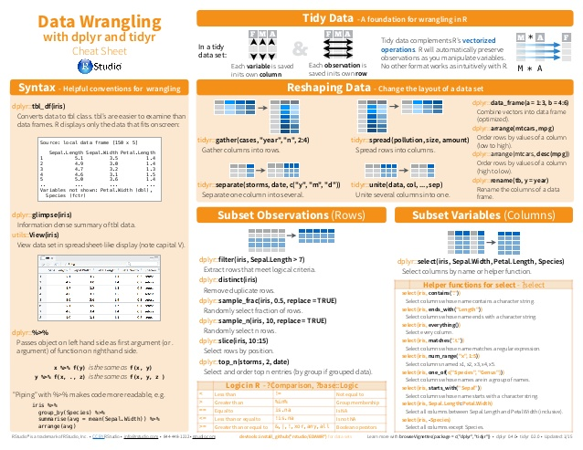

```{r setup, echo = FALSE}
knitr::opts_chunk$set(comment = NA, 
                      fig.width = 6, 
                      fig.height = 6,
                      fig.align = 'center',
                      echo = FALSE, 
                      eval = FALSE, 
                      warning = FALSE, 
                      message = FALSE)

options(digits = 3)
```

<p align="center" width="100%">
  
  <br>
  <font style="font-size:10px">from <a href="https://hillcountryeye.com/patient-resources/schedule-an-appointment/">hillcountryeye.com</a></font>
</p>

# {.tabset}

## Overview

In diesem Practical wirst du üben Daten mit `dplyr` zu transformieren und zu organisieren. 

Am Ende des Practicals wirst du wissen wie man:

1. Spalten verändert, kreiert, auswählt.
2. Fälle auswählt.
3. Daten verbindet.

## Aufgaben

### A - Setup

1. Öffne dein `TheRBootcamp` R project. Es sollte die Ordner `1_Data` und `2_Code` enthalten. 

2. Öffne ein neues R Skript. Schreibe deinen Namen, das Datum und "Wrangling Practical" als Kommentare an den Anfang des Skripts.

```{r, eval = FALSE, echo = TRUE}
## NAME
## DATUM
## Wrangling Practical
```

3. Speichere das neue Skript unter dem Namen `wrangling_practical.R` im `2_Code` Ordner.

4. Lade das `tidyverse`.

```{r, eval = FALSE, echo = TRUE}
# Pakete laden
library(tidyverse)     
```

```{r}
library(tidyverse)
```

### B - Lade den Datensatz

1. Verwende die `read_csv()` Funktion um den Datensatz `appointments` als Objekt `appointments` einzulesen. Denke an den Trick mit den Anführungszeichen (Cursor zwischen die Anführungszeichen und dann Tab). 

```{r, echo = F}
# Lese appointments
appointments <- read_csv('1_Data/appointments.csv')
```

2. Printe den Datensatz. Wurden alle Variablentypen korrekt identifiziert?

3. Verwende `summary()` um einen weiteren Überblick über die Daten zu bekommen.

### C - Verändere Spaltennamen mit `rename()`

1. Verwende `names()` um die Spaltennamen von `appointments` anzuzeigen.  

```{r, eval = FALSE, echo = TRUE}
# Zeige Spaltennamen
names(XXX)
```

```{r}
# Zeige Spaltennamen
names(appointments)
```

2. Eine der Spalten hat aktuell den namen `Age`. Verwende `rename()` um den Namen in `alter_jahre` zu ändern, so dass klar ist, dass es sich um das Alter in Jahren handelt.   

```{r, echo = TRUE, eval = FALSE}
# Ändere Age zu alter_jahre
appointments <- appointments %>%
  rename(NEU = ALT)
```

```{r}
# Ändere Age zu alter_jahre
appointments <- appointments %>%
  rename(alter_jahre = Age)
```

3. Verwende nochmals `names()` um dir die Namen anzeigen zu lassen. Hat sich der Name geändert?

```{r}
names(appointments)
```

4. Ergänze nun den Code unten, um alle Variablennamen ins Deutsche zu übersetzen.

```{r, echo = TRUE, eval = FALSE}
appointments <- appointments %>%
  rename(patient = XX,
         termin_id = XX,
         geschlecht = XX,
         termin_vereinbart = XX,
         termin_tag = XX,
         geburtsort = XX,
         bluthochdruck = XX,
         diabetes = XX,
         alkoholismus = XX,
         behinderung = XX,
         sms_erhalten = XX,
         termin_eingehalten = XX)
```

```{r}
appointments <- appointments %>%
  rename(patient = PatientId,
         termin_id = AppointmentID,
         geschlecht = Gender,
         termin_vereinbart = ScheduledDay,
         termin_tag = AppointmentDay,
         geburtsort = Neighbourhood,
         bluthochdruck = Hypertension,
         diabetes = Diabetes,
         alkoholismus = Alcoholism,
         behinderung = Handicap,
         sms_erhalten = SMS_received,
         termin_eingehalten = NoShow)
```

5. Überprüfe mit `names()` ob alles stimmt.

### D - Verändere Spalten mit `mutate()`

1. Verwende `mutate()`, um eine Spalte zu ergänzen, die das Alter in Monaten kodiert, also `alter_jahre * 12` und nenne die Spalte `alter_monate`.  

```{r, echo = TRUE, eval = FALSE}
# Alter in Monaten
appointments <- appointments %>%
  mutate(XX = XX * 12)
```

```{r}
# Alter in Monaten
appointments <- appointments %>%
  mutate(alter_monate = alter_jahre * 12)
```

2. Verwende `mutate()`, um eine Spalte `krankheitsgrad` zu ergänzen, die anzeigt wie viele Erkrankungen der Patient hat. Addiere hierzu die Spalten `bluthochdruck`, `diabetes`, `alkoholismus`. Erinnere: `TRUE = 1` und `FALSE = 0`. 

```{r, echo = TRUE, eval = FALSE}
# Kreiere Krankheitsgrad
appointments <- appointments %>%
  mutate(XX = XX + XX + XX)
```

```{r}
# Kreiere Krankheitsgrad
appointments <- appointments %>%
  mutate(krankheitsgrad = bluthochdruck + diabetes + alkoholismus)
```

3. Verwende `mutate()` und `case_when()` um eine Spalte `schwer_krank` zu ergänzen, die `Ja` enthält, wenn jemand einen Krankheitsgrad von grösser 1 hat, und ansonsten `Nein`.

```{r, echo = TRUE, eval = FALSE}
# Kreiere schwer_krank
appointments <- appointments %>%
  mutate(schwer_krank = case_when(
    XX <= XX ~ "Nein",
    XX  > XX ~ "Ja"
    )
  )
```

```{r}
# Kreiere schwer_krank
appointments <- appointments %>%
  mutate(schwer_krank = case_when(
    krankheitsgrad <= 1 ~ "Nein",
    krankheitsgrad  > 1 ~ "Ja"
    )
  )
```

4. Verwende `mutate()` und `case_when()` um `M` und `F` in der Spalte `geschlecht` in `männlich` und `weiblich` zu verändern. Weise hierzu die entstehende Variable direkt wieder der Spalte `geschlecht` zu.

```{r, echo = TRUE, eval = FALSE}
# Verändere geschlecht
appointments <- appointments %>%
  mutate(XX = case_when(
    XX == XX ~ XX,
    XX == XX ~ XX
    )
  )
```

```{r}
# Verändere geschlecht
appointments <- appointments %>%
  mutate(geschlecht = case_when(
    geschlecht == "M" ~ "männlich",
    geschlecht == "F" ~ "weiblich"
    )
  )
```

5. Verwende `mutate()` und `case_when()` um `No` und `Yes` in der Spalte `termin_eingehalten` in `0` respektive `1` zu verändern. Kreiere hierzu eine neue Spalte mit Namen `termin_eingehalten_01`.  

```{r, echo = TRUE, eval = FALSE}
# Termin eingehalten Yes = 1, No = 0
appointments <- appointments %>%
  mutate(XX = case_when(
    XX == XX ~ XX,
    XX == XX ~ XX
    )
  )
```

```{r}
# Termin eingehalten Yes = 1, No = 0
appointments <- appointments %>%
  mutate(termin_eingehalten_01 = case_when(
    termin_eingehalten == "No" ~ 0,
    termin_eingehalten == "Yes" ~ 1,
    )
  )
```

6. Finde mit dem untenstehenden Code heraus, ob schwerkranke Patienten häufiger den Termin nicht wahrnehmen (verwende `termin_eingehalten_01`).  

```{r, echo = TRUE, eval = FALSE}
# Anteil nicht wahrgenommener Termine
appointments %>%
  filter(XX == XX) %>%
  pull(XX) %>% 
  mean()

appointments %>%
  filter(XX != XX) %>%
  pull(XX) %>% 
  mean()
```

```{r}
# Anteil nicht wahrgenommener Termine
appointments %>%
  filter(schwer_krank == "Ja") %>%
  pull(termin_eingehalten_01) %>%
  mean()

appointments %>%
  filter(schwer_krank != "Ja") %>%
  pull(termin_eingehalten_01) %>%
  mean()
```

7. Vergleiche nun, ob es in den wahrgenommenen Terminen vielleicht Unterschiede zwischen Männern und Frauen gibt und ob es Unterschiede zwischen Patienten gibt, die mehr oder weniger als 360 Monate alt sind.  

```{r}
# Anteil nicht wahrgenommener Termine
appointments %>%
  filter(geschlecht == "männlich") %>%
  pull(termin_eingehalten_01) %>%
  mean()

appointments %>%
  filter(geschlecht != "männlich") %>%
  pull(termin_eingehalten_01) %>%
  mean()

# Anteil nicht wahrgenommener Termine
appointments %>%
  filter(alter_monate >= 360) %>%
  pull(termin_eingehalten_01) %>%
  mean()

appointments %>%
  filter(alter_monate < 360) %>%
  pull(termin_eingehalten_01) %>%
  mean()
```

### E - Organisieren mit `select()`, `filter()`, `slice()`, und `arrange()` 

1. Verwende `select()` um die Spalten `patient`, `geschlecht`, `alter_jahre`, `krankheitsgrad` und `termin_eingehalten_01` auszuwählen. Speichere den resultierenden data frame als `appointments_reduziert`.

```{r, echo = TRUE, eval = FALSE}
# Wähle Spalten aus
appointments_reduziert <- appointments %>%
  select(XX, XX, XX, XX, XX)
```

```{r}
# Wähle Spalten aus
appointments_reduziert <- appointments %>%
  select(patient, geschlecht, alter_jahre, krankheitsgrad, termin_eingehalten_01)
```

2. Printe `appointments_reduziert`. Sind die richtigen Spalten enthalten?

3. Verwende `filter()` um Fälle auszuwählen, in denen der Patient weiblich ist. Ergänze hierzu direkt die Pipeline. 

```{r, echo = TRUE, eval = FALSE}
# Wähle Fälle aus
appointments_reduziert <- appointments %>%
  select(XX, XX, XX, XX, XX) %>%
  filter(XX == XX)
```

```{r}
# Wähle Fälle aus
appointments_reduziert <- appointments %>%
  select(patient, geschlecht, alter_jahre, krankheitsgrad, termin_eingehalten_01) %>%
  filter(geschlecht == 'weiblich')
```

4. Printe `appointments_reduziert$geschlecht`. Sind noch Männer enthalten?

5. Ergänze die Pipeline um nur solche Patientinnnen auszuwählen, die auch über 30 Jahre alt sind. 

```{r, echo = TRUE, eval = FALSE}
# Wähle Fälle aus
appointments_reduziert <- appointments %>%
  select(XX, XX, XX, XX, XX) %>%
  filter(XX == XX,
         XX > XX)
```

```{r}
# Wähle Fälle aus
appointments_reduziert <- appointments %>%
  select(patient, geschlecht, alter_jahre, krankheitsgrad, termin_eingehalten_01) %>%
  filter(geschlecht == 'weiblich',
         alter_jahre > 30)
```

6. Printe `appointments_reduziert$alter_jahre`. Sind noch Jüngere enthalten?

7. Verwende `arrange()` um den `appointments_reduziert` Datensatz aufsteigend nach Alter zu ordnen. Ergänze die Pipeline. 

```{r, echo = TRUE, eval = FALSE}
# Wähle Fälle aus
appointments_reduziert <- appointments %>%
  select(XX, XX, XX, XX, XX) %>%
  filter(XX == XX,
         XX > XX) %>%
  arrange(XX)
```

```{r}
# Wähle Fälle aus
appointments_reduziert <- appointments %>%
  select(patient, geschlecht, alter_jahre, krankheitsgrad, termin_eingehalten_01) %>%
  filter(geschlecht == 'weiblich',
         alter_jahre > 30) %>%
  arrange(alter_jahre)
```

8. Printe `appointments_reduziert` und `appointments_reduziert$alter_jahre`. Ist alles schön sortiert?

9. Verwende `arrange()` und `desc()`, um `appointments_reduziert` absteigend (descending) nach Alter zu ordnen. 

```{r, echo = TRUE, eval = FALSE}
# Wähle Fälle aus
appointments_reduziert <- appointments %>%
  select(XX, XX, XX, XX, XX) %>%
  filter(XX == XX,
         XX > XX) %>%
  arrange(desc(XX))
```

```{r}
# Wähle Fälle aus
appointments_reduziert <- appointments %>%
  select(patient, geschlecht, alter_jahre, krankheitsgrad, termin_eingehalten_01) %>%
  filter(geschlecht == 'weiblich',
         alter_jahre > 30) %>%
  arrange(desc(alter_jahre))
```

10. Printe `appointments_reduziert` und `appointments_reduziert$alter_jahre`. Ist alles schön sortiert?

11. Verwende `arrange()` und `desc()` um `appointments_reduziert` ebenfalls, absteigend (descending) nach `krankheitsgrad` zu ordnen. 

```{r, echo = TRUE, eval = FALSE}
# Wähle Fälle aus
appointments_reduziert <- appointments %>%
  select(XX, XX, XX, XX, XX) %>%
  filter(XX == XX,
         XX > XX) %>%
  arrange(desc(XX),
          desc(XX))
```

```{r}
# Wähle Fälle aus
appointments_reduziert <- appointments %>%
  select(patient, geschlecht, alter_jahre, krankheitsgrad, termin_eingehalten_01) %>%
  filter(geschlecht == 'weiblich',
         alter_jahre > 30) %>%
  arrange(desc(alter_jahre),
          desc(krankheitsgrad))
```

12. Printe `appointments_reduziert` und `appointments_reduziert$krankheitsgrad`. Ist alles schön sortiert?

13. Ändere die Reihenfolge von `krankheitsgrad` und  `alter_jahre` in der `arrange()` Funktion um primär nach `krankheitsgrad` zu sortieren. 

```{r, echo = TRUE, eval = FALSE}
# Wähle Fälle aus
appointments_reduziert <- appointments %>%
  select(XX, XX, XX, XX, XX) %>%
  filter(XX == XX,
         XX > XX) %>%
  arrange(desc(XX),
          desc(XX))
```

```{r}
# Wähle Fälle aus
appointments_reduziert <- appointments %>%
  select(patient, geschlecht, alter_jahre, krankheitsgrad, termin_eingehalten_01) %>%
  filter(geschlecht == 'weiblich',
         alter_jahre > 30) %>%
  arrange(desc(krankheitsgrad),
          desc(alter_jahre))
```

14. Verwende `slice()` um die ersten zwanzig Fälle in `appointments_reduziert` auszuwählen. Ergänze die Pipeline.

```{r, echo = TRUE, eval = FALSE}
# Wähle Fälle aus
appointments_reduziert <- appointments %>%
  select(XX, XX, XX, XX, XX) %>%
  filter(XX == XX,
         XX > XX) %>%
  arrange(desc(XX),
          desc(XX)) %>%
  slice(XX:XX)
```

```{r}
# Wähle Fälle aus
appointments_reduziert <- appointments %>%
  select(patient, geschlecht, alter_jahre, krankheitsgrad, termin_eingehalten_01) %>%
  filter(geschlecht == 'weiblich',
         alter_jahre > 30) %>%
  arrange(desc(krankheitsgrad),
          desc(alter_jahre)) %>%
  slice(1:20)
```

15. Printe `appointments_reduziert`. Sind es nun 20 Fälle? Sind die ausgewählten Fälle zum Termin erschienen?

### F - Verbinde Datensätze mit `*_join()`

1. Verwende die `read_csv()` Funktion um den Datensatz `weather`, welcher Daten über das Wetter in Brasilien enthält, als Objekt `weather` einzulesen. Denke an den Trick mit den Anführungszeichen. 

```{r, echo = F}
# Lese weather
weather <- read_csv('1_Data/weather.csv')
```

2. Printe den Datensatz. Wurden alle Variablentypen korrekt identifiziert?

3. Verwende `summary()` um einen weiteren Überblick über die Daten zu bekommen.

4. Verwende `select()` und `rename()` um die Spalten `YYYYMMDD` und `PRECTOT` auszuwählen und sie in `termin_tag` und `niederschlag` umzubenennnen. Nenne das resultierende Objekt `weather_reduziert`

```{r, echo = TRUE, eval = FALSE}
# Verarbeite weather
weather_reduziert <- weather %>%
  select(XX, XX) %>%
  rename(XX = XX,
         XX = XX) 
```

```{r}
# Verarbeite weather
weather_reduziert <- weather %>%
  select(YYYYMMDD, PRECTOT) %>%
  rename(termin_tag = YYYYMMDD,
         niederschlag = PRECTOT) 
```

5. Printe `weather_reduziert`. Ist alles wie gewünscht?

6. Verwende `left_join()` um `weather_reduziert` mit den Spalten `termin_tag` und `termin_eingehalten` in `appointments` zu verbinden. Nenne den gemeinsamen Datensatz `appointments_weather`. 

```{r, echo = TRUE, eval = FALSE}
# Verbinde Datensätze
appointments_weather <- appointments %>%
  select(XX, XX) %>%
  left_join(XX)
```

```{r}
# Verbinde Datensätze
appointments_weather <- appointments %>%
  select(termin_tag, termin_eingehalten) %>%
  left_join(weather_reduziert)
```

7. Printe `appointments_weather`. Ist alles in Ordnung?

8. Verwende `select()` um nach dem Verbinden die Spalten in die folgende Reihenfolge zu bringen: `termin_tag`, `niederschlag`, und `termin_eingehalten`. 

```{r, echo = TRUE, eval = FALSE}
# Verbinde Datensätze
appointments_weather <- appointments %>%
  select(XX, XX) %>%
  left_join(XX) %>%
  select(XX, XX, XX)
```

```{r}
# Verbinde Datensätze
appointments_weather <- appointments %>%
  select(termin_tag, termin_eingehalten) %>%
  left_join(weather_reduziert) %>%
  select(termin_tag, niederschlag, termin_eingehalten)
```

9. Printe `appointments_weather`. Ist alles in Ordnung?

10. Erstelle im nächsten Schritt der Pipeline erneut eine Variable `termin_eingelten_01` genauso wie du das vorher bereits einmal gemacht hast. Erstelle ausserdem eine Variable `niederschlag_01` die anzeigt, ob es Niederschlag gab oder nicht. 

```{r, echo = TRUE, eval = FALSE}
# Verbinde Datensätze
appointments_weather <- appointments %>%
  select(XX, XX) %>%
  left_join(XX) %>%
  select(XX, XX, XX) %>%
  mutate(
    termin_eingehalten_01 = case_when(
      XX == XX ~ XX,
      XX == XX ~ XX,
      ),
    niederschlag_01 = case_when(
      XX == 0 ~ 0,
      XX > 0 ~ 1,
      )
  )
```

```{r}
# Verbinde Datensätze
appointments_weather <- appointments %>%
  select(termin_tag, termin_eingehalten) %>%
  left_join(weather_reduziert) %>%
  select(termin_tag, niederschlag, termin_eingehalten) %>%
  mutate(
    termin_eingehalten_01 = case_when(
      termin_eingehalten == "No" ~ 0,
      termin_eingehalten == "Yes" ~ 1,
      ),
    niederschlag_01 = case_when(
      niederschlag == 0 ~ 0,
      niederschlag > 0 ~ 1,
      )
    )
```

11. Printe `appointments_weather`. Ist alles in Ordnung?

12. Finde nun mit Hilfe des untenstehenden Codes heraus, ob Termine bei Regen seltener eingehalten wurden.  

```{r, echo = TRUE, eval = FALSE}
# Anteil nicht wahrgenommener Termine
appointments_weather %>%
  filter(XX == XX) %>%
  pull(XX) %>%
  mean()

appointments_weather %>%
  filter(XX != XX) %>%
  pull(XX) %>%
  mean()
```

```{r}
# Anteil nicht wahrgenommener Termine
appointments_weather %>%
  filter(niederschlag_01 == 1) %>%
  pull(termin_eingehalten_01) %>%
  mean()

appointments_weather %>%
  filter(niederschlag_01 != 1) %>%
  pull(termin_eingehalten_01) %>%
  mean()
```


### X - Challenge

1. Versuche alle bisherigen Schritte beginnend beim einlesen bis zum Verbinden der Datensätze in eine einzige Pipeline zu bringen. Das Ziel ist es die letzte Version von `appointments_weather` zu erstellen ohne auch nur einmal ein Objekt zwischendrin zuzuweisen. 

```{r, echo = TRUE, eval = FALSE}
# kreire appointments_weather
read_csv("XX") %>%
  ...

```

## Beispiele

```{r, eval = FALSE, echo = TRUE}

# Wrangling mit dplyr ---------------------------

library(tidyverse)  

# Lade basel
basel <- read_csv("1_Data/basel.csv")

# dplyr Pipeline

basel %>%
  
  # Ändere Spaltennamen
  rename(alter_jahre = alter,
         schwimmen = rhein) %>%
  
  # Nur Leute über 30
  filter(alter_jahre > 30) %>%
  
  # Berechne neue Variablen
  mutate(gewicht_pfungd = gewicht * 2.22,
         groesse_meter = groesse / 100,
         BMI = gewicht / groesse_m ^ 2,
         
         # Binarisiere geschlecht
         geschlecht_01 = case_when(
                           geschlecht == "m" ~ 0,
                           geschlecht == "f" ~ 1),

        # Ist groesse groesser als 150cm
        groesse_150 = case_when(
                          groesse < 150 ~ 1,
                          groesse >= 150 ~ 0)) %>%
  
  # Sortiere die Daten
  arrange(geschlecht, desc(alter_jahre)))

```


## Datensätze

```{r, eval = TRUE, message = FALSE, echo = FALSE}
library(tidyverse)
appointments <- read_csv("1_Data/appointments.csv")
weather <- read_csv("1_Data/weather.csv")

```

|Datei | Zeilen | Spalten | Beschreibung | 
|:----|:-----|:------|:------|
|[appointments.csv](https://github.com/therbootcamp/R4DS_2019Feb/blob/master/1_Data/appointments.csv?raw=true)| `r nrow(appointments)` | `r ncol(appointments)`| Datensatz zu eingehalten Arztterminen in Brasilien |
|[weather.csv](https://github.com/therbootcamp/R4DS_2019Feb/blob/master/1_Data/weather.csv?raw=true)| `r nrow(weather)` | `r ncol(weather)`| Datensatz zum Wetter in Brasilien zur selben Zeit wie in `appointments.csv`  |

#### appointments.csv

*Erste 5 Zeilen von appointments.csv*

```{r, eval = TRUE, echo = FALSE}
knitr::kable(appointments[1:5,])
```

|Variable | Beschreibung |
|:--------|:-----------------------------|
|PatientId | ID des Patienten |
|AppointmentID | ID des Arzttermins |
|Gender | M = Männlich, F = Weiblich|
|ScheduledDay | Der Tag an dem der Termin vereinbart wurde |
|AppointmentDay | Der Tag des Arzttermins |
|Age | Wie alt ist der Patient |
|Neighbourhood | Wo wurde der Patient geboren |
|Hypertension | Bluthochdruck Ja, Nein |
|Diabetes | Diabetes Ja, Nein |
|Alcoholism | Alcoholismus Ja, Nein |
|Handcap | Behinderung - Stufen 1 bis 4, 1 niedrigstes Level |
|SMS_received | Hat der Patient eine Erinnerung per SMS erhalten? |
|No-show | Ist der Patient zum Termin erschienen?|

#### weather.csv

*Erste 5 Zeilen von weather.csv*

```{r, eval = TRUE, echo = FALSE}
knitr::kable(weather[1:5,])
```

|Variable | Beschreibung |
|:--------|:-----------------------------|
|LON  |Längengrad|
|LAT  |Breitengrad|
|YEAR  | Jahr| 
|MM    | Monat|
|DD   | Tag|
|DOY | Tag des Jahres|
|YYYYMMDD | Datum|    
|RH2M   |Relative Feuchtigkeit auf 2 Metern|
|T2M | Temperatur auf 2 Metern|
|PRECTOT | Niederschlag|


## Funktionen

### Pakete

|Package| Installation|
|:------|:------|
|`tidyverse`|`install.packages("tidyverse")`|

### Funktionen

| Function| Package | Description |
|:---|:------|:---------------------------------------------|
|     `rename()`|`dplyr`|    Spalten umbenennen| 
|     `select()`|`dplyr`|    Spalten auswählen | 
|     `filter()`, `slice()`|`dplyr`|  Fälle auswählen| 
|     `arrange()`|`dplyr`|    Fälle sortieren | 
|     `mutate()`|`dplyr`|    Spalten verändern / kreieren |
|     `case_when()`|`dplyr`| Rekodiere Spalten | 

## Resourcen

### `dplyr` vignette

Siehe die `dplyr` [**vignette**](https://cran.r-project.org/web/packages/dplyr/vignettes/dplyr.html).

### Cheatsheet

<p align="center" width="100%">
<a href="image/data-wrangling-cheatsheet.pdf" download>
  </a>
  <br>
  <font style="font-size:10px">from <a href="https://www.rstudio.com/resources/cheatsheets/">R Studio</a></font>
</p>
