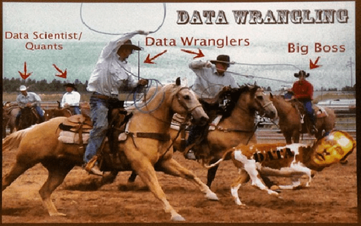
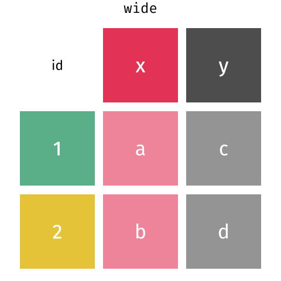
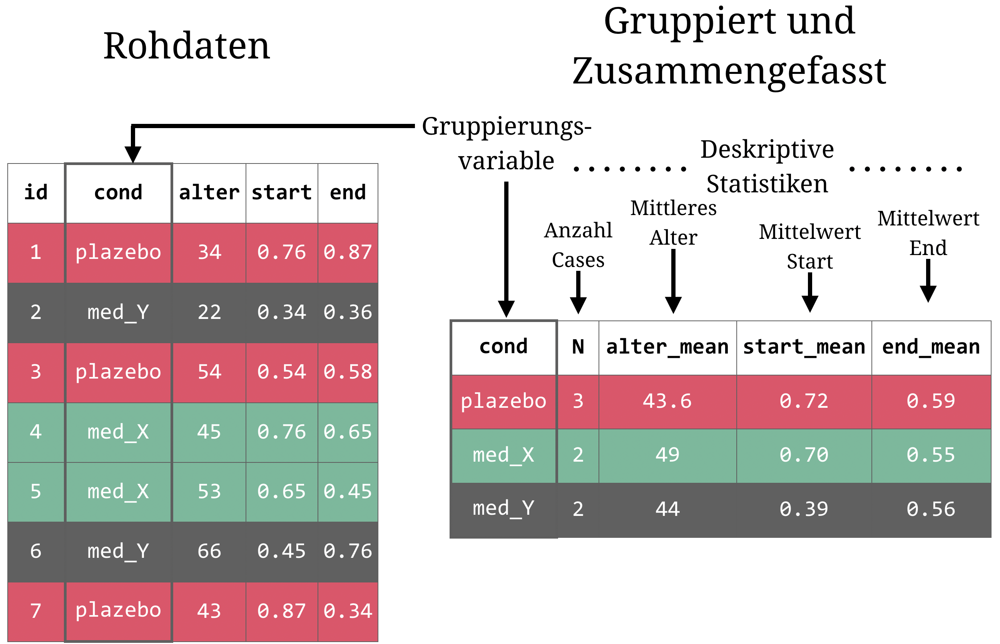

layout: true

<div class="my-footer">
  <span style="text-align:center">
    <span> 
      
    </span>
    <a href="https://therbootcamp.github.io/">
      <span style="padding-left:82px"> 
        <font color="#7E7E7E">
          www.therbootcamp.com
        </font>
      </span>
    </a>
    <a href="https://therbootcamp.github.io/">
      <font color="#7E7E7E">
       Explorative Datenanalyse mit R | März 2021
      </font>
    </a>
    </span>
  </div> 

---
  
```{r, eval = FALSE, echo = FALSE, message=FALSE}
# Code to knit slides
xaringan::inf_mr('_sessions/D1S2_Wrangling/Wrangling.Rmd')

```

```{r setup, include=FALSE}
options(htmltools.dir.version = FALSE)
options(width=110)
options(digits = 4)
library(tidyverse)
basel <- read_csv("1_Data/basel.csv")
studie <- tibble(id = c(1, 2),
                 medikament = c("medikament", "plazebo"),
                 baseline = c(3, 4),
                 t1 = c(8, 6))

patienten <- tibble(id = c(1, 2, 3, 4, 5),
                    X1 = c(37, 65, 57, 34, 45),
                    X2 = c(1, 2, 2, 1, 2))

ergebnisse <- tibble(id = c(4, 92, 1, 2, 99),
                     t_1 = c(100, 134, 123, 143, 102),
                     t_2 = c(105, 150, 135, 140,68))
patienten_ergebnisse = patienten %>% 
  rename(alter = X1, bedingung = X2) %>%
  mutate(bed_label = case_when(
    bedingung == 1 ~ "placebo",
    bedingung == 2 ~ "medikament")) %>%
  # Verbinde mit ergebnisse
  left_join(ergebnisse, by = "id")


```

# Noch mehr `dplyr`

.pull-left45[


<ul>
  <li class="m1"><span><high>Transformation & Organisation</high>
  <br><br>
  <ul class="level">
    <li><span>Fehlende Werte ersetzen / entfernen</span></li>
    <li><span>Ändere alle Variablen, die...</span></li>
    <li><span>Zeilen zu Spalten oder Spalten zu Zeilen</span></li>
  </ul>
  </span></li>
  <li class="m2"><span><high>Aggregation</high>
  <br><br>
  <ul class="level">
    <li><span>Nach Variablen gruppieren</span></li>
    <li><span>Deskriptive Statistiken berechnen</span></li>
  </ul>
  </span></li>
</ul>

]


.pull-right45[
<p align="center">
<br>
<font style="font-size:10px">from <a href="https://DATENsciencebe.com/tag/DATEN-wrangling/">DATENsciencebe.com</a></font>
</p>

]

---

# Transformation & Organisation

.pull-left4[

<ul>
  <li class="m1"><span><high>Transformation</high>
  <br><br>
  <ul class="level">
    <li><span><mono>mutate_if()</mono></span></li>
    <li><span><mono>replace_na()</mono></span></li>
    <li><span><mono>drop_na()</mono></span></li>
  </ul>
  </span></li>
  <li class="m2"><span><high>Organisation</high>
  <br><br>
  <ul class="level">
    <li><span><mono>starts_with(), contains(), :</mono></span></li>
    <li><span><mono>pivot_longer(), pivot_wider()</mono></span></li>
  </ul>
  </span></li>
</ul>

]

.pull-right5[

```{r}
patienten_ergebnisse
```


]

---

# `mutate_if()`

.pull-left4[

<ul>
  <li class="m1"><span>Transformation
  <br><br>
  <ul class="level">
    <li><span><high><mono>mutate_if()</mono></high></span></li>
    <li><span><mono>replace_na()</mono></span></li>
    <li><span><mono>drop_na()</mono></span></li>
  </ul>
  </span></li>
  <li class="m2"><span>Organisation
  <br><br>
  <ul class="level">
    <li><span><mono>starts_with(), contains(), :</mono></span></li>
    <li><span><mono>pivot_longer(), pivot_wider()</mono></span></li>
  </ul>
  </span></li>
</ul>

]

.pull-right5[

```{r}
patienten_ergebnisse %>%
  
  # Ändere alle numeric in character
  mutate_if(is.numeric, as.character)

```

]

---

# `replace_na()`

.pull-left4[

<ul>
  <li class="m1"><span>Transformation
  <br><br>
  <ul class="level">
    <li><span><mono>mutate_if()</mono></span></li>
    <li><span><high><mono>replace_na()</mono></high></span></li>
    <li><span><mono>drop_na()</mono></span></li>
  </ul>
  </span></li>
  <li class="m2"><span>Organisation
  <br><br>
  <ul class="level">
    <li><span><mono>starts_with(), contains(), :</mono></span></li>
    <li><span><mono>pivot_longer(), pivot_wider()</mono></span></li>
  </ul>
  </span></li>
</ul>

]

.pull-right5[

```{r}
patienten_ergebnisse %>%
  
  # Ändere fehlende Werte in 110
  mutate(t_1 = replace_na(t_1, 110))

```

]

---

# `replace_na()`

.pull-left4[

<ul>
  <li class="m1"><span>Transformation
  <br><br>
  <ul class="level">
    <li><span><mono>mutate_if()</mono></span></li>
    <li><span><mono>replace_na()</mono></span></li>
    <li><span><high><mono>drop_na()</mono></high></span></li>
  </ul>
  </span></li>
  <li class="m2"><span>Organisation
  <br><br>
  <ul class="level">
    <li><span><mono>starts_with(), contains(), :</mono></span></li>
    <li><span><mono>pivot_longer(), pivot_wider()</mono></span></li>
  </ul>
  </span></li>
</ul>

]

.pull-right5[

```{r}
patienten_ergebnisse %>%
  
  # Entferne Zeilen mit fehlenden Werten
  drop_na()

```

]

---

# `starts_with()`

.pull-left4[

<ul>
  <li class="m1"><span>Transformation
  <br><br>
  <ul class="level">
    <li><span><mono>mutate_if()</mono></span></li>
    <li><span><mono>replace_na()</mono></span></li>
    <li><span><mono>drop_na()</mono></span></li>
  </ul>
  </span></li>
  <li class="m2"><span>Organisation
  <br><br>
  <ul class="level">
    <li><span><high><mono>starts_with(), contains(), :</mono></high></span></li>
    <li><span><mono>pivot_longer(), pivot_wider()</mono></span></li>
  </ul>
  </span></li>
</ul>

]

.pull-right5[

```{r}
patienten_ergebnisse %>%
  
  # Wähle spalten aus, die mit "t" beginnen
  select(starts_with("t"))

```

]

---

# `contains()`

.pull-left4[

<ul>
  <li class="m1"><span>Transformation
  <br><br>
  <ul class="level">
    <li><span><mono>mutate_if()</mono></span></li>
    <li><span><mono>replace_na()</mono></span></li>
    <li><span><mono>drop_na()</mono></span></li>
  </ul>
  </span></li>
  <li class="m2"><span>Organisation
  <br><br>
  <ul class="level">
    <li><span><high><mono>starts_with(), contains(), :</mono></high></span></li>
    <li><span><mono>pivot_longer(), pivot_wider()</mono></span></li>
  </ul>
  </span></li>
</ul>

]

.pull-right5[

```{r}
patienten_ergebnisse %>%
  
  # Wähle spalten aus, die "_" beinhalten
  select(contains("_"))

```

]

---

# `:`

.pull-left4[

<ul>
  <li class="m1"><span>Transformation
  <br><br>
  <ul class="level">
    <li><span><mono>mutate_if()</mono></span></li>
    <li><span><mono>replace_na()</mono></span></li>
    <li><span><mono>drop_na()</mono></span></li>
  </ul>
  </span></li>
  <li class="m2"><span>Organisation
  <br><br>
  <ul class="level">
    <li><span><high><mono>starts_with(), contains(), :</mono></high></span></li>
    <li><span><mono>pivot_longer(), pivot_wider()</mono></span></li>
  </ul>
  </span></li>
</ul>

]

.pull-right5[

```{r}
patienten_ergebnisse %>%
  
  # Spalten von alter bis t_1
  select(alter:t_1)

```

]

---

# `pivot_*()`

.pull-left4[

<ul>
  <li class="m1"><span>Transformation
  <br><br>
  <ul class="level">
    <li><span><mono>mutate_if()</mono></span></li>
    <li><span><mono>replace_na()</mono></span></li>
    <li><span><mono>drop_na()</mono></span></li>
  </ul>
  </span></li>
  <li class="m2"><span>Organisation
  <br><br>
  <ul class="level">
    <li><span><mono>starts_with(), contains(), :</mono></span></li>
    <li><span><high><mono>pivot_longer(), pivot_wider()</mono></high></span></li>
  </ul>
  </span></li>
</ul>

]

.pull-right5[

<p align="center">
<br>
<font style="font-size:10px">adapted from <a href="https://github.com/gadenbuie/tidyexplain">tidyexplain</a></font>
</p>

]


---

# `pivot_longer()`

.pull-left4[

```{r, eval = F}
# wide zu long
TIBBLE %>% 
  pivot_longer(cols = VARS,
               names_to = NAME1,
               values_to = NAME2)
```

]

.pull-right5[

```{r}
# wide zu long
patienten_ergebnisse %>% 
  filter(bed_label == "placebo")

```
]

---

# `pivot_longer()`

.pull-left4[

```{r, eval = F}
# wide zu long
TIBBLE %>% 
  pivot_longer(cols = VARS,
               names_to = NAME1,
               values_to = NAME2)
```

]

.pull-right5[

```{r}
# wide zu long
patienten_ergebnisse %>% 
  filter(bed_label == "placebo") %>%
  pivot_longer(cols = c("t_1", "t_2"),
               names_to = "zeit",
               values_to = "messung")
```

]

---


# `pivot_wider()`

.pull-left4[

```{r, eval = F}
# wide zu long
TIBBLE %>% 
  pivot_wider(names_from = VAR1,
              values_from = VAR2)
```
]

.pull-right5[

```{r, echo = FALSE}
# wide zu long
patienten_ergebnisse_lang <- patienten_ergebnisse %>% 
  filter(bed_label == "placebo") %>%
  pivot_longer(cols = c("t_1", "t_2"),
               names_to = "zeit",
               values_to = "messung")
```

```{r}
# wide zu long
patienten_ergebnisse_lang
```

]

---


# `pivot_wider()`

.pull-left4[

```{r, eval = F}
# wide zu long
TIBBLE %>% 
  pivot_wider(names_from = VAR1,
              values_from = VAR2)
```
]

.pull-right5[

```{r, echo = FALSE}
# wide zu long
patienten_ergebnisse_lang <- patienten_ergebnisse %>% 
  filter(bed_label == "placebo") %>%
  pivot_longer(cols = c("t_1", "t_2"),
               names_to = "zeit",
               values_to = "messung")
```

```{r}
# wide zu long
patienten_ergebnisse_lang %>%
    pivot_wider(names_from = "zeit",
                values_from = "messung")
```

]

---

# Aggregation

.pull-left4[

<ul>
  <li class="m1"><span><high>Aggregation</high>
  <br><br>
  <ul class="level">
    <li><span><mono>summarise()</mono></span></li>
    <li><span><mono>summarise_if()</mono></span></li>
    <li><span><mono>group_by(), summarise()</mono></span></li>
    <li><span><mono>n(), first(), last(), nth()</mono></span></li>
    <li><span><mono>pull()</mono></span></li>
  </ul>
  </span></li>
</ul>

]

.pull-right5[

```{r, echo=F}
options(tibble.width=40, tibble.print_max=5, tibble.print_min=5, tibble.max_extra_cols=10)
```

```{r}
basel
```


]


---


# `summarise()`

.pull-left4[


```{r, echo = TRUE, eval = FALSE}
TIBBLE %>%
  summarise(
    NAME1 = SUMMARY_FUN(VAR1),
    NAME2 = SUMMARY_FUN(VAR2)
  )
```


]

.pull-right5[

```{r}
basel %>%
  
  # Berechne deskriptive Statistiken
  summarise(
    alter_mean = mean(alter),
    groesse_median = median(groesse)
  )
```


]

---


# `summarise_if()`

.pull-left4[


```{r, echo = TRUE, eval = FALSE}
TIBBLE %>%
  summarise_if(
    BEDINGUNG,
    SUMMARY_FUN
  )
```


]

.pull-right5[

```{r}
basel %>%
  select(alter, groesse, konfession, einkommen)
```


]

---


# `summarise_if()`

.pull-left4[


```{r, echo = TRUE, eval = FALSE}
TIBBLE %>%
  summarise_if(
    BEDINGUNG,
    SUMMARY_FUN
  )
```


]

.pull-right5[

```{r}
basel %>%
  
  # Berechne deskriptive Statistiken
  select(alter, groesse, konfession, einkommen) %>%
  summarise_if(is.numeric, mean)
```

]

---


# `summarise_if()`

.pull-left4[


```{r, echo = TRUE, eval = FALSE}
TIBBLE %>%
  summarise_if(
    BEDINGUNG,
    SUMMARY_FUN,
    ARGUMENTE
  )
```


]

.pull-right5[

```{r}
basel %>%
  
  # Berechne deskriptive Statistiken
  select(alter, groesse, konfession, einkommen) %>%
  summarise_if(is.numeric, mean, na.rm = TRUE)
```

]


---

# Gruppierte Aggregation

<p align="center">
  
</p> 


---

# `group_by()`, `summarise()`

.pull-left4[

```{r, eval = F}
TIBBLE %>%
  group_by(GRUPPEN_VAR) %>%
  summarise(
    NAME1 = SUMMARY_FUN(VAR1),
    NAME2 = SUMMARY_FUN(VAR2)
  )
```


]

.pull-right5[

```{r}
basel %>%
  
  # Gruppiere nach geschlecht
  group_by(geschlecht) %>%
  
  # Berechne Statistiken
  summarise(
    alter_mean = mean(alter),
    groesse_median = median(groesse)
  )
```

]

---

# `n()`

.pull-left4[

```{r, eval = F}
TIBBLE %>%
  group_by(GRUPPEN_VAR) %>%
  summarise(
    NAME1 = SUMMARY_FUN(VAR1),
    NAME2 = SUMMARY_FUN(VAR2)
  )
```


]

.pull-right5[

```{r, echo=F}
options(tibble.width=50, tibble.print_max=5, tibble.print_min=5, tibble.max_extra_cols=10)
```


```{r}
basel %>%
  
  # Gruppiere nach geschlecht
  group_by(geschlecht) %>%
  
  # Berechne Statistiken
  summarise(
    N = n()
  )
```

]

---

# `first()`

.pull-left4[

```{r, eval = F}
TIBBLE %>%
  group_by(GRUPPEN_VAR) %>%
  summarise(
    NAME1 = SUMMARY_FUN(VAR1),
    NAME2 = SUMMARY_FUN(VAR2)
  )
```


]

.pull-right5[

```{r}
basel %>%
  
  # Gruppiere nach geschlecht
  group_by(geschlecht) %>%
  
  # Berechne Statistiken
  summarise(
    N = n(),
    bild_1 = first(bildung)
  )
```

]

---

# `last()`

.pull-left4[

```{r, eval = F}
TIBBLE %>%
  group_by(GRUPPEN_VAR) %>%
  summarise(
    NAME1 = SUMMARY_FUN(VAR1),
    NAME2 = SUMMARY_FUN(VAR2)
  )
```


]

.pull-right5[

```{r}
basel %>%
  
  # Gruppiere nach geschlecht
  group_by(geschlecht) %>%
  
  # Berechne Statistiken
  summarise(
    N = n(),
    bild_1 = first(bildung),
    bild_N = last(bildung)
  )
```

]

---

# `nth()`

.pull-left4[

```{r, eval = F}
TIBBLE %>%
  group_by(GRUPPEN_VAR) %>%
  summarise(
    NAME1 = SUMMARY_FUN(VAR1),
    NAME2 = SUMMARY_FUN(VAR2)
  )
```


]

.pull-right5[

```{r}
basel %>%
  
  # Gruppiere nach geschlecht
  group_by(geschlecht) %>%
  
  # Berechne Statistiken
  summarise(
    N = n(),
    bild_1 = first(bildung),
    bild_N = last(bildung),
    bild_150 = nth(bildung, 150)
  )
```

]

---

# `pull()`

.pull-left4[

```{r, eval = F}
TIBBLE %>%
  group_by(GRUPPEN_VAR) %>%
  summarise(
    NAME = SUMMARY_FUN(VAR),
  ) %>%
  pull(NAME)
```


]

.pull-right5[

```{r}
basel %>%
  
  # Gruppiere nach geschlecht
  group_by(geschlecht) %>%
  
  # Berechne Statistiken
  summarise(N = n()) %>%
  
  # Extrahiere Vektor
  pull(N)
  
```

]

---


class: middle, center

<h1><a href="https://therbootcamp.github.io/EDA_2021Mar/_sessions/WranglingII/WranglingII_practical.html">Practical</a></h1>
