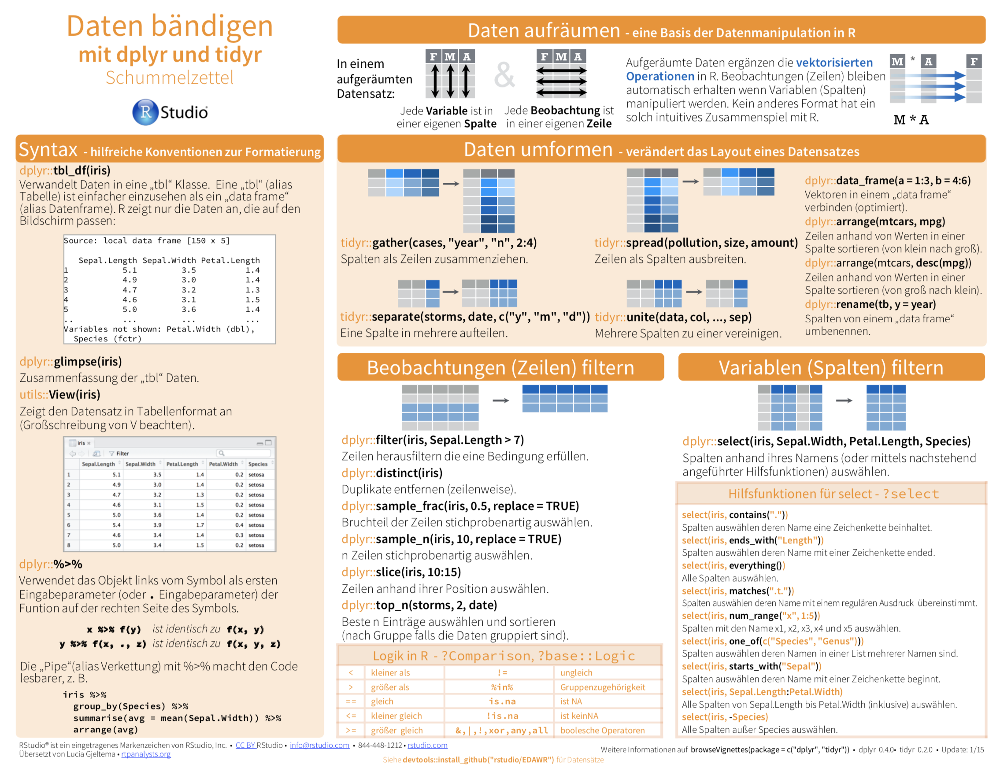

```{r setup, echo = FALSE, message=F, warning=F}
knitr::opts_chunk$set(comment = NA, 
                      fig.width = 6, 
                      fig.height = 6,
                      fig.align = 'center',
                      echo = FALSE, 
                      eval = FALSE, 
                      warning = FALSE,
                      message = FALSE)

options(digits = 3)

library(tidyverse)
kc_house <- read_csv("../../1_Data/kc_house.csv")
bevoelkerung <- read_csv("../../1_Data/bevoelkerung.csv")
basel <- read_csv("1_Data/basel.csv")
```

<p align="center">
<br>
<font style="font-size:10px">adapted from [trueloveproperty.co.uk](http://www.trueloveproperty.co.uk/houses-sale-ingham/)</font>
</p>

# {.tabset}

## Überblick

In diesem Practical wirst du das Transformieren, Gruppieren und Analysieren von Daten mit `dplyr` üben.

Am Ende des Practicals wirst du wissen wie man:

1. Daten transformiert.
2. Daten gruppiert und deskriptive Statistiken berechnen kann.

## Aufgaben

### A - Setup

1. Öffne dein `TheRBootcamp` R project. Es sollte bereits die Ordner `1_Data` und `2_Code` enthalten. 

2. Öffne ein neues R Skript. Schreibe deinen Namen, das Datum und "Wrangling II Practical" als Kommentare an den Anfang des Skripts.

```{r, eval = FALSE, echo = TRUE}
## NAME
## DATUM
## Wrangling II Practical
```

3. Speichere das neue Skript unter dem Namen `wrangling_II_practical.R` im `2_Code` Ordner.

4. Lade das `tidyverse`.

```{r, eval = FALSE, echo = TRUE}
# Pakete laden
library(tidyverse)     
```

```{r}
library(tidyverse)
```

### B - Transformation von *Long* zu *Wide* Format 

In diesem Abschnitt arbeitest du zunächst mit dem `bevoelkerung.csv` Datensatz. Er enthält die Einwohnerzahlen verschiedener Schweizer Städte von 1930 bis 2011. Im `Datensätze` Tab findest du eine Auflistung und eine kurze Beschreibung der im Datensatz enthaltenen Variablen. 

1. Lese den Datensatz mit der `read_csv()` Funktion in R ein und speichere ihn unter dem Namen `bevoelkerung`.

```{r eval = FALSE, echo = TRUE}
bevoelkerung <- read_csv(file = "1_Data/bevoelkerung.csv")
```

2. Mache dich mit dem Datensatz vertraut in dem du die ersten paar Zeilen (`print()`) und die Variablennamen (`names()`) anschaust.

```{r}
names(bevoelkerung)
bevoelkerung
```

3. Im Moment sind die Daten so angeordnet, dass jedes Jahr eine einzelne Spalte hat, d.h. es liegt ein *Wide* Format vor; wir wollen sie aber im *Long* format. Verwende `pivot_longer()` um das Format zu wechseln. Verwende `"st_wbev_2011"` und `"st_wbev_2001"` für das `cols` Argument und `"jahr" für` das `names_to` Argument und speichere das Resultat als neues Objekt `bevoelkerung_long` ab.

```{r eval = FALSE, echo = TRUE}
# Transofmation vom Wide ins Long Format
bevoelkerung_long <- bevoelkerung %>%
  pivot_longer(cols = c("XX", "XX"), names_to = "XX")
```

```{r}
# Transofmation vom Wide ins Long Format
bevoelkerung_long <- bevoelkerung %>%
  pivot_longer(cols = c("st_wbev_2011", "st_wbev_2001"), names_to = "jahr")

```

4. Printe den neu erstellten Datensatz. Alles wie erwartet?

5. Nun bringe nicht nur die Jahre 2001 und 2011, sondern alle im Datensatz vorhandenen Jahre ins Long-Format. Schaue dir zunächst nochmals die Namen der Spalten mit `names()` an.

```{r}
names(bevoelkerung)
```

6. Jede Jahr-Variable hat die gleiche Struktur, nämlich `st_wbev_XXX`. Das bedeutet, dass du die sehr hilfreiche `starts_with()` Funktion zur Variablenauswahl verwenden kannst. Benutze `pivot_longer()` und `starts_with()` um alle Jahr-Variablen zu transformieren.

```{r eval = FALSE, echo = TRUE}
# Transofmation vom Wide ins Long Format
bevoelkerung_long <- bevoelkerung %>%
  pivot_longer(cols = starts_with("XX"), names_to = "XX")
```

```{r}
bevoelkerung_long <- bevoelkerung %>%
  pivot_longer(cols = starts_with("st_"), names_to = "jahr")
```

7. Printe nochmals `bevoelkerung_long`.

8. Die Einwohnerzahl ist im neuen Datensatz mi dem Standardwert `value` benannt. Führe nun nochmal die `pivot_longer` Funktion aus, verwende nun aber auch noch das `values_to` Argument um die neue Spalte `einwohner` zu nennen. 

```{r eval = FALSE, echo = TRUE}
# Transofmation vom Wide ins Long Format
bevoelkerung_long <- bevoelkerung %>%
  pivot_longer(cols = starts_with("XX"), names_to = "XX", values_to = "XX")
```

```{r}
bevoelkerung_long <- bevoelkerung %>%
  pivot_longer(cols = starts_with("st_"), names_to = "jahr", values_to = "einwohner")
```

9. Schaue dir das Resultat an. Alles in Ordnung?

10. Verwende nun das `names_prefix` Argument um die Präfixe der Jahreszahlen (`"st_wbev_"`) automatisch zu entfernen. Der `character`-String der für `names_prefix` bereit gestellt wird, wird vom Beginn der Variablennamen entfernt. 

```{r}
bevoelkerung_long <- bevoelkerung %>%
  pivot_longer(starts_with("st_"), names_to = "jahr", 
               values_to = "einwohner",
               names_prefix = "st_wbev_")
```

### C - Transformation von *Long* zu *Wide* Format 

1. Nun nimm an, dass du die Daten als `bevoelkerung_long` im Long Format bekommen hättest und sie ins Wide Format umwandeln müsstest. Verwende die `pivot_wider()` Funktion und weise den Argumenten `names_from` und `values_from` die Spalten `jahr` und `einwohner` zu. Speichere das Ergebnis als `bevoelkerung_wide` ab.

```{r eval = FALSE, echo = TRUE}
# Transofmation vom Long ins Wide Format
bevoelkerung_wide <- bevoelkerung_long %>%
  pivot_wider(names_from = XX, values_from = XX)
```

```{r}
bevoelkerung_wide <- bevoelkerung_long %>%
  pivot_wider(names_from = jahr, values_from = einwohner)
```

2. Vergleiche `bevoelkerung_wide` mit `bevoelkerung`. War die Rücktransformation erfolgreich? Was fehlt?

3. Um die zuvor entfernten Präfixe wieder bei den Variablennamen hinzuzufügen, kannst du das `names_prefix` argument in `pivot_wider()` verwenden. Benutze `names_prefix` um `"st_wbev_"` als Präfix wieder hinzuzufügen. 

```{r}
bevoelkerung_wide <- bevoelkerung_long %>%
  pivot_wider(names_from = jahr, values_from = einwohner,
              names_prefix = "st_wbev_")
```

### D - Wiederholung Wrangling I

Im Rest des Practicals arbeitst du mit dem `kc_house.csv` Datensatz. Er enthält Verkaufspreise von Häusern in King County, Washington. Aufgelistet sind Häuser, welche zwischen Mai 2014 und Mai 2015 verkauft wurden. Nebst den Verkaufspreisen enthält der Datensatz Spezifikationen der Häuser, z.B. die Anzahl Zimmer eines Hauses. 

1. Lese den Datensatz mit der `read_csv()` Funktion in R ein und speichere ihn unter dem Namen `kc_house`.

```{r, eval = FALSE, echo = TRUE}
kc_house <- read_csv(file = "1_Data/kc_house.csv")
```

2. Printe den Datensatz und verwende `summary()` und `names()` um einen Eindruck über dessen Struktur zu erhalten.

```{r}
kc_house
summary(kc_house)
```

3. Da es sich um einen US Datensatz handelt, sind die Flächenangaben in Quadratfuss angegeben. Wir als "rest of the world" sind es natürlich eher gewohnt in Quadratmeter zu denken. Kreiere dazu drei neue Variablen `qm_wohnraum`, `qm_dachstock` und `qm_keller`, welche die jeweilige Raumgrösse in Quadratmeter angeben. Ein Quadratfuss entspricht 0.093 Quadratmeter.

```{r eval = FALSE, echo = TRUE}
kc_house <- kc_house %>%
  mutate(XX = XX * 0.093,
         XX = XX * 0.093,
         XX  = XX * 0.093)
```

```{r, eval = TRUE}
kc_house <- kc_house %>%
  mutate(qm_wohnraum = qf_wohnraum * 0.093,
         qm_dachstock = qf_dachstock * 0.093,
         qm_keller  = qf_keller * 0.093)
```

4. Kreiere wiederum mit `mutate()` eine neue Spalte `qm_total`, welche die Summe aus `qm_wohnraum`, `qm_dachstock` und `qm_keller` darstellt.

```{r, eval = TRUE}
kc_house <- kc_house %>%
  mutate(qm_total = qm_wohnraum + qm_dachstock + qm_keller)
```

5. Füge eine neue Variable `villa` hinzu (mit `mutate()`), welche den Wert `"ja"` annimmt, wenn `qm_total` grösser als 750 ist und "nein", wenn `qm_total` kleiner oder gleich 750 ist.

```{r, eval = TRUE}
kc_house <- kc_house %>%
                mutate(villa = case_when(
                              qm_total > 750 ~ "ja",
                              qm_total <= 750~ "nein"))
```


### E - `summarise`

1. Unter Verwendung der base-R `TIBBLE$VARIABLE`-Notation, berechne den Mittelwert über alle Hauspreise mit `mean()`.

```{r}
mean(kc_house$preis)
```

2. Berechne wieder den Mittelwert aber verwende diesmal `mean()` innerhalb der `summarise()` Funktion. Besteht ein Unterschied in den Resultaten dieser und der vorherigen Aufgabe?

```{r, echo = TRUE, eval = FALSE}
kc_house %>%
  summarise(
    XX = mean(XX)
  )
```

```{r}
kc_house %>%
  summarise(
    preis_mean = mean(preis)
  )
```

3. Wie hoch ist der höchste Verkaufspreis? Verwende die `max()` Funktion.

```{r}
kc_house %>%
  summarise(
    preis_max = max(preis)
  )
```

4. Sortiere mittels der `arrange()` und der `desc()` Funktion den Datensatz nach `preis` in absteigender Reihenfolge und printe das Resultat. Richtig sortiert?

```{r}
kc_house <- kc_house %>%
  arrange(desc(preis))

kc_house
```

5. Wie gross ist der Anteil an Häuser, welche für mehr als 1 Million USD verkauft wurden? 

```{r eval = FALSE, echo = TRUE}
kc_house %>%
  summarise(million_prozent = mean(XX > XX))
```

```{r}
kc_house %>%
  summarise(million_prozent = mean(preis > 1000000))
```

6. Berechne die mittlere Anzahl Stockwerke (`stoecke`) und Badezimmer (`badezimmer`) von Villen (`villa`). Verwende erst `filter()` um Villen auszuwählen und danach `summarise()`.

```{r}
kc_house %>%
  filter(villa == "ja") %>%
  summarise(
    stoecke_mean = mean(stoecke),
    badezimmer_mean = mean(badezimmer)
  )
```

### F - `group_by` und `summarise` 

1. Verwende `group_by()`, `summarise()` und `n()` um zu berechnen wie viele Villen und wie viele normale Häuser (nicht-Villen) im Datensatz vorhanden sind. 

```{r eval = FALSE, echo = TRUE}
kc_house %>%
  group_by(XX) %>%
  summarise(N = XX)
```

```{r}
kc_house %>%
  group_by(villa) %>%
  summarise(N = n())
```

2. Ergänze nun einen Eintrag in `summarise()`, der den mittlere Verkaufspreis von Villen und normalen Häusern (nicht-Villen) berechnet?

```{r}
kc_house %>%
  group_by(villa) %>%
  summarise(N = n(),
            preis_mean = mean(preis))
```

3. Berechne nun auch noch das Minimum (`min()`) und Maximum (`min()`).

```{r}
kc_house %>%
  group_by(villa) %>%
  summarise(N = n(),
            preis_min = min(preis),
            preis_mean = mean(preis),
            preis_max = max(preis))
```

4. Haben Häuser, welche später gebaut wurden, eine grössere Wohnfläche? Gruppiere zur Beantwortung dieser Frage die Daten nach `baujahr` und berechne dann die mittlere Wohnfläche (`qm_wohnraum`).

```{r}
kc_house %>%
  group_by(baujahr) %>%
  summarise(N = n(),
            wohnraum = mean(qm_wohnraum))
```


### G - Mehrere Gruppen

1. Dein Freund Theodorus interessiert sich für Häuser einer bestimmten Gegend, nämlich mit den Postleitzahlen (`postleitzahl`) 98001, 98109, 98117 und 98199. Stelle ihm einen neuen Datensatz `theodorus` zusammen, welcher nur die Häuser dieser Gegend enthält. Tipp: der `%in%` Operator testet ob Elemente des Vektors auf der rechten Seite im Vektor auf der linken Seite enthalten sind.

```{r eval = FALSE, echo = TRUE}
theodorus <- kc_house %>%
  filter(XX %in% c(XX, XX, XX, XX))
```

```{r}
theodorus <- kc_house %>%
  filter(postleitzahl %in% c(98001, 98109, 98117, 98199))
```

2. Berechne für Theodorus den mittleren, den den Minimum-, den Maximumpreis, sowie die Anzahl Häuser pro Gruppe, separat für die Postleitzahlen und ob es eine Villa ist.

```{r}
theodorus %>%
  group_by(postleitzahl, villa) %>%
  summarise(preis_mean = mean(preis),
            stoecke_min = min(stoecke),
            stoecke_max = max(stoecke),
            N = n())
```


### X - Challenges

1. Welche Postleitzahl hat den höchsten Anteil Häuser, welche am Ufer gebaut sind (`ufer`)? Printe nur diese Zeile des Datensatzes.

```{r}
kc_house %>%
  group_by(postleitzahl) %>%
  summarise(ufer_p = mean(ufer)) %>%
  arrange(desc(ufer_p)) %>%
  slice(1)
```

2. Welches Haus hat das schlechteste Preis-Wohnraumgrösse Verhältnis? Printe nur diese Zeile des Datensatzes.

```{r}
kc_house %>%
  mutate(preis_zu_flaeche = preis / qm_wohnraum) %>%
  arrange(desc(preis_zu_flaeche)) %>%
  slice(1)
```

3. Welche 10 Postleitzahlen haben im Schnitt die höchsten Hauspreise? Printe nur diese 10 Zeilen.

```{r}
kc_house %>%
  group_by(postleitzahl) %>%
  summarise(preis_mean = mean(preis)) %>%
  arrange(desc(preis_mean)) %>%
  slice(1:10)
```

4. Kreiere den folgenden Datensatz *genau* wie er unten steht.

```{r, eval = FALSE, echo = FALSE}
kc_house %>%
  filter(baujahr >= 1990 & baujahr < 1999) %>%
  group_by(baujahr) %>%
  summarise(N = n(),
            preis_mean = mean(preis),
            preis_max = max(preis),
            qm_wohnraum_mean = mean(qm_wohnraum)) %>%
  knitr::kable(digits = 0)
```

| baujahr|   N| preis_mean| preis_max| qm_wohnraum_mean|
|--------:|---:|----------:|---------:|---------------:|
|     1990| 320|     563966|   3640900|             234|
|     1991| 224|     630441|   5300000|             244|
|     1992| 198|     548169|   2480000|             223|
|     1993| 202|     556612|   3120000|             226|
|     1994| 249|     486834|   2880500|             209|
|     1995| 169|     577771|   3200000|             224|
|     1996| 195|     639534|   3100000|             240|
|     1997| 177|     606058|   3800000|             234|
|     1998| 239|     594159|   1960000|             241|

```{r}
kc_house %>%
  filter(baujahr >= 1990 & baujahr < 1999) %>%
  group_by(baujahr) %>%
  summarise(N = n(),
            preis_mean = mean(preis),
            preis_max = max(preis),
            qm_wohnraum_mean = mean(qm_wohnraum)) %>%
  knitr::kable(digits = 0)
```


## Beispiele

```{r, eval = FALSE, echo = TRUE}
# Wrangling II mit dplyr and tidyr ---------------------------

library(tidyverse)    # Lade tidyverse für dplyr

# Lese den basel Datensatz ein
basel <- read_csv("1_Data/basel.txt")

# Keine Gruppierungsvariable
bas <- basel %>%
  summarise(
    alter_m = mean(alter, na.rm = TRUE),
    einkommen_median = median(einkommen, na.rm = TRUE),
    N = n()
  )

bas

# Eine Gruppierungsvariable
bas_ges <- basel %>%
  group_by(geschlecht) %>%
  summarise(
    alter_m = mean(alter, na.rm = TRUE),
    einkommen_median = median(einkommen, na.rm = TRUE),
    N = n()
  )

bas_ges

# Zwei Gruppierungsvariablen
bas_ges_bil <- basel %>%
  group_by(geschlecht, bildung) %>%
  summarise(
    alter_m = mean(alter, na.rm = TRUE),
    einkommen_median = median(einkommen, na.rm = TRUE),
    N = n()
  )

bas_ges_bil

# Gruppiere nach Geschlecht und Bildung und berechne den Mittelwert aller 
# Variablen des Typs numeric
basel %>%
  group_by(geschlecht, bildung) %>%
  summarise_if(is.numeric, mean, na.rm = TRUE)

```

## Datensätze

|File | Zeilen | Spalten | Beschreibung |
|:----|:-----|:------|:-----------------------------------------|
|[kc_house.csv](https://raw.githubusercontent.com/therbootcamp/BaselRBootcamp_2018July/master/_sessions/_data/baselrbootcamp_data/kc_house.csv) | 21613 | 11|Verkaufspreise von Häusern in King County zwischen Mai 2014 und Mai 2015. |
|[bevoelkerung.csv](https://raw.githubusercontent.com/therbootcamp/BaselRBootcamp_2018July/master/_sessions/_data/baselrbootcamp_data/kc_house.csv) | 161 | 10|Einwohnerzahlen Schweizer Städte von 1930 bis 2011. |

#### kc_house.csv

*Erste 5 Zeilen und 5 Spalten von kc_house.csv*

```{r, eval = TRUE, echo = FALSE}
knitr::kable(kc_house[1:5, 1:5])
```

|Variable | Beschreibung |
|:--------|:-----------------------------|
|preis  | Preis in USD| 
|schlafzimmer    | Anzahl Schlafzimmer|
|badezimmer   | Anzahl Badezimmer|
|qf_wohnraum | Wohnraumfläche in Quadratfuss|
|qf_parzelle | Parzellengrösse in Quadratfuss|    
|stoecke   |Anzahl Stöcke|
|ufer | Ist das Haus am Ufer gebaut (1) oder nicht (0)|
|qf_dachstock | Dachstockfläche in Quadratfuss|
|qf_keller | Kellerfläche in Quadratfuss|
|baujahr | Baujahr|
|postleitzahl | Postleitzahl|


#### bevoelkerung.csv

*Erste 5 Zeilen und 5 Spalten von bevoelkerung.csv*

```{r, eval = TRUE, echo = FALSE}
knitr::kable(bevoelkerung[1:5, 1:5])
```

|Variable | Beschreibung |
|:--------|:-----------------------------|
|Stadtname  |Name der Stadt|
|st_wbev_2011  |Wohnbevölkerung im Jahr 2011|
|st_wbev_2001  | Wohnbevölkerung im Jahr 2001| 
|proz_ver-2001–2011    | Veränderung der Einwohnerzahl in Prozent zwischen 2001 und 2011|
|bevdichte   | Bevölkerungsdichte|
|st_wbev_1930 | Wohnbevölkerung im Jahr 1930|
|st_wbev_1970 | Wohnbevölkerung im Jahr 1970|    
|st_wbev_1980   |Wohnbevölkerung im Jahr 1980|
|st_wbev_1990 | Wohnbevölkerung im Jahr 1990|
|st_wbev_2000 | Wohnbevölkerung im Jahr 2000|


## Funktionen

### Pakete

|Paket| Installation|Beschreibung|
|:------|:------|:------|
|`tidyverse`|`install.packages("tidyverse")`|Ein Metapaket für Data Science, einschliesslich `dplyr`, `ggplot2` und weitere Pakete|

### Funktionen

*Wrangling*

| Funktion| Paket | Beschreibung |
|:---|:------|:---------------------------------------------|
|     `rename()`|`dplyr`|    Umbenennen von Spalten| 
|     `select()`|`dplyr`|    Auswahl von Spalten basierend auf Name oder Index| 
|     `filter()`|`dplyr`|    Auswahl von Zeilen basieren auf einem logischen Ausdruck| 
|     `arrange()`|`dplyr`|    Sortiere Zeilen| 
|     `mutate()`|`dplyr`|    Hinzufügen von Spalten|
|     `case_when()`|`dplyr`|    Recodieren von Spalten| 
|     `group_by(), summarise()`|`dplyr`|   Gruppierung von Daten zur Berechnung deskriptiver Statistiken|
|     `pivot_longer()`|`tidyr`|   Transormation vom Wide ins Long Format|
|     `pivot_wider()`|`tidyr`|   Transormation vom Long ins Wide Format|


## Ressourcen

### Vignettes

Hier geht es zur `dplyr` [**vignette**](https://cran.r-project.org/web/packages/dplyr/vignettes/dplyr.html) und hier zur `tidyr` [**vignette**](https://www.tidyverse.org/blog/2019/09/tidyr-1-0-0/).


### Cheatsheet

<p align="center" width="100%">
<a href="https://github.com/rstudio/cheatsheets/raw/master/translations/german/data-wrangling-german.pdf">
  </a>
  <br>
  <font style="font-size:10px">von <a href="https://www.rstudio.com/resources/cheatsheets/">R Studio</a></font>
</p>
